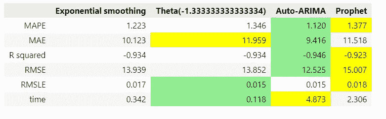

# 先知在赛马中四处游荡

> 原文：<https://medium.com/mlearning-ai/the-prophet-traipses-at-the-horse-races-dd13f1423007?source=collection_archive---------2----------------------->

## 使用 fbProphet 和替代方法的时间序列预测

我们将在同一组时间序列上运行 facebook Prophet 模型，以及其他方法，如 SARIMA、Theta 和指数平滑，然后比较预测准确性指标。这将是我们的赛马。

image by author

# **1。fbProphet** 的人气