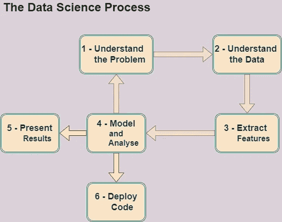

# 真正的数据科学路线图

> 原文：<https://medium.com/mlearning-ai/the-real-data-science-road-map-e09a60977cf?source=collection_archive---------8----------------------->

数据科学过程概述

Photo by [https://pixabay.com/images/id-2107479/](https://pixabay.com/images/id-2107479/)

“数据科学”这个术语现在非常流行，你可以在任何地方找到列出成为数据科学家所需技能的出版物。

通常，数据科学的最终产品是由统计学家或业务分析师交付的，但在许多情况下，实现这一目标也需要软件工程技能。

很难找到能够建立良好的统计模型、破解高质量软件并以一种有意义的方式将其与商业问题联系起来的人。这些人非常罕见，招聘人员经常称他们为“独角兽”。

在本文中，我们将概述数据科学流程，重点关注数据科学家工作的不同阶段，以及将数据科学与其他知识领域区分开来的方面。

## 数据科学过程

下图总结了解决数据科学问题的过程:

Image by author adapted from The Data Science Handbook

**第一步:理解问题**

了解问题并根据业务需求定制解决方案对于启动每个新的数据科学项目至关重要。

在投入工作之前，完成的[定义(DoD)](https://en.wikipedia.org/wiki/Scrum_(software_development)) 或[工作说明书(SOW)](https://en.wikipedia.org/wiki/Statement_of_work) 是定义成功所需标准的好方法。这些标准通常在文档中列出，这是一个协作过程，涉及到与利益相关者的多次交流和多次协商。

明确应该为哪种类型的客户服务也是非常重要的:人还是机器。一旦你了解了谁是你的客户，下一步就是确定你要为他们做什么:一份演示文稿，一份书面报告或者一个执行分析工作的软件。

**第二步:理解数据**

● *基本问题*

一旦您可以访问您将使用的数据，这是识别数据问题的一个好方法，询问一些一般性的问题:

*   数据集有多大？这是整个数据集吗？这个数据足够有代表性吗？
*   是否可能存在显著的异常值或异常的噪声源？
*   数据集中可能会插入人工数据吗？
*   是否有任何字段是唯一标识符？所谓的唯一标识符实际上是唯一的吗？如果不是，那意味着什么？
*   当数据条目是空白的时候，那是从哪里来的？空白条目有多常见？

● *数据争论*

数据争论是将数据从其原始格式转换为适合更传统分析的
格式的过程，创建一个软件管道，将数据从存储位置取出，进行任何必要的清理或过滤，并将其转换为常规格式。

数据争论是数据科学家需要传统统计学家或分析师不具备的技能的主要领域。这些数据通常存储在专用数据库中，需要专门的工具才能访问。

● *探索性分析*

探索性分析基本上意味着挖掘数据，以许多不同的方式将其可视化，尝试不同的方式对其进行转换，计算一些相关性等，但不使用机器学习。

从探索性分析中你通常会得到两件事:

*   对数据的直观洞察，包括显著的模式是什么
    看起来很直观。
*   关于数据中发生的事情的一系列具体假设。通常，一个假说会被一个吸引人的图表所激发:一个显示明确模式的时间序列，一个表明两个变量相互关联的散点图，或者一个明显双峰的直方图。

**第三步:提取特征**

这个阶段与探索性分析和数据准备有很多重叠。

一个特性实际上只是从你的数据中提取的一个数字或类别，而
描述了一些实体。例如，您可以提取文本文档的平均单词长度
或文档中的字符数。

提取好的资源是分析工作中最重要的事情。这比好的机器学习模型、复杂的统计技术或优雅的代码重要得多。尤其是如果您的数据没有现成的资源，如网页、图像等。

资源抽取也是数据科学中最具创造性的部分，也是与领域经验联系最紧密的部分。通常情况下，一个真正好的功能会匹配一些现实世界的现象。

数据科学家必须与领域专家密切合作，了解这些现象意味着什么，以及如何将它们提炼为数字。

**第四步:建模和分析**

一旦提取了特征，大多数数据科学项目都涉及某种机器学习模型。

在许多数据科学项目中，建模阶段非常简单，只需采用一组标准模型，将数据插入每个模型，然后查看哪一个效果最好。在其他情况下，需要非常小心地调整模型，并检查每一点性能。

事实上，这应该发生在数据科学项目的每个阶段，但是
在分析建模步骤的结果时，这变得尤其重要。这个阶段允许项目中的过程修正，并给出想法
来知道如果有另一个迭代，做什么不同。

如果您的客户是人类，通常会使用各种模型，调整不同的方式来检查数据的不同方面。

但是，如果您的客户是一台机器，您可能需要关注将用于生产的单一型号。

**第五步:展示结果**

如果你的客户是人类，你可能需要做一个介绍
或者一份描述工作及其结果的书面报告。

沟通是一项困难而重要的技能，但对于数据科学来说尤其棘手，因为数据是高度技术性的，受众可能非常多样化。

数据科学家必须与公司利益相关者、领域专家、软件工程师和业务分析师流畅地交流。这些小组往往会有不同的知识库，他们会关注不同的事情，以及他们习惯的不同的演示风格。

**第六步:部署代码**

如果你的最终客户是计算机，那么你的工作就是编写代码，让
在将来被其他人定期运行。通常这符合两个类别的
:

*   批量分析代码将用于重做类似于
    的分析，这已经完成，对数据将在未来收集。
*   实时代码，通常是大型软件包中的分析模块，用高性能编程语言编写，符合所有软件工程最佳实践。

在这个阶段有三种典型的结果:

*   代码本身。
*   如何运行代码的文档。
*   一些测试代码的方法，确保你的代码能够正确运行。

在代码部署中，数据科学家往往承担着双重角色，比如
软件工程师。

特别是对于非常复杂的算法，让一个人指定而另一个人实现相同的东西用于生产通常是不切实际的。

**第七步:迭代**

数据科学是一个迭代过程，甚至比典型的软件
工程更是如此。

这是因为在软件中，你通常知道你打算创建什么，即使你采取迭代的方法。但在数据科学中，提取哪些特征最终会有用，以及您将训练哪个模型，这通常是一个悬而未决的问题。因此，数据科学过程必须围绕能够无痛苦地改变事物的目标来构建。

必须遵守以下建议:

*   了解
    数据后，争取尽快得出初步结果。也许是一个基于原始初步特征的简单模型
    ,然而它是有效的。
*   在一个脚本中自动化分析，所以很容易用一个命令运行整个
    的事情。从一开始就保护可复制的东西。
*   保持代码模块化，并分成清晰的阶段。在实验时，使修改、添加和执行步骤变得更加容易。

本文到此为止，感谢阅读！您可以使用以下链接在 LinkedIn 上与我联系:

*   [https://www.linkedin.com/in/fernando-oliveira-2a42b51a4/](https://www.linkedin.com/in/fernando-oliveira-2a42b51a4/)

**参考文献**

*   [《数据科学手册》；卡迪，菲尔德；约翰·威利&父子公司，2017](https://www.wiley.com/en-us/The+Data+Science+Handbook-p-9781119092940)

 [## Mlearning.ai 提交建议

### 如何成为 Mlearning.ai 上的作家

medium.com](/mlearning-ai/mlearning-ai-submission-suggestions-b51e2b130bfb)