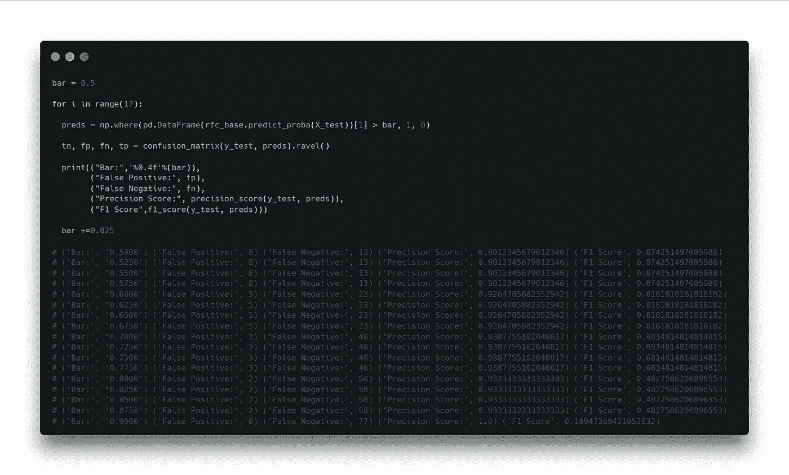
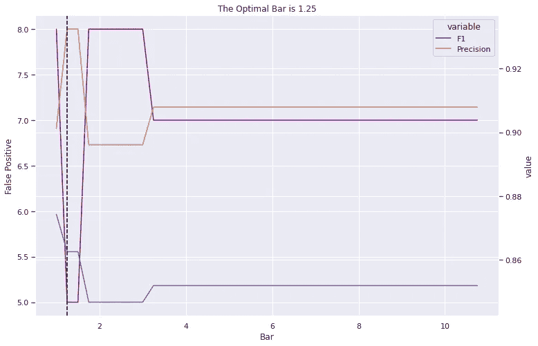

# 我不喜欢的推荐音乐是所谓的误报

> 原文：<https://medium.com/mlearning-ai/the-recommended-music-i-dont-like-are-so-called-false-positives-5df25a0d34a8?source=collection_archive---------8----------------------->

## 以客户为中心思考音乐推荐算法。

Photo by John Tekeridis: [https://www.pexels.com/photo/person-using-smartphone-340103/](https://www.pexels.com/photo/person-using-smartphone-340103/)

# 介绍

今天下午早些时候，我一边看书一边听音乐。这个应用程序开始随机“推荐”真正让我心烦的音乐。就在那一瞬间，一个看似不相关的名词浮现在我的脑海:**假阳性**。

对于 Apple Music，Spotify，Amazon Music 等音乐平台。，他们的推荐团队必须如此努力地工作，以建立识别我的兴趣和个性化我的体验的系统。所以，我作为客户，是可以挽留的。在一首新的音乐进入队列让我听之前，它可能已经被分析并与我先前标记为喜欢的音乐进行了比较。系统相信我会喜欢这首曲子。

屏幕背后的真实系统肯定比我上面描述的要复杂得多。他们可能已经完成了一些类型的无监督学习作为子模块来增强系统，例如音乐聚类、用户聚类、与歌词相关的 NLP 分析等等。所有这些工作完成后，在最后一步，系统必须决定我是否会喜欢这段音乐。很明显，今天下午系统做了一个错误的决定。

嗯，可能是我太挑剔了。作为一个客户，我真的不需要考虑原因和算法。我需要做的就是将它标记为“不感兴趣/不喜欢”，信任这些应用程序，并希望我不会再次遇到这样的事情。然而，作为一名数据科学家，我忍不住认为，我不喜欢的推荐音乐是算法产生的误报之一。为了解决这个问题，我们可能需要在分析问题时，暂时将我们的战略从以算法为中心调整为以客户为中心。

> 我宁愿不听让我心烦的音乐，也不愿听我可能喜欢的音乐。

# 数据

我在 Kaggle 上找到了一个带标签的 Spotify 数据集，它应该符合我们在这种情况下的需求。可以在这里找到数据:[https://www . ka ggle . com/datasets/bricevergnou/Spotify-推荐？select=data.csv](https://www.kaggle.com/datasets/bricevergnou/spotify-recommendation?select=data.csv) 。

原始数据集有 100 首音乐被标记为喜欢，95 首被标记为不喜欢。为了模拟我们的情况，我在拟合模型之前丢弃了 35 首不喜欢的音乐，因为不平衡的类别更有可能导致错误分类。

我只拿了 15%的数据做训练，剩下的作为测试数据。可用的特征都是数字的。因为我们对每个特性的贡献不感兴趣，所以没有进行进一步的特性工程。

# 建模

## 基础模型

因为我们对避免误报感兴趣，所以我选择了 precision 分数和 f1 分数作为评估指标。假阳性越小，精度得分越高。

Code by author

我首先用随机森林分类器建立了一个基本模型。对于我们的测试数据，我们发现了 8 个假阳性，精确度分数为 0.90，f1 分数为 0.87。

## 手动强制降低 FP

如果我们使用 predict_proba 进行预测，而不是返回 0 和 1，它将返回分类器给每个类的概率。我手动将阈值从 0.5 提高到 0.9，如下所示。这就像我们告诉分类器，只有当它对自己的决定有 90%的信心时，才会向我们推荐新音乐。否则，标记为 0。

Code by author

通过调整阈值，我们不再看到误报推荐。然而，假阴性推荐的数量增加到 77，f1 分数降低到 0.19。

让我们做一个网格搜索，看看阈值如何影响分数。我们每次迭代都将阈值增加 0.025，并打印结果:

Code by author

简单地提高阈值肯定会删除误报推荐。但是，它也删除了大量正确的建议。所以，让我们找到一个更“算法化”的方法来解决这个问题。

## 随机森林中的类权重

随机森林中的一个参数叫做 class_weight。与形式为`{class_label: weight}`的类别相关的权重。如果没有给定，所有类的权重都应该是 1。这个参数也接受两个模式名字符串作为输入。第一种是“平衡”模式，使用 y 值自动调整与输入数据中类别频率成反比的权重，如`n_samples / (n_classes * np.bincount(y))`。另一种是“平衡子样本”模式。它与“平衡”相同，只是权重是基于每棵生长的树的 bootstrap 样本计算的。([https://sci kit-learn . org/stable/modules/generated/sk learn . ensemble . randomforestclassifier . html](https://scikit-learn.org/stable/modules/generated/sklearn.ensemble.RandomForestClassifier.html))

为了让观众更好地了解这个参数如何帮助我们，我进行了另一次网格搜索，并将结果存储到一个表中:

Code by author

让我们想象一下结果:

Code by author

Image by author

根据迭代，类 1 的最佳权重是 1.25。通过将权重调整为 1.25，我们成功地删除了 3 个误报推荐，精确度分数增加到 0.93，f1 分数的下降幅度最小(-0.0075)。

# 结论

这个项目始于这样一个问题:“如果我宁愿不听让我心烦的音乐，也不听我可能喜欢的音乐，会怎么样？”我试图用随机森林中的 class_weight 参数来惩罚误报推荐。随着 f1 分数的最小损失，我们的精确度分数有了很大的提高。对于 Xgboost，它有一个类似的参数叫做“scale_pos_weight ”,这个参数应该可以解决同样的问题。

另一个涉及此问题的例子是垃圾邮件识别。每一个误报分类都意味着一封重要的电子邮件有可能在没有通知的情况下被删除。

通过这个项目，我真正想提出的想法是，我们机器学习模型的最佳得分可能不会导致生产中的最佳用户体验。我们每天都在努力打造我们相信能为客户带来最佳 UX 的车型。然而，不管算法有多先进，人类都应该拥有选择权。我真的希望有一天在我的应用程序中看到一个按钮，让我惩罚 FP，这样得到一首愚蠢歌曲的可能性将被推至无穷大。对于那些喜欢听新音乐的人来说，情况正好相反。惩罚新生力量应该是他们的选择。

***请随时与我联系***[***LinkedIn***](https://www.linkedin.com/in/jinhangjiang/)***。***

# 参考

韦尔努，b。Spotify 推荐。[https://www . ka ggle . com/datasets/bricevergnou/Spotify-推荐？select=data.csv](https://www.kaggle.com/datasets/bricevergnou/spotify-recommendation?select=data.csv) 。

**佩德拉戈萨*等人*** *(2011)。* JMLR 12 号，第 2825–2830 页。[sci kit-learn:Python 中的机器学习](http://jmlr.csail.mit.edu/papers/v12/pedregosa11a.html)。

 [## Mlearning.ai 提交建议

### 如何成为 Mlearning.ai 上的作家

medium.com](/mlearning-ai/mlearning-ai-submission-suggestions-b51e2b130bfb)