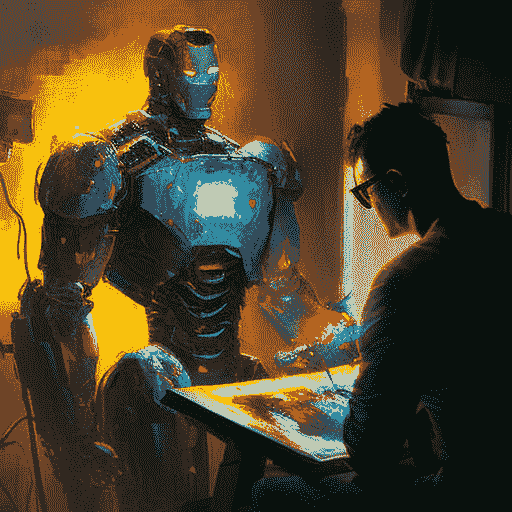

# 人工智能艺术的崛起:艺术家和艺术爱好者的挑战和机遇

> 原文：<https://medium.com/mlearning-ai/the-rise-of-ai-generated-art-challenges-and-opportunities-for-artists-and-art-lovers-alike-146b53c19044?source=collection_archive---------3----------------------->

探索创造力的边界:人工智能生成的艺术

Image by Author via MidJourney using prompt “robot and man painting together”

# **概述**

什么是 AI 生成艺术？

机器学习和深度学习模型等人工智能算法用于创建各种类型的图像、数字绘画和…