# 正则化在线性回归模型中的作用

> 原文：<https://medium.com/mlearning-ai/the-role-of-regularization-in-linear-regression-models-382d4ae64b42?source=collection_archive---------1----------------------->

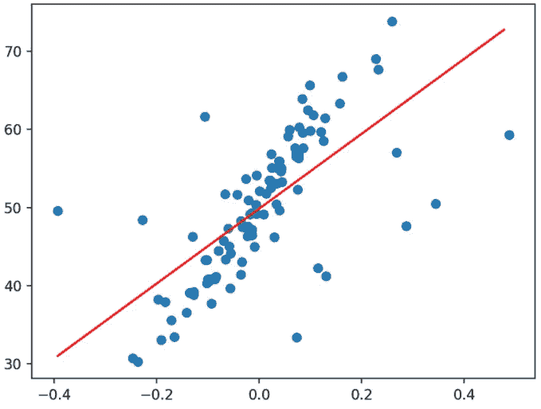

线性回归是最简单的算法之一，当试图建立特征和目标之间的线性关系时，它很方便。

当实现一些学习算法时，考虑成本(或风险)函数以将寻找合适的系数来拟合回归超平面的问题转化为优化问题是非常合理的。

捕捉期望值偏差的成本函数可以定义如下:

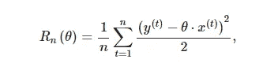

如果你想知道为什么这个成本函数平方并除以 2，答案很简单:“数学上的便利”

让我解释一下为什么会这样:

当我们修正误差时，我们希望惩罚更多的与实际值相差较大的值。另一个重要原因是在以下情况下不会产生负面损失

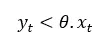

现在，当我们试图寻找成本函数的最小值时，如果我们对问题的封闭形式的解决方案感兴趣:

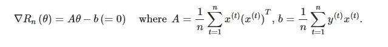

但是……如果我们尝试实现一个学习算法，而不是找到一个封闭形式的解决方案，我们可以在计算上做得更好。

算法非常简单:

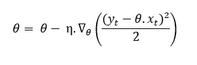

其中系数是学习率参数。

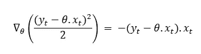

最后:

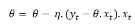

因此，随着算法的每次迭代，每个点都微调参数，并试图达到成本函数的最小值。棒极了对吗？嗯……不完全是。

如果你在机器学习领域工作了一段时间，你可能会在某个时候遇到“过拟合”这个术语，它和“欠拟合”一起困扰着整个机器学习领域。问题很简单:如果我们的数据与训练数据拟合得太好，我们的模型就失去了归纳的能力，我们很可能在测试数据上表现不佳，导致我们过度拟合。

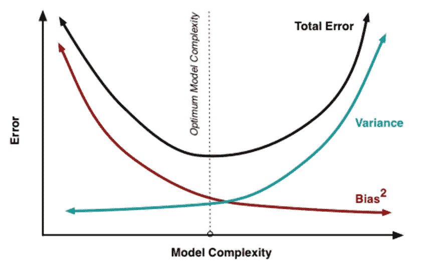

为了避免这一点，我们可以修改成本函数以添加正则化项来实现这一目标，因此修改后的版本将是:

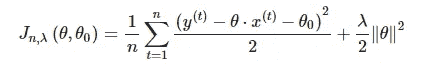

这种类型的正则化称为岭。这个正则化的目标是将 theta 缩小到 0，这样做，如果我们有很好的证据这样做，我们只是改变了太多的 theta。

如果我们应用相同的推理来寻找θ的新的更新规则，我们发现下面的等式。

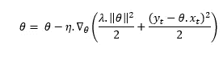

和

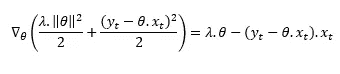

所以我们想出了θ更新的表达式:

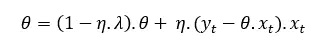

注意，表达式的第二部分和我们之前做的完全一样，但是现在我们有了另一个限制θ的项。太好了！！

结论:当我们试图最大化模型的泛化能力时，添加一个正则项似乎是一个好主意！

但是，要小心！增加一个很大的正则项会导致训练集和测试集的结果很差。

我希望这篇文章有助于更深入地理解线性回归和正则化:

注意:还有其他类型的正规化像套索。

注意:这个想法是非常强大的，并在其他算法中使用。

请评论，如果你有任何话题让我们辩论=)