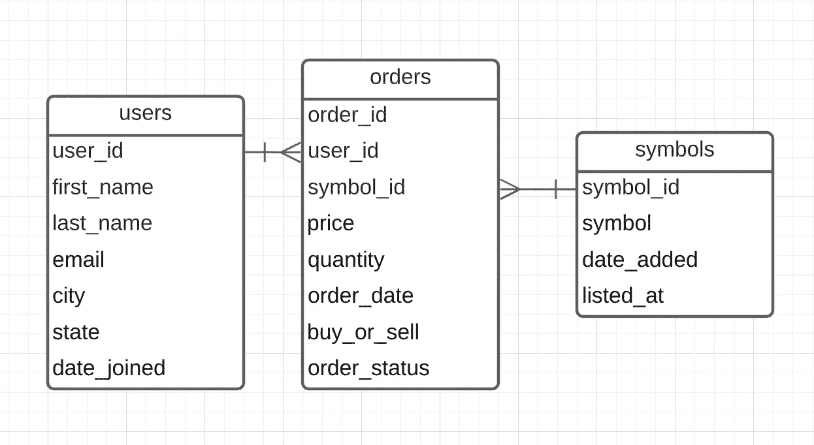
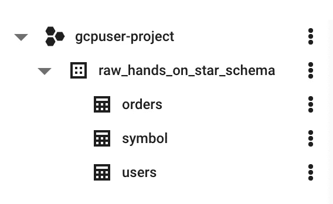
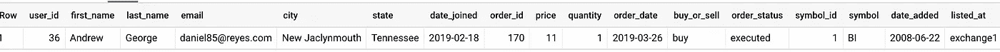
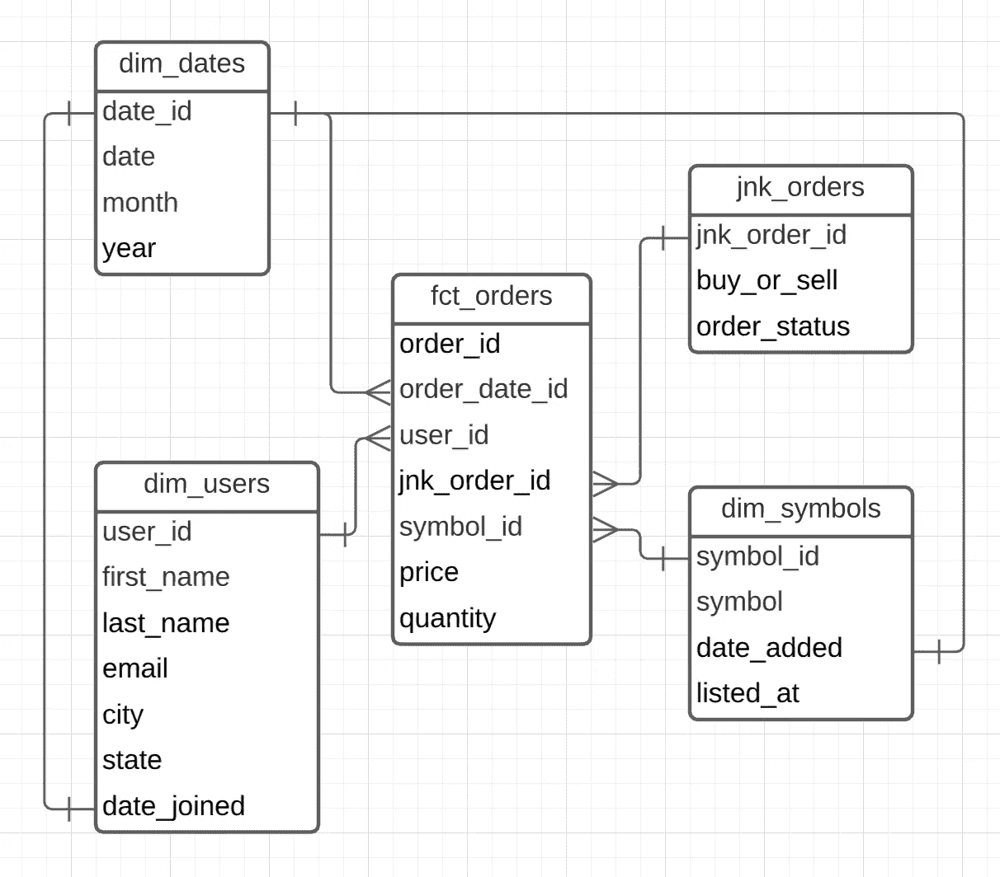
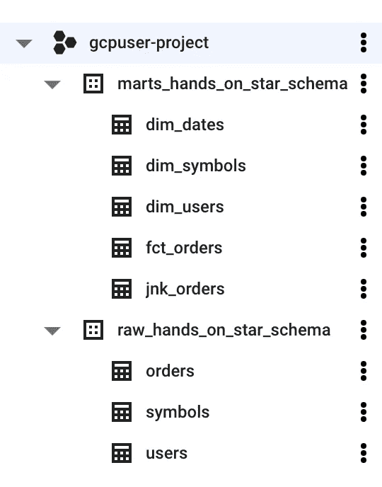
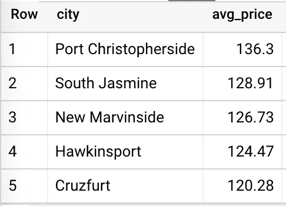
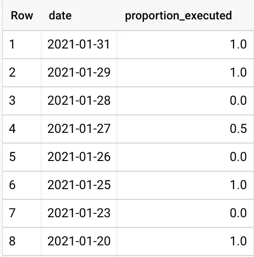

# 星型模式:建模的实践方法

> 原文：<https://medium.com/mlearning-ai/the-star-schema-a-hands-on-approach-to-modeling-fcf9e87edc08?source=collection_archive---------3----------------------->


Photo by [Tim Mossholder](https://unsplash.com/@timmossholder?utm_source=unsplash&utm_medium=referral&utm_content=creditCopyText) on [Unsplash](https://unsplash.com/s/photos/inspiration?utm_source=unsplash&utm_medium=referral&utm_content=creditCopyText)

## 介绍

数据建模是一门艺术。它是分析和工程之间的最终交叉点，在这一点上，您同时考虑性能、可扩展性和可伸缩性，以及可能的业务查询的覆盖范围。

我不会为您的公司选择“正确”的数据模型，但是，我会说有许多数据模型可供选择，每种模型都有自己的优缺点，但最终这种选择取决于 3 个因素:

1.  源数据(您是否有共享一个键的不同平面文件？或者您的数据是否来自规范化的生产数据库表？)
2.  您的分析/数据工程师的技能组合——星型模式涉及的工作比广泛的非规范化表要详细得多。
3.  商业用户。如果他们不采用数据模型，什么都不重要。如果您的数据模型导致长时间运行的查询、不一致的数据，或者对于日常使用来说过于复杂/难以承受，就会发生这种情况。

## 搭建舞台

先说几点。

1.  我们是一家虚构的股票市场交易公司的数据团队成员，该公司需要对其订单数据进行深入分析。在分析了我们的源数据和业务需求之后，团队决定将订单数据建模为星型模式是最佳选择。
2.  我们从后端团队接收数据导出。这种转移的方式并不重要，因为我们将在项目被装载到我们的仓库时开始我们的项目。原始数据将被规范化，由三个表组成——用户、订单和符号。
3.  Google 的 BigQuery 是我们的数据仓库(您可以使用任何列数据仓库或 RDBMS 来跟进)。

**源数据**

我在这里保持事情简单，但是对于任何不熟悉交易世界的人，让我们详细地看一下每张表。

Users —这只是一个为每个用户存储一条记录的表。用户是唯一的，包含一些额外的信息，如城市、州等。

订单—当用户想要进行交易时，他们首先必须下订单。这增加了模型的复杂性，因为订单的状态会随着时间的推移而变化。比如你可能今天下单买 100 股特斯拉，明天取消。

符号—该表存储了我们虚构的贸易公司中所有可交易的符号。在现实世界中，这个表的条目将包括像 Apple、Tesla 等公司。我也包括了一些额外的信息，只是为了有更多的数据。

## *所有数据都是随机生成的，并非基于任何真实情况。用户数据是使用 Python Faker 库创建的，所以虽然看起来这是真实的人的数据，但实际上不是。我将在文章末尾包含用于创建这些表的脚本。

为了帮助可视化表之间的关系，让我们来看一个 ER 图:



ER Diagram for Backend Tables

记住，这不是我们的分析模型。为操作使用而优化的数据建模与用于分析的数据建模非常不同。将前者转化为后者，是数据和分析工程师存在的原因之一。

## 将原始数据加载到 BQ

您可以自由地使用任何数据库系统，但是请记住，像 BigQuery、Redshift 和 Snowflake 这样的云数据仓库不是免费的。如果你想免费跟进，请建立一个开源的 RDBMS，如 PostgreSQL 或 MySQL。不同引擎的方言略有不同，但任何语法问题都可以通过快速的谷歌搜索得到解决。

第一步是确保从我的存储库中获取代表我们的表的三个 CSV 文件(您可以将 repo 克隆到您的本地机器并从那里获取文件)。在数据库中创建相应的表。在我的例子中，我创建了一个 raw_hands_on_star_schema 数据集(BQ 版本的模式),其中包含我的四个表。



Raw Tables in BigQuery

BigQuery 使得通过其 UI 加载数据变得非常容易，但是，如果您使用 PostgreSQL 之类的东西，您可能需要执行一些 CREATE TABLE 和 COPY 命令。以用户表为例，DDL 应该如下所示:

```
CREATE TABLE **users** (
    user_id INTEGER,
    first_name **VARCHAR**(155),
    last_name **VARCHAR**(155),
    email **VARCHAR**(155),
    city **VARCHAR**(155),
    state **VARCHAR**(155),
    date_joined DATE
);
```

虽然复制命令看起来像这样:

```
COPY users
FROM 'path/to/local/file/users.csv'
DELIMITER ','
CSV HEADER;
```

将“path/to/local/file/users.csv”更改为您下载实际文件的目录。这两个命令都可以在 PostgreSQL 中使用，但是如果您使用的是另一个关系数据库，可能需要稍微调整一下。

其余表的 DDL 包含在我的 Github 存储库中的 ddl.sql 文件中。

## 维度设计流程

在这个阶段，我们需要做出四个决定。

1.  选择业务流程。
2.  申报粮食。
3.  确定维度。
4.  辨别事实。

这实际上是教科书式的 Kimball(实际上，转到数据仓库工具包的第 38 页)。

我们项目中的业务流程是用户下的订单。快速浏览一下原始订单表，我们看到两个数字列——价格和数量——从中我们可以生成业务的关键指标。这些将是我们最终事实表中的事实/衡量标准。

既然我们已经清楚地定义了我们的业务流程，我们就可以着手解决这个问题了。Kimball 鼓励瞄准*原子粒度——*给定业务流程捕获数据的最低级别——在我们的情况下，这将在订单级别定义我们的记录。这意味着我们不会试图通过先发制人地猜测他们的问题来限制我们的业务用户，相反，我们会给他们最大量的数据，并允许他们自己探索。

除了粒度，BI 用户采用我们的模型的最重要的贡献者是维度表。请求通常至少有两部分，首先是度量(多少，多少，等等。)，其次是过滤器/描述符(谁，什么，什么时候等等。).我们提供的维度越多，我们的用户通过分割数据能够发现的就越多。

最后，我们转到事实表。事实表有几种不同的类型，但是，选择哪一种并不取决于我们。仔细看看我们的业务流程及其粒度，很明显我们的表是事务性的。每个订单都是在特定时间点只发生一次的事件。

📝其他类型的事实表包括定期快照和无事实表。定期快照是指每一行汇总一段时间内的测量值，累积定期快照是指每一行代表某个业务流程的一个实例(如订单或索赔的生命周期)，无事实表是指没有测量值的表。

## 形成星形模式

开始设计星型模式最简单的方法是将原始表反规格化为一条记录。这将为我们的订单交易提供一个广阔的视野，并帮助我们构建我们的维度。

下面的查询将做到这一点。

```
WITH users AS(
  SELECT *
  FROM `gcpuser-project.raw_hands_on_star_schema.users`
),symbols AS(
  SELECT *
  FROM `gcpuser-project.raw_hands_on_star_schema.symbols`
),orders AS (
  SELECT *
  FROM `gcpuser-project.raw_hands_on_star_schema.orders`
),joined AS (
  SELECT
    u.user_id,
    u.last_name,
    u.email,
    u.city,
    u.state,
    u.date_joined,
    o.order_id,
    o.price,
    o.quantity,
    o.order_date,
    o.buy_or_sell,
    o.order_status,
    s.symbol_id,
    s.symbol,
    s.date_added,
    s.listed_at
  FROM orders AS o LEFT JOIN symbols AS s 
  ON o.symbol_id = s.symbol_id LEFT JOIN users AS u 
  ON o.user_id = u.user_id
)SELECT *
FROM joined 
LIMIT 1
```

太好了！我们现在对订单交易有了一个完整的了解。



Denormalized Query Result

该记录由我们的两个业务事实——价格和数量——以及将用于构建维度表的外键和各种描述符组成。

幸运的是，将原始用户表转换成用户维度表似乎不需要任何更改。符号表也是如此，因此剩下的唯一真正的数据建模就是创建日期和订单维度表。

**日期**

对于日期维度表，有很多方法可以生成一系列过去和未来的日期。这实际上取决于您的数据库使用的方言，但应该看起来非常类似于我下面的内容(同样，我使用的是 BigQuery)。

```
-- dim_datesCREATE TABLE `gcpuser-project.marts_hands_on_star_schema.dim_dates` AS(
  SELECT
    date AS date_id,
    date,
    EXTRACT(MONTH FROM date) AS month,
    EXTRACT(YEAR FROM date) AS year
  FROM UNNEST(
    GENERATE_DATE_ARRAY('2014-01-01', CURRENT_DATE('America/New_York'), INTERVAL 1 DAY)
  ) AS date
```

上面的查询生成一个不同日期的表，从任意日期“2014-01-01”开始到当前日期，间隔一天。因为日期是不同的，所以我选择在 date_id 字段中也使用它们。

此外，该表需要每天重新创建，以包含最近的当前日期。BigQuery 允许我们调度查询，而其他引擎也有类似的功能来帮助自动化作业。或者，我们可以生成很久以后的日期，而不必担心每天更新表。

**垃圾订单**

我们将在原始订单表的基础上构建我们的事实表，但要在删除一些描述性列之后。buy_or_sell 和 order_status 列可用于创建所谓的垃圾维度表，其中的行只是列属性的所有可能组合。还将计算不同组合的散列，并将其用作代理键。

```
-- jnk_ordersCREATE TABLE `gcpuser-project.marts_hands_on_star_schema.jnk_orders` AS (WITH values AS (
  SELECT DISTINCT buy_or_sell, order_status
  FROM `gcpuser-project.raw_hands_on_star_schema.orders`
),apply_surrogate_key AS (
  SELECT
    SHA256(CONCAT(buy_or_sell, order_status)) AS jnk_orders_id,
    buy_or_sell,
    order_status
  FROM values
)SELECT *
FROM apply_surrogate_key
)
```

让我们进一步讨论这个问题。假设我们的 orders 维度表包含事实表中每个 order_id 的 buy_or_sell 和 order_status 值。

我们遇到的第一个问题是冗余。考虑这两列之间可能组合的基数(只有 4 种不同的组合)，这将在我们的维度表中引入相当多的重复数据。

更大的问题是性能。我们的 orders 维度表将以与 orders 事实表相同的速度增长。我们需要尽力避免这样的设计，而是选择相对于事实表增长缓慢的维度表。

这就是垃圾维度表有所帮助的地方。我们用每列所有可能的值填充该表，基于行值的组合创建一个新的代理键，并将这个新键添加到事实表中以供参考。结果是一个不会增长的表，除非底层业务流程发生变化(例如，我们添加了一个新的 order_status，比如‘modified’)。

**用户&符号**

用户和符号维度表可以创建为原始表的一对一副本。这两个表的模式都不需要更改。

**订单事实表**

剩下的工作就是从原始订单表构建一个事实表。这个阶段唯一的主要变化是重新计算 jnk_orders_id 散列，这将允许我们连接到 jnk_orders 维度表。我们将此作为事实表的 DDL 的一部分。

```
-- fct_ordersCREATE TABLE `gcpuser-project.marts_hands_on_star_schema.fct_orders` AS (SELECT
  order_id,
  order_date as order_date_id,
  user_id,
  SHA256(CONCAT(buy_or_sell, order_status)) as jnk_order_id,
  symbol_id,
  price,
  quantity
FROM `gcpuser-project.raw_hands_on_star_schema.orders`
)
```

现在一切都建模完毕，让我们看看我们的星型模式的 ERD。



ERD Star Schema

以及 BigQuery 内部的表结构。



Table Structure in BQ

需要注意的几件事是日期字段的维度表之间的关系。在金博尔模式中，这是一种可接受的设计，称为外伸支架尺寸。

## 分析

我们现在有了一个模型，可以输入到大多数 BI 工具中，并提供给最终用户。

让我们用我们的模型来回答几个假设的问题。

1.  **平均而言，哪些城市的股票交易价格最高？**

```
SELECT
  city,
  ROUND(AVG(price),2) AS avg_price
FROM `gcpuser-project.marts_hands_on_star_schema.fct_orders` AS fLEFT JOIN `gcpuser-project.marts_hands_on_star_schema.dim_users` as u
ON f.user_id = u.user_idGROUP BY city
ORDER BY avg_price DESC
LIMIT 5
```



Results

2.**每天执行的订单比例是多少(相对于取消的)？**

```
SELECT
  date,
  SUM(CASE WHEN order_status = 'executed' THEN 1 ELSE 0 END) /
    COUNT(*) AS proportion_executed
FROM `gcpuser-project.marts_hands_on_star_schema.fct_orders` as fLEFT JOIN `gcpuser-project.marts_hands_on_star_schema.dim_dates` as d
ON f.order_date_id = d.date_idLEFT JOIN `gcpuser-project.marts_hands_on_star_schema.jnk_orders` as o
ON f.jnk_order_id = o.jnk_order_idGROUP BY date
ORDER BY date DESC
```



Results

## 包裹

我希望本文提供了一个实践数据建模的好机会。我认为，让其他人可以访问数据是整个数据领域最大的增值。

和往常一样，请查看文章后面的 [github repo](https://github.com/jduran9987/medium-star-schema-hands-on.git) 。

👋干杯。