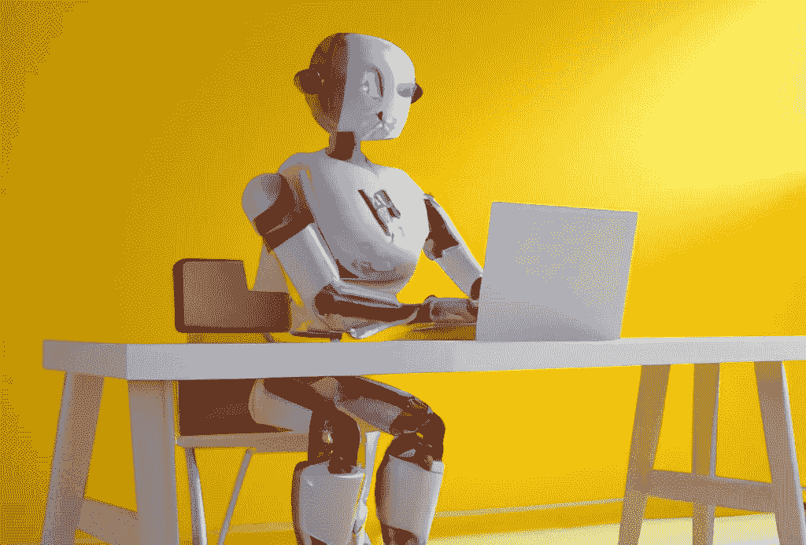

# 检测人工智能生成的内容的状态

> 原文：<https://medium.com/mlearning-ai/the-state-of-detecting-ai-generated-content-2621dbf28067?source=collection_archive---------6----------------------->

人工智能(AI)近年来发展迅速，带来了各种简直神奇的创新。从已经从大数据集学习过的机器生成的看似真实的内容正变得与人类生成的内容几乎无法区分。尽管这种人工智能生成的内容对个人、企业和组织有几个好处，但滥用的可能性令人担忧，学术实验室、公司甚至个人现在都在竞相研究检测方法。本文探讨了检测人工智能生成的内容的当前状态。

# 那么，人工智能生成的内容有哪些类型呢？

最近，有几种人工智能生成的内容受到了关注:

一种类型的人工智能生成的内容是视频(和音频)内容，如 deepfake 视频，这些内容是使用人工智能来操纵或合成语音和面部表情而生成的。[这段巴拉克·欧巴马称唐纳德·川普为“彻头彻尾的笨蛋”的视频是深度伪造视频的一个例子。有了这项技术，任何人都可以在任何时候说任何话。](https://www.youtube.com/watch?v=cQ54GDm1eL0&ab_channel=BuzzFeedVideo)

同样，也有使用人工智能来操纵或合成视觉内容的 deepfake 图像。deepfake 技术的使用允许创建令人信服但完全虚构的图像。

另一种类型是基于文本的内容，如文章、诗歌、散文或社交媒体帖子，它们是使用自然语言处理(NLP)技术创建的。这一类别中最近的是 [ChatGPT](https://openai.com/blog/chatgpt/) ，这是 OpenAI 的一个前沿人工智能聊天机器人，你可以以对话的方式与之互动。ChatGPT 以其令人惊叹的魅力震惊了世界，在推出 5 天内就获得了 100 万注册用户。

> “我们离危险的人工智能不远了”——埃隆·马斯克

合成音频、视频和图像产品看起来相当可怕，但广泛传播且无法检测的合成文字会更糟糕。《连线》杂志的这篇文章解释了为什么人工智能生成的文本是最可怕的深度伪造。因此，本文的其余部分将集中在基于文本的内容上，从检测它们的一些挑战开始。

> "学术界有一些非常严肃的问题需要面对。"——新闻教授丹·吉尔摩[评论](https://www.theguardian.com/technology/2022/dec/04/ai-bot-chatgpt-stuns-academics-with-essay-writing-skills-and-usability)他对 ChatGPT 的评价。

# **检测人工智能生成内容的挑战**

检测人工智能生成的内容的主要挑战之一是很难将它与人类生成的内容区分开来。人工智能算法正变得越来越复杂，可以产生与人类创造的内容几乎无法区分的内容。这使得即使是专家也很难准确识别人工智能生成的内容。

也缺乏检测人工智能生成内容的标准化方法。不同的研究人员和组织正在开发不同的技术和方法，但目前还没有广泛接受的方法来检测人工智能生成的内容。

除了这些挑战，用于创建人工智能生成内容的技术和策略也在不断发展。人工智能生成器现在使用复杂的反抄袭工具和语法检查器来确保短语或句子不被复制，语法结构有序，甚至可以指示它们用 a 编写。这使得它很难领先于那些可能出于恶意目的使用人工智能的人，如传播虚假信息或冒充个人。现在是时候探索用于识别人工智能生成内容的现有方法了。

# **目前检测人工智能生成内容的方法**

目前有两种主要的方法来检测人工智能生成的内容:人类检测和基于机器学习(ML)的检测。人类检测涉及事实检查或专家分析，以识别人工智能生成的内容。虽然这种方法可能是有效的，但是它在可伸缩性方面是有限的，并且对于大量的内容可能是不可行的。

基于 ML 的检测涉及使用算法分析文本、音频或图像数据中的模式，以识别人工智能生成的内容。这种方法具有更大的可伸缩性，但也不是绝对安全的。机器学习算法可能会被愚弄或黑客攻击，如果人工智能生成的内容不符合正在分析的模式，就有可能被遗漏。

像谷歌这样的大公司尚未透露他们是否有有效的系统来检测人工智能生成的内容。然而，我们有像[创意这样的创业公司。AI](https://originality.ai/) 在 2022 年 12 月初推出了第一款 AI 检测工具，声称它对知名 NLP 引擎如 GPT-3、GPT-J 和 GPT-Neo 产生的内容的识别准确率高达 90%以上，据本[报道](https://siliconangle.com/2022/12/16/startup-says-can-reliably-detect-ai-generated-content/)。

Turnitin 的首席执行官 Chris Caren 在[的博客文章](https://www.turnitin.com/blog/ai-writing-the-challenge-and-opportunity-in-front-of-education-now)中写道，教育现在面临的挑战和机遇，并透露他们在过去两年半的时间里一直在研究和创造技术，以识别人工智能辅助写作的签名。他介绍了[Turnitin original](https://www.turnitin.com/products/originality)，“一种调查学生作品真实性的上市产品，可以检测某些形式的人工智能辅助写作，并报告合同作弊的指标”。人工智能书写检测器有望在 2023 年整合到 Turnitin 面向教育工作者的市场产品中。

> “我们拥有可以检测人工智能辅助写作和今天 ChatGPT 等工具生成的人工智能写作的技术。”——克里斯·卡伦，Turnitin 的首席执行官，

现在让我们探讨一下我们已经讨论过的当前方法的一些局限性。

# **检测人工智能生成内容的当前方法的限制和问题**

目前检测人工智能生成内容的方法也有局限性和担忧。人工检测在可扩展性方面是有限的，可能跟不上所产生的内容量。基于机器学习的检测也有其局限性，可能无法准确识别所有人工智能生成的内容。感觉需要做更多的工作，所以对未来有什么展望？

# **检测人工智能生成内容的未来方向**

展望未来，有几个方向可以用来提高检测人工智能生成内容的能力。这包括通过研究人员、行业、组织、教育工作者和政府之间的合作，开发更先进的机器学习技术，建立标准和最佳实践。

# **总结时间**

总之，检测人工智能生成的内容是一个复杂而持续的挑战。虽然目前正在开发一些方法，但仍有一些限制和问题需要解决。解决这个问题对于维护信息的完整性和防止恶意使用人工智能生成的内容非常重要。

所以你走吧，

*如果你觉得这些信息有用，请随意分享，这样其他人就可以看到我们在检测人工智能生成的内容方面的进展。*

*如果您有任何问题或贡献，请随时联系我们！*

在 [Twitter](http://twitter.com/inspiredbash) 或 [LinkedIn](http://linkedin.com/in/anakobe) 上与我联系！

 [## Mlearning.ai 提交建议

### 如何成为 Mlearning.ai 上的作家

medium.com](/mlearning-ai/mlearning-ai-submission-suggestions-b51e2b130bfb)