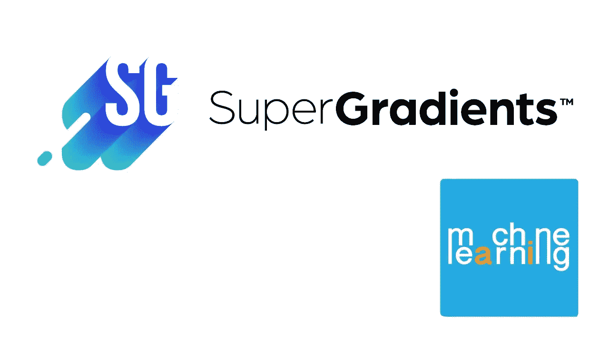

# 超梯度革命

> 原文：<https://medium.com/mlearning-ai/the-supergradient-revolution-520bcd16f4b?source=collection_archive---------5----------------------->

## [机器学习艺术](https://mlearning.substack.com)

这太棒了！你听说过**超梯度**吗？

这个框架的伟大之处在于，它结合了使用 SOTA 模型的易用性和便利性以及产品成熟度的超强能力。两全其美

可以把它看作是一个一站式的全包开源库，它已经预先培养了 SOTA…