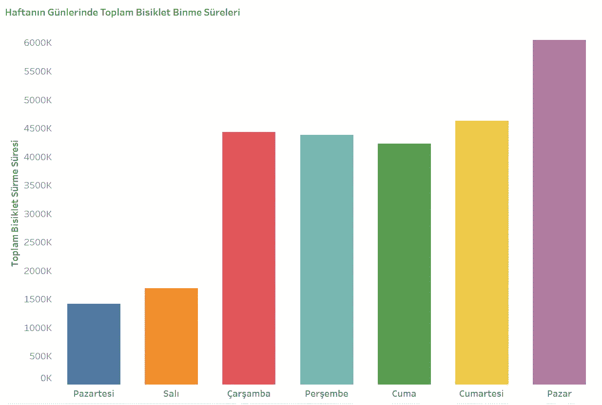
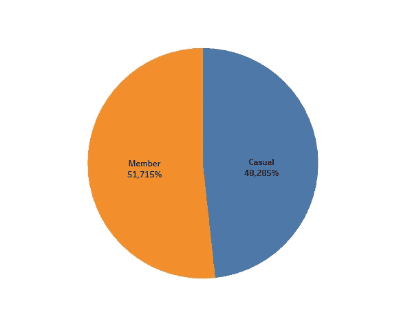
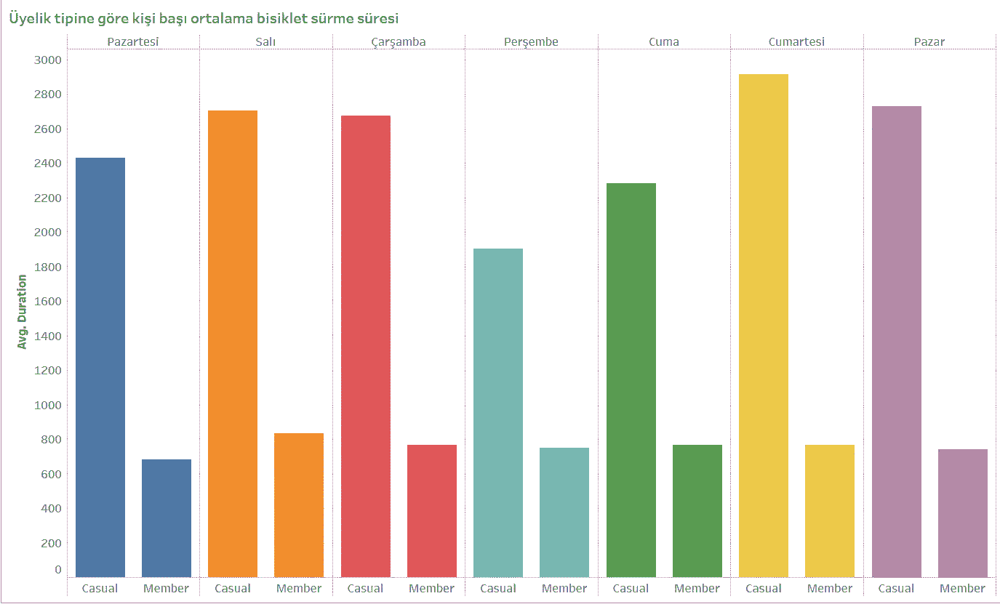
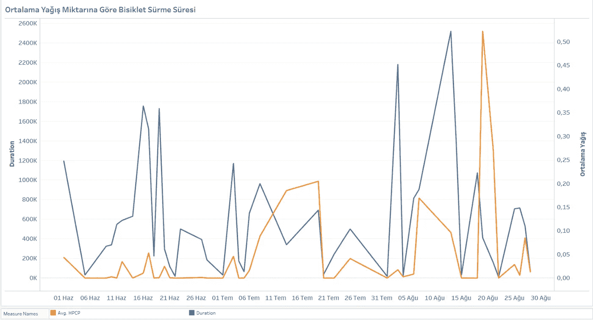

# Tableau 项目:自行车共享和天气可视化

> 原文：<https://medium.com/mlearning-ai/the-tableau-project-bike-sharing-and-weather-visualization-551f235dc31c?source=collection_archive---------1----------------------->

这篇文章是由[阿尔帕斯兰·梅斯里](https://medium.com/u/fe99f0a4a612?source=post_page-----551f235dc31c--------------------------------)和[哈坎·埃尔巴斯](https://medium.com/u/ebbe06a6f0e8?source=post_page-----551f235dc31c--------------------------------)撰写的。

[Photo from Pexels](https://www.pexels.com/photo/two-black-bicycles-beside-gray-frame-glass-window-880467/)

在本文中，我们将向您展示如何使用 Tableau 分析和可视化数据。
我们将根据 2011 年夏季的数据，探索华盛顿州 DC 地区的共享单车数据。特别是，我们将看看天气、星期几和成员类型如何影响使用。
如果你准备好了，让我们开始…
Tableau 是一个超级强大的数据分析和数据可视化工具。它已被各种类型的公司广泛采用，以帮助它们变得更加数据驱动。这是许多数据科学家、业务分析师和经理都可以使用的基本程序。DC 市区有超过 4300 辆社区自行车。

# 数据

您可以在此免费访问自行车共享使用数据。您可以访问关于降水量的数据，我们将在这里免费与自行车常用数据一起解读。
作为 Python 环境中数据清理的结果，我们的数据文件有以下几列:
Duration:它表示旅行时间。
开始日期:出差开始日期。
结束日期:出差结束日期。
会员类型:表示单车用户为注册(年度会员、特别会员、当天特别会员)或访客类型(单次使用、24 小时、3 天、5 天)会员。
HPCP:显示每小时的降水量。
仅 2011 年 6 月、7 月和 8 月，就有大约 120 万条记录。因此，我们将本次研究限制在这三个月内。为了更容易处理持续时间，可以在输入 Tableau 工作表后创建一个计算列。如果你想用分钟而不是秒来工作，时间应该四舍五入到 60。我们用 Python 做了这个。如果你愿意，你也可以在 Excel 或 Google Sheets 中提前做这件事。
我从 NOAA 获得了 2011 年 6 月 1 日至 2011 年 8 月 31 日里根国家机场(DCA)的降水数据。采取必要措施后，当数据可供下载时，NOAA 将向您发送电子邮件。这个过程只需要一分钟。我们已经使用 Python 删除了 csv 文件中除降水和日期之外的所有列。

# 数据可视化和分析

我们制作了几个可视化的工作表，用于检查数据的各个方面。然后我们把它们中的几个合并成一个--控制面板，它变成了一个故事，正如你在这里看到的。由于不可能将表格转移到 medium，我们截图如下。

Graph 1: Cycling Times by Day of the Week

Graph 2: Cycling Amounts by Membership Type

Graph 3: Relationship Between Membership Type, Average Cycling Time, and Days of the Week

Graph 4: Cycling Time by Average Rainfall

在本文中，我们只提供了对这一深层可视化领域的简单介绍。我们所欣赏的 Tableau 程序的高级特性在完整版中可用。其中之一是有机会在网上交互式发布你的图形。如果您愿意，您可以搜索此功能，并打开您自己的图形来访问服务器。我们最新的图表是双轴格式的。一般来说，双轴图在一开始并不能很好地帮助研究人员洞察全局，但是在显示测量单位之间的关系方面，双轴图是非常有用的。在这张最终的图表中，蓝色的线显示了总的循环时间，而橙色的线显示了平均降雨量。

# 分析

在图 4 中，在某些情况下，高降水量导致低利用率。降雨量和骑行时间似乎成反比。

当看骑自行车的数量时，把一天分成几个小时会很有趣。深夜或者凌晨下雨大概对骑行影响不大。我们将在以后的工作中考虑这一分析。
在图表 1 中，令人惊讶的是，与一周中的其他日子相比，夏季的周一和周二的自行车使用量要少得多。这张图表清楚地显示了工作日的使用关系。

图 3 中的数据显示，拥有会员卡的用户比没有会员卡的用户周期短得多，研究人员可能会对此感兴趣。这可以解释为会员大多使用自行车通勤，而非会员司机大多以旅游为目的使用自行车。当然，这个论点的准确性可以通过用更多的数据对这个主题做更多的研究来检验。

在图-2 中，可以观察到成员和非成员的总循环时间几乎相同。然而，图 3 中非会员的平均骑行时间要高得多。这给我们的信息是，会员的骑行量要高得多。

[Photo from Pexels](https://pixabay.com/tr/photos/bisiklet-bulan%c4%b1kl%c4%b1k-arabalar-kent-1836934/)

# 结论

在本文中，使用 Tableau 并结合两个数据集，我们发现了一些关于华盛顿州 DC 共享自行车的有趣信息。Tableau 让数据分析变得快速；只花了几个小时就找到了数据，清理，整理碎片，建立控制面板，写了这篇文章。
除了上面提到的那些，使用 Tableau 的其他功能可以完成更多的分析和项目。我们仅使用 2011 年的数据进行了分析。查看所有年份的数据以了解全局会给我们带来更多有趣的发现。
使用机器学习生成出行预测也会很有趣。Tableau Public 不允许到 python 代码的简单链接，但 Tableau Desktop 允许，它最近跃升至每用户 70 美元。

 [## Mlearning.ai 提交建议

### 如何成为 Mlearning.ai 上的作家

medium.com](/mlearning-ai/mlearning-ai-submission-suggestions-b51e2b130bfb)