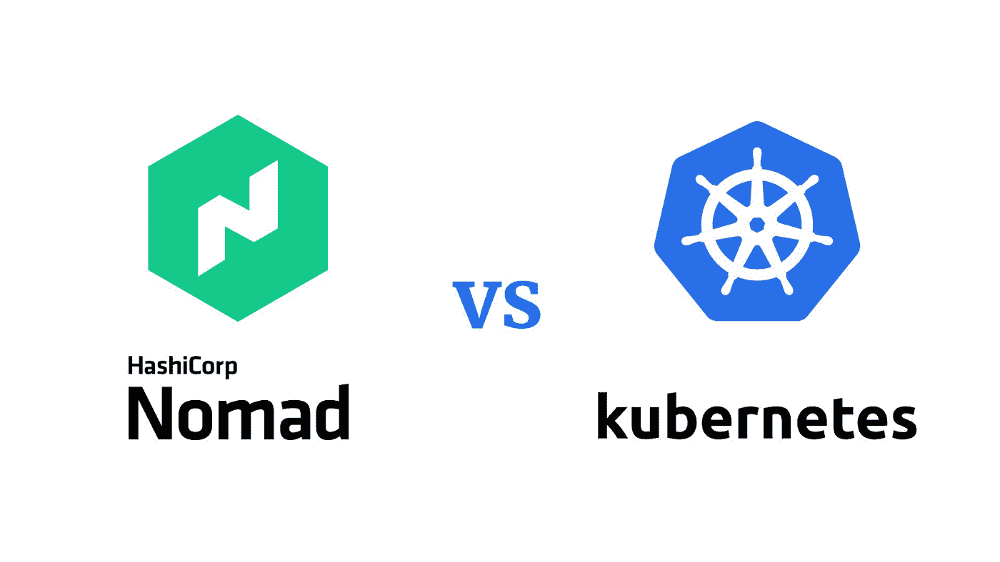
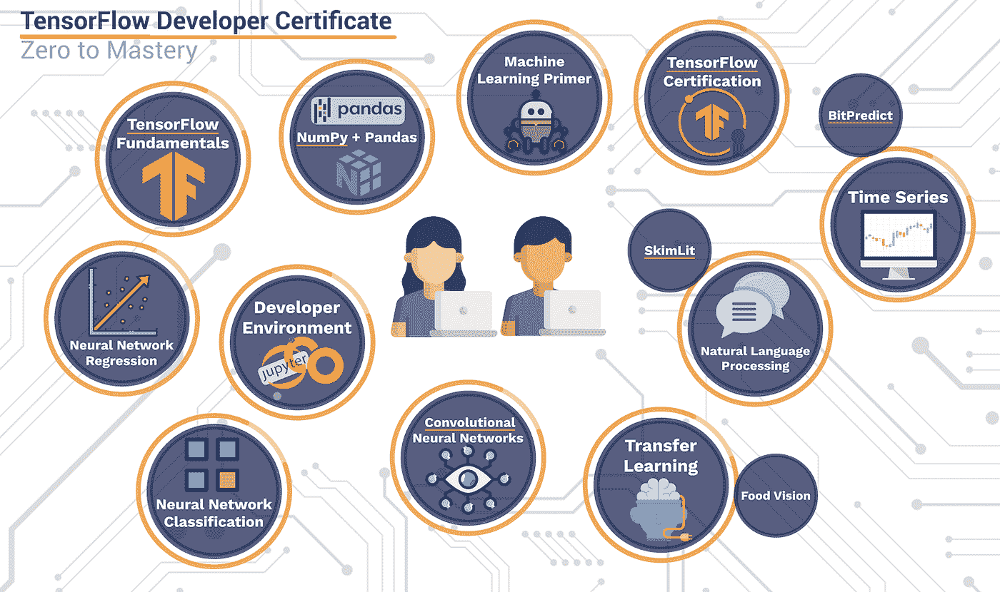

# 未来十年开发人员需要的三大技能

> 原文：<https://medium.com/mlearning-ai/the-top-3-skills-developers-need-for-the-next-decade-8bff8ab4bbd3?source=collection_archive---------4----------------------->

随着我们进入 21 世纪 20 年代中期及以后，我们可以期待看到技术世界的一些重大变化。记住这一点，确保你的开发人员具备在这个快速变化的环境中茁壮成长所需的技能是很重要的。以下是未来十年每个开发人员都应该具备的三项技能。

# 摘要

[**技巧一:快速学习新语言**](https://amzn.to/3TIXVIH)

*   [书籍:快速而深刻的学习。](https://amzn.to/3TIXVIH)
*   其他资源: [Anki app](https://apps.ankiweb.net/) 让你创建免费列表，每天练习。非常适合移动加固。

[**技能二:云计算**](https://amzn.to/3QpiJCw)

*   书籍:[云计算，Devops with Kubernetes](https://amzn.to/3QpiJCw) ，[云安全](https://amzn.to/3QvMemd)，[云成本管理](https://amzn.to/3AM5O7S)
*   资源:[云专家](https://acloudguru.com/)提供了一个练习和学习实用 devops 技能的专用环境。这就是我如何提升到自信地做 DevOps 工作。

[**技能三:AI 和机器学习技能**](https://amzn.to/3Bd5v7i)

*   书籍: [-概率机器学习，其实很好理解的给初学者的 AI 书:)](https://amzn.to/3Bd5v7i)
    - [带 Spark 的 AI 管道，数据湖库](https://amzn.to/3TG8X1A)
    - [带 Tensforflow 的 Python V2](https://amzn.to/3AL4SR7)
*   资源:
    [Coursera 的深度学习](https://www.coursera.org/specializations/deep-learning?utm_source=gg&utm_medium=sem&campaignid=380484307&adgroupid=71799650636&device=c&keyword=coursera%20data%20science%20courses&matchtype=b&network=g&devicemodel=&adpostion=&creativeid=354998379049&hide_mobile_promo=&gclid=Cj0KCQjwmdGYBhDRARIsABmSEePkSRauO9t79V3P2ltRr1u2NeDyHlj5oyuj_BLei1Ed8wRZBgeTsvQaAp7nEALw_wcB)类和机器学习类的课程，入门有用。

# [1。快速学习新语言的能力](https://amzn.to/3TIrsCl)

开发人员可以学习一种编程语言并终生受益的日子已经一去不复返了。如今，新的语言一直在开发，为了跟上最新的趋势，开发人员需要能够快速学习它们。此外，能够快速学习新语言也将使开发人员更容易掌握相关技术，如框架和库。

## [在你掌握基础知识之前不要继续前进](https://amzn.to/3TIXVIH)

学习编程语言时，首先掌握基本概念很重要。一旦你理解了为什么某些东西是端到端工作的，你就可以进入更高级的话题了。然而，如果你试图在没有坚实基础的情况下跳跃前进，你很可能会发现自己迷失了方向，感到沮丧。想要继续学习一门语言的最新和最棒的特性可能很有诱惑力，但是要忍住这种冲动，花时间先理解基础知识。从长远来看，你会很高兴你这样做了。

## [间隔重复测验](https://amzn.to/3TIXVIH)

间隔重复测验是学习和掌握新内容的有效方法。它们的工作原理是将测验间隔分开，这样你就可以在忘记之前复习这些材料。这种间隔可以让你更有效地学习材料，并保持更长的时间。事实证明，SRQs 比传统的测验更有效，对于任何想要学习新的编程语言或工具的人来说，这是一个极好的选择。使用 srq 时，一定要创建涵盖所有需要学习的关键概念的测验。srq 也可以用来评估你对现有内容的理解。通过对你已经知道的材料做一个小测验，你可以衡量你对材料的理解，并找出你知识中的任何差距。这在准备考试或工作面试时尤其有用。无论你是想学习新知识还是评估现有知识，间隔重复测验都是一个很好的方法。

## [开始使用](https://amzn.to/3TIXVIH)

这是一本帮助你建立学习[元技能](https://amzn.to/3TIXVIH)的好书

# [2。云计算技能](https://amzn.to/3QpiJCw)

云计算正在彻底改变企业的运营方式，在未来几年，它只会变得更加无处不在。因此，想要保持领先的开发人员需要提高他们的云计算技能。幸运的是，有大量的资源可以帮助开发人员掌握这项快速发展的技术。

## [云编排](https://amzn.to/3QvMemd)

容器提供了一种打包应用程序及其依赖项的方式，使得它可以在任何地方运行。这意味着没有对存储或网络的本地访问，这些是通过编排工具处理的，如谷歌的 **Kubernetes** 服务(它也负责管理高可用性)。容器平台自动执行在主机上启动容器的任务，包括配置管理；根据客户流量生成率的预期需求模式，结合部署阶段设定的所需弹性措施，在适当的时间安排资源，同时持续监控工作负载大小，以便他们知道何时会因性能提高而出现扩展需求。

Kubernetes 还有其他竞争对手，包括**游牧者**。HashiCorp 的 Nomad 是一款简单灵活的工作负载协调工具，有助于在本地或云等平台上部署、管理和扩展不同类型的工作负载。它提供了来自多个提供商的公共池基础设施——在位置(即本地)和类型方面都是如此；这包括从箱柜到包装容器的所有东西，以提高效率。

## [了解更多！](https://amzn.to/3QpiJCw)

[云计算，Devops with Kubernetes](https://amzn.to/3QpiJCw) 。

## [云网络和安全](https://amzn.to/3AM5O7S)

随着企业越来越多地将数据和应用程序迁移到云中，他们还必须确保这种迁移是安全的。云网络和安全性有助于保护数据和系统免受未经授权的访问，同时还为授权用户提供安全的出入点。为了保护云中的数据，企业必须首先了解云安全的共同责任模型。在这种模式下，云提供商负责保护基础架构，而客户负责保护其数据和应用。这意味着企业必须实施自己的安全措施，如加密和访问控制。他们还必须仔细监控云环境中的活动，并准备好快速应对任何威胁。通过采取这些步骤，企业可以保护他们在云中的数据，并确保他们向云的过渡成功。

## [入门](https://amzn.to/3QvMemd)

但是这个领域很深，我会推荐你继续阅读这个:[云安全](https://amzn.to/3QvMemd)。

## [云成本管理](https://amzn.to/3AM5O7S)

云成本管理是监控、分析和优化云计算费用的过程。这是一种专门针对使用云服务的组织的财务运营(finops)。因为云服务是按使用量收费的，所以对公司来说，密切观察其成本并尽可能降低成本是非常重要的。成本上升可能是由多种因素造成的，包括使用量的突然激增、定价计划的变化或资源利用效率低下。通过持续监控成本并采取积极措施防止浪费支出，finops 团队可以帮助组织控制云预算。

## [开始使用](https://amzn.to/3AM5O7S)

这本书很棒[云成本管理](https://amzn.to/3AM5O7S)。这里还有[其他资源。](https://amzn.to/3THCeZL)

# [3。人工智能和机器学习技能](https://amzn.to/3Bd5v7i)

人工智能(AI)和机器学习是另外两种在商业世界中迅速获得牵引力的技术。随着这些技术变得越来越普遍，对有经验的开发人员的需求将会很大。幸运的是，有许多在线课程和教程可以帮助开发人员开始学习人工智能和机器学习。

## [深度学习:卷积神经网络等](https://amzn.to/3Bd5v7i)

深度学习是机器学习的一个子集，涉及受大脑结构和功能启发的算法。深度学习通常用于指神经网络的使用，神经网络是一组特定的算法。神经网络受到了我们对大脑及其学习方式的理解的启发。

这些算法旨在以类似于大脑的方式进行学习。卷积神经网络(CNN)是一种深度学习算法，在图像识别任务中非常有效。CNN 已经成功地在其他计算机视觉任务中识别人脸、物体和交通标志。

然而，最近，出现了一种转向使用更复杂的模型，如生成敌对网络(GANs)。GANs 由两个神经网络组成:一个生成器网络和一个鉴别器网络。

生成器网络创建看起来逼真的图像，而鉴别器网络试图识别哪些图像是真的，哪些是假的。这两个网络然后相互竞争，导致生成的图像随着时间的推移变得越来越真实。这些更复杂的深度学习模型开始被更频繁地使用，因为它们提供了比传统 CNN 更好的结果。

想真正了解它是如何工作的吗？[这本书实际上让人工智能和深度学习对初学者来说是可以理解的。Udemy 也有一些评价很高的课程可以提供帮助。](https://amzn.to/3Bd5v7i)

## [Python tensor flow 2 实用技巧](https://amzn.to/3AL4SR7)

Python 是一种编程语言，它的许多特性使它非常适合学习人工智能。例如，它有一个庞大而活跃的社区，创建了许多有用的库。此外，Python 相对容易学习，即使对于初学者也是如此。TensorFlow 2 是一个流行的机器学习开源库，可以与 Python 一起使用。它允许开发人员轻松构建复杂的人工智能模型。Python 和 TensorFlow 2 一起提供了你入门学习 AI 所需的一切。

## [开始使用:](https://amzn.to/3AL4SR7)

这里有丰富的资源和深入的例子:[带 Tensforflow V2 的 Python](https://amzn.to/3AL4SR7)

## [了解如何使用 Spark 为人工智能管道建模](https://amzn.to/3TG8X1A)

Spark 对于那些使用 AI 模型管道的人来说是一个必不可少的工具。它允许构建数据湖，这些数据湖是用于训练和测试机器学习模型的所有数据的储存库。Spark 还帮助管理和监控培训过程，确保模型调整正确，性能最佳。此外，Spark 可以用于将经过训练的模型部署到生产环境中。因此，对于任何使用人工智能模型管道的人来说，它都是一个重要的工具。Spark 提供了许多优势，包括易用性、灵活性和可伸缩性。随着越来越多的组织采用人工智能技术，Spark 可能会变得更加重要。

## [**入门**](https://amzn.to/3TG8X1A)

这里有一个伟大的资源开始:[人工智能管道与火花，数据湖](https://amzn.to/3TG8X1A)。

# [今天就为下一个世纪的技能做好准备！](https://amzn.to/3TIXVIH)

技术的世界是不断变化的，如果开发人员想要保持领先，他们需要随之改变。为了做到这一点，他们需要用正确的技能武装自己。在未来十年，我们预测开发者最重要的三项技能将是快速学习新语言的能力、[云计算技能](https://amzn.to/3TIXVIH)和[AI/机器学习技能](https://amzn.to/3TG8X1A)。

如果你喜欢这篇文章，请给它一个赞并订阅！

 [## Mlearning.ai 提交建议

### 如何成为 Mlearning.ai 上的作家

medium.com](/mlearning-ai/mlearning-ai-submission-suggestions-b51e2b130bfb)