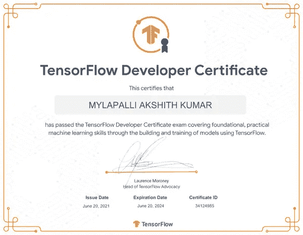
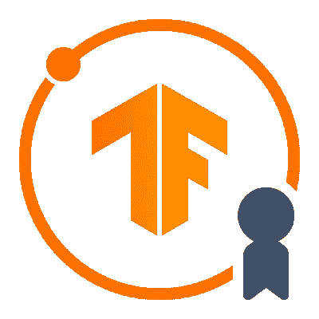

# 从 TensorFlow 用户到 TensorFlow 开发者的转变

> 原文：<https://medium.com/mlearning-ai/the-transformation-from-tensorflow-user-to-tensorflow-developer-1605a5f84fa3?source=collection_archive---------6----------------------->

我的开发者证书背后的完整故事。

我收到了我的 **TensorFlow 开发者证书！！**

最初，当我开始从事机器学习项目时，我觉得在相关问题上学习和实现那些算法很酷。但是当涉及到神经网络时，由于神经网络主题的庞大，很难实现它们的解决方案。所以，我开始使用 TensorFlow，它腾出时间来抓取 API 中的东西。我听说如果你看到事情很复杂，那就从简单的开始。我做了同样的事情，从基本语法开始，了解了更多关于 API 的知识。我相信通过网络平台学习新东西会容易得多。

准备参加这次考试花了我大约两个月的时间。我将在这里分享这两个月的经历。参加这个考试对我来说是一次很棒的经历，通过他们的社区，我从用户变成了开发者。

第一步:浏览候选人手册 [TensorFlow 开发者](https://www.tensorflow.org/certificate)。

接下来开始在技能清单中安排考试模式。

我为考试 [TensorFlow 开发者备考](https://www.notion.so/TensorFlow-Developer-Preparation-65aa437d69c0477381cce9051a7e8680)制定了时间表计划。点击复制图标以访问您自己的。

最初，我通过 [codebasics](https://www.youtube.com/playlist?list=PLeo1K3hjS3uu7CxAacxVndI4bE_o3BDtO) 开始复习概念，我强烈推荐这本书，因为它是数据科学概念的基础和视觉享受。最重要的是，这个考试与 Coursera 提供的深度学习有关。AI TensorFlow 开发人员课程，请开始学习该课程。

这次考试的强制作业是练习，所以不要只是完成课程。而是拿一些数据去探索，用 TensorFlow API 工作。

一旦一切准备就绪，就可以开始考试了，抱歉，还有一件事要提一下，考试是在 Pycharm IDE 上进行的。所以一定要熟悉 Pycharm，为考试做好准备。甚至我最初也不熟悉 Pycharm，所以花了一周时间来熟悉它。

我在 6 月 20 日参加了我的考试，并在最后提交的下一分钟收到了你已经通过考试的消息。因此，在考试环境中，您将在五个小时内回答五个问题，每个问题满分为 5 分。您必须在 Pycharm 上运行模型，并提交这些模型权重来测试您的模型，在那里您将看到每个模型提交的分数，最棒的是我们可以根据需要多次提交模型。在规定的时间内完成后，点击结束按钮进行最终提交。

感谢阅读！！祝你考试顺利。