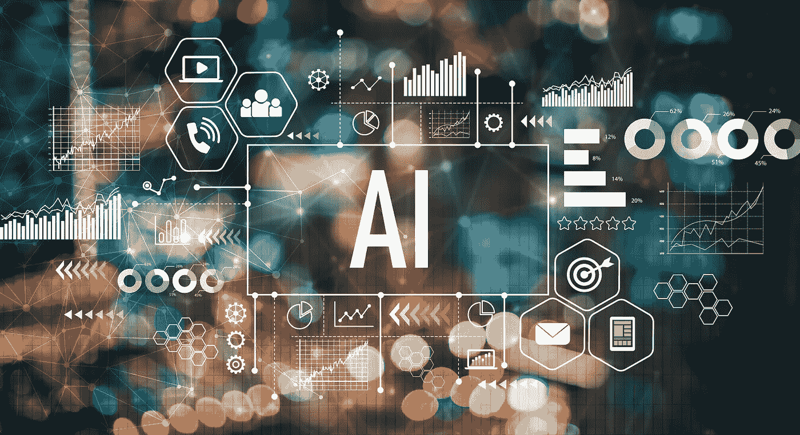
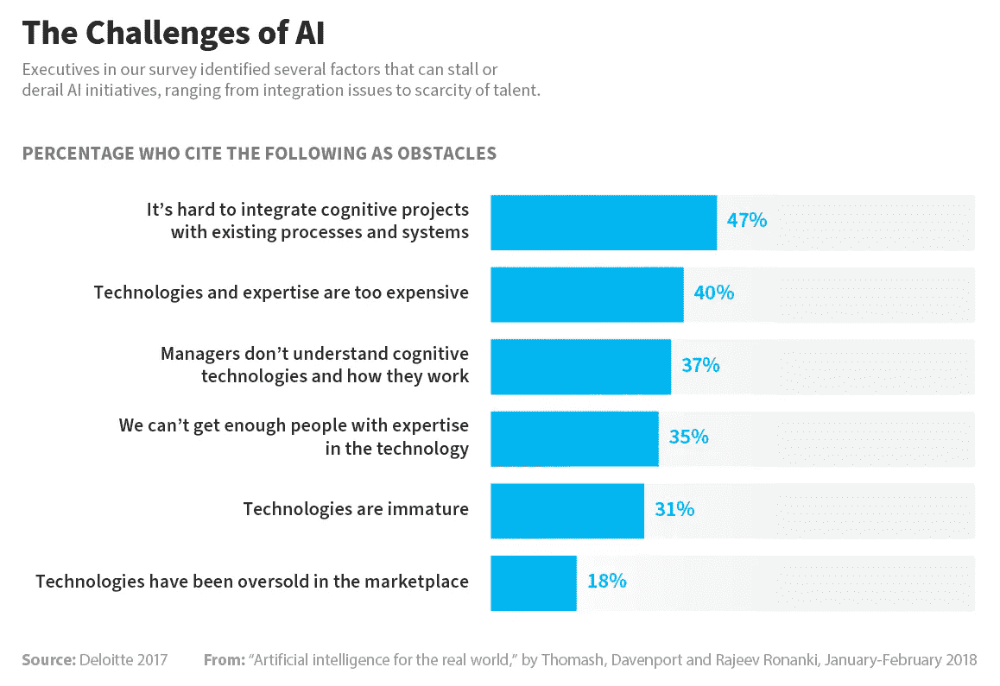

# 人工智能对商业的变革性影响

> 原文：<https://medium.com/mlearning-ai/the-transformational-impact-of-ai-on-business-9d979b0da997?source=collection_archive---------3----------------------->

## 我们习惯于认为人工智能(AI)是坏人。过去半个世纪的电影和书籍几乎总是将人工智能描绘成最终机器战争和科幻反乌托邦的先驱。然而，在过去的十年里，这种定性开始发生变化。

今天，人工智能已经成为我们生活中的一个普通工具。虽然它的使用仍处于初级阶段，但像亚马逊 Echo 和谷歌 Home 这样的智能设备正变得越来越熟悉。

从商业角度来看，人工智能也在产生影响。虽然人工智能将如何影响就业市场中的个人仍有一些不确定性，但对机器人统治的恐惧不再存在。在商业领域，人工智能正在世界各地的每个行业和部门发挥作用。

# 什么是人工智能

关于人工智能是什么，有很多不同的误解。算法是一种计算机程序，它提供清晰的、一步一步的指令来执行一项有明确起点和终点的任务。人工智能系统是使用多种不同的算法配对创建的。对 AI 最简单的解释是，它是一种模拟人类分析和学习信息并提出问题解决方案的能力的计算机算法。

# 商业人工智能

人工智能仍然只是处于采用的形成阶段，它的能力仍在开发和创造中。然而，它已经展示的成功让商业领袖们相当兴奋。随着技术变得更加强大，许多高管都在积极评估人工智能系统将为他们的组织带来的好处。

人工智能仍然处于难以置信的早期发展和实施阶段。理解人工智能最终将演变成什么是困难的，但是，有可能看到人工智能如何在这些领域为企业带来好处:

# 营销

人工智能可以查看行业趋势和数据，并帮助向公司提供营销策略。人工智能系统已经根据位置和兴趣定位广告，这一趋势还在不断增长。人工智能还可以与聊天机器人配对，根据客户的要求提供产品和服务的实时信息。

# 销售

虽然人工智能系统还不具备人类的“口才”，但它们确实可以访问信息和数据。人工智能系统有助于提高企业内部的销售，不仅可以改善预测，还可以帮助改善沟通，更好地确定客户需求。

# 研究与开发

全球可用和可访问的数据量正以天文数字的速度增长。这些信息虽然人类无法处理，但却非常适合人工智能。人工智能系统可以解析大数据，以寻找不太明显的模式和趋势。这种能力让人工智能系统找到我们无法立即发现的解决方案。

# IT 运营

人工智能是帮助组织实现其 IT 功能的理想选择。随着对业务至关重要的物联网设备和系统监控警报数量的不断增加，人类根本无法监控或跟踪一切。AI 不仅可以解析所有数据，还可以确定哪些问题需要解决，并主动解决其中一些问题，只将升级的问题留给 IT 团队。

# 人力资源、会计、财务

虽然人工智能不会取代所有的人力资源职能，但它可以在招聘和雇用职能中发挥关键作用。在当前的就业市场中，许多职位都充斥着简历，从人才库中选择合适的候选人可能非常耗时。由于简历都是数字化的，它们可以很容易地存储在 ATS(申请人跟踪系统)中。这让人工智能根据简单的关键字算法和权重剔除不适合角色的人，这对人力资源团队至关重要。

人工智能对商业的许多其他领域也有好处。在会计和金融领域，人工智能可以承担不需要专业技能或知识的更简单的任务。去除这些重复性的任务在很多方面都有好处，除了节省时间，还有助于提高士气。

# 联络中心和客户体验

在联络中心方面，人工智能系统可以帮助根据数量预测合适的资源和所需的总体人员配置。它可以比这更进一步，因为人工智能系统也可以帮助改善客户体验。人工智能系统非常适合使用聊天机器人和其他类似的解决方案来提高响应速度和提供的信息。此外，许多企业开始意识到，客户忠诚度不是通过服务自动获得的。相反，客户想要的是一种出门就能买到的产品或服务，而不需要打服务电话。这就是人工智能解决方案可以发挥作用的地方——不仅在初始阶段提供帮助，还可以主动识别未来的问题，这样客户就不需要再打电话了。

# 设施维护

像楼宇自动化这样的工具对楼宇管理人员来说是一个巨大的好处。这些系统会自动计算工作人数，并适当地自我调节资源。这极大地提高了整体效率，也有助于提高安全性。

# 制造业

及时库存控制是沃尔玛等公司成功的标志。使用预测智能，制造组织可以确保将浪费保持在最低水平，同时将库存供应保持在准确的数量。

# 结论——人工智能的挑战

人工智能在许多不同的行业都有巨大的潜力。当前的人工智能解决方案主要可以分为三种不同的方式

业务流程自动化

客户服务和客户体验解决方案

数据分析

虽然迄今为止人工智能已经取得了许多小的成功，但重要的是要承认，在某些情况下，它并没有实现其设计者预期的愿景。

企业已经意识到，这与其说是一场短跑，不如说是一场马拉松。例如，最初客户服务行业的许多人认为人工智能解决方案会取代他们，他们会失去工作。数据显示，事实并非如此。AI 仍在部署中，但不是作为人员的替代，而是作为支持人员的合作伙伴。支持团队现在使用人工智能解决方案来处理简单、重复的任务，让熟练的员工有时间专注于更复杂的问题。

人工智能解决方案不是简单地购买“现成的”，而是需要围绕商业和行业的需求进行定制设计和构建。与 NIX 这样的外包商合作在这一领域至关重要，因为除非你的团队拥有正确的数据科学或分析技能，否则你只是在浪费时间。NIX 曾参与多个人工智能项目，并拥有可用的技能和知识来指导您实施将为您和您的公司工作的解决方案。请联系我们，了解我们如何提供帮助。