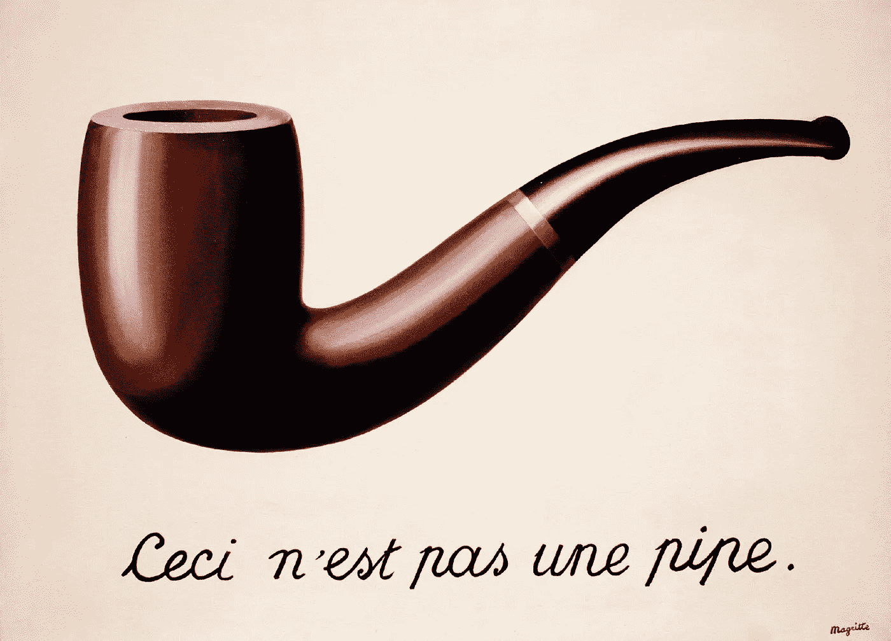
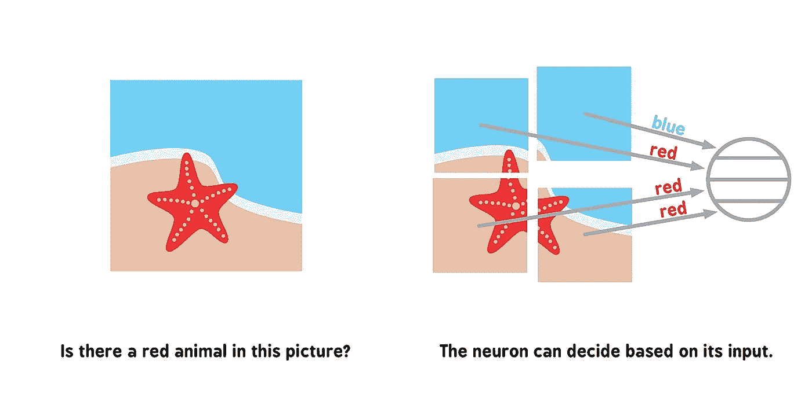

# 图像的背叛

> 原文：<https://medium.com/mlearning-ai/the-treachery-of-images-or-what-even-is-synthetic-data-c3000201599b?source=collection_archive---------5----------------------->

## *或者，*究竟什么是合成数据？

圣诞节时，我给女儿买了一本*婴儿神经网络*。我觉得这很有趣、可爱，但也很实用，因为我在[的日常工作是计算机视觉技术，有时我觉得自己像一个 9 个月大的孩子一样掌握了一切。最终，我对这本书没有解释神经网络是如何训练的感到失望。但是当一本书的第一页是“这是一个球”时，这可能是一个不公平的期望。](https://www.zumolabs.ai/?utm_source=medium&utm_medium=social&utm_campaign=unepipe)

因为我不得不学习如何解释这个过程(用一种连我都能理解的方式)，我想我应该分享一下。当我这么做的时候，我还会解释合成训练数据到底是什么，以及为什么或者什么时候你可能会想要使用它。*免责声明:* *我不是机器学习工程师，也不是数据科学家，甚至不是“传统意义上的智能”，所以请理解这可能是不完美的，也肯定是不完整的。*

勒内·马格里特最著名的作品是*图像的背叛*。这是一幅烟斗的画，下面有一个标题写着“颜后君不是烟斗”，或者“这不是烟斗”这件超现实主义的作品引起了人们的愤怒，他们认为，实际上，伙计，在我看来这就像一个烟斗。马格里特，一个超越时代的巨魔，为自己辩护说:“人们为此责备我！但是，你能塞住我的烟斗吗？不，这只是一个表象，不是吗？所以如果我在照片上写‘这是一根管子’，那我就是在撒谎！”

这个故事说明了人类计算机——我们古老的大脑——是如何处理信息的。如果你有视力，你瞥一眼某样东西，将它与你以前见过的东西的数据库(及其附带的标签)进行比较，并了解你到底在看什么。这一切都发生在一瞬间，这就是我们看到管子时能够认出它的原因。

但与人类不同，计算机不会随着它们的增长而有机地积累一个标记参考图像的数据库。如果你希望计算机能够执行物体检测任务，比如识别图像中物体的位置，或者预测物体的名称，你首先需要教会计算机这些东西看起来像什么，它们叫什么。

这是我将巧妙地掩饰深度学习部分的地方。可以说，不再需要构建自己的对象检测模型。有许多不同的公开可用的算法可以完成这项任务:例如，令人兴奋的缩写如 SSD、R-CNN 和 YOLO。所有这些都被耐心地解释给我听，我现在充其量也就有了一个*婴儿神经网络*对每一个的理解。

但是它们有效。为了让他们发挥作用，他们首先需要接受数据培训。在某些情况下，您可以找到已经在公开可用的数据集(如 ImageNet)上训练过的模型(ResNet-101 或 MobileNet)。这个流行的数据集有超过一百万张图像，可以教会模型大约 1000 个对象类别。但是，如果你试图使用计算机视觉来解决一个特定的问题，并识别特定的东西，那么很可能你必须自己训练这个模型。为此，您需要一个自定义数据集。

您知道 ImageNet 数据集中不包含什么对象吗？一根管子。如果您想要构建一个管道检测器，并且必须训练您的模型来识别管道，您将需要一个充满管道图像的数据集。当你找不到满足你需求的现有数据集时，你大概有三个选择:拼凑、制作或伪造。

拼凑一个数据集就像它听起来的那样。你在 Flickr 或谷歌图片搜索中寻找你需要的图片。往好里说，这很耗时，往坏里说，当你考虑形象权甚至肖像权时，这在伦理上是模糊的。(你最好希望那里不会有一个伊利诺伊州人。)虽然您可以通过这种方式获得一系列图像，但最终的数据集是否符合您的目的则完全是另一个问题。

一些雄心勃勃的团队可能会选择在内部开发他们的数据集。对于管道来说，这相对容易。买个烟斗，拍一大堆照片。等等，实际上，你需要买一堆管子，否则计算机只能识别一个特定的管子。你可能需要在不同的环境和背景下拍摄这些管子的照片，在手上，挂在嘴上，等等。以免计算机认为管道只能存在于桌子上。好吧，看，这就是为什么人们刮他们的数据集。

但是等等，为什么不造假呢？人类可以区分实际的管道和管道的图像——就像，我们得到了马格里特！—但是计算机只会处理图像。这意味着计算机并不真正知道或关心该图像是您拍摄的真实照片还是您使用 CGI 生成的静止图像。这种为给定的计算机视觉问题定制 3D 模型并生成的训练数据被称为合成数据。

听着，我知道这么说是我的工作，但是合成数据有很多好处。它是灵活而丰富的。它解决了数据稀缺的问题，这是一个有趣的情况，你试图检测的东西的图片非常难以获得。不存在隐私问题，因为在合成数据集中没有真实的人。你也不需要煞费苦心地(或者更有可能的是，花钱请别人)给你从谷歌搜集来的图像贴上标签，因为合成图像一开始就用你想要的标签生成了。(实际上，我之前已经写过关于标签数据的缺点的文章。)

同样，再一次，计算机不在乎你给它吃的是不可能的汉堡，相当于汉堡包。计算机只需要学习管道的特征和上下文，这样它就可以在未来看到管道时识别它们。合成数据在这方面非常有用。虽然你*可以*专门在合成数据上训练，但目前的研究表明，最好的模型性能实际上来自混合方法(同时使用原始图像和合成图像)。顺便说一句，这就是我们学习的方式，对吗？我的女儿现在可以说球了(爸爸吹牛)，我不得不相信她能够识别真正的球和插图球是因为她在这两方面都受过训练。

至于马格里特，尽管他对此很挑剔，但我认为他是对的。这不是烟斗。这只是合成数据。

This is not a pipe either.

如果你想了解更多关于计算机视觉的知识，我为 Zumo 实验室写了一份名为 *The Juice* 的每周时事通讯。[在这里报名](https://www.zumolabs.ai/thejuice?utm_source=medium&utm_medium=social&utm_campaign=unepipe)。