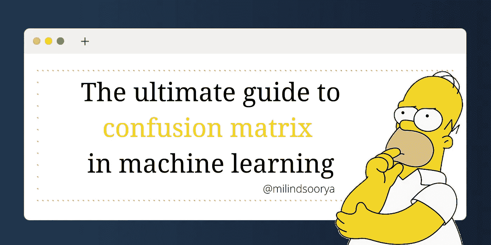

# 机器学习中混淆矩阵的最终指南

> 原文：<https://medium.com/mlearning-ai/the-ultimate-guide-to-confusion-matrix-in-machine-learning-1cd9b8686125?source=collection_archive---------5----------------------->

# 介绍

是的，混淆矩阵真的很混乱(没有双关语的意思)。在这篇文章中，我将回顾机器学习中的一些非常重要的术语，如准确度、精确度和召回率。我还将回答一些与混淆矩阵和准确度分数相关的常见问题，例如-