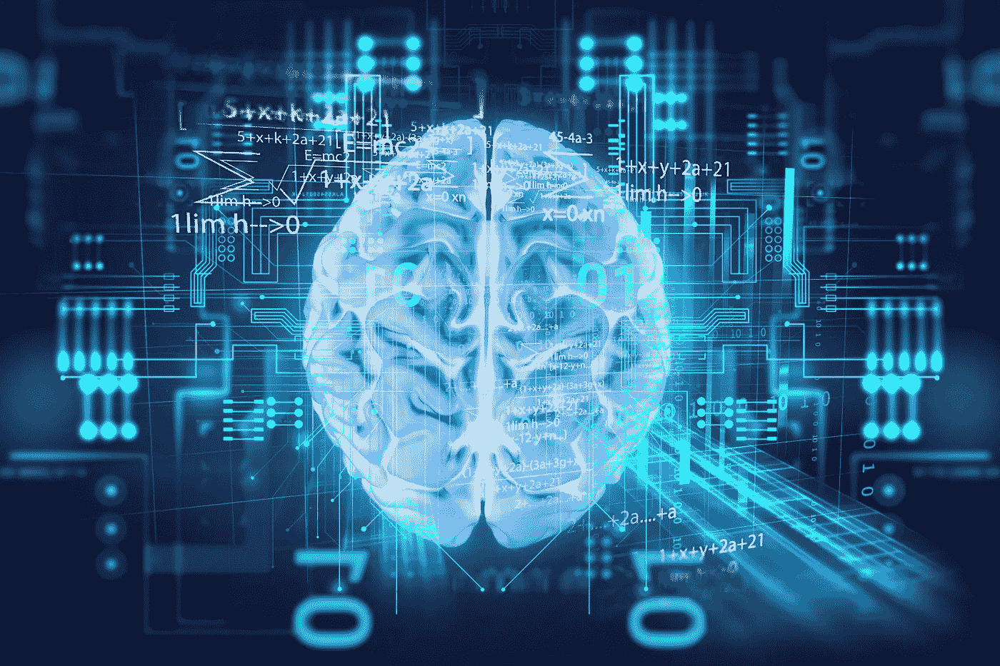

# 神秘的艺术家

> 原文：<https://medium.com/mlearning-ai/the-uncanny-artist-22d8bbe61129?source=collection_archive---------8----------------------->

## 创造力|技术

## 深度学习时代的人类创造力…

Photo by [Monsit](https://depositphotos.com/portfolio-10325396.html) on [Depositphotos](https://depositphotos.com)

“如果你不爱一个孩子，你能让他走得多远，这真令人惊讶。”

如今，机器学习无处不在，而且在大多数情况下，它几乎是无形的。从流媒体应用程序决定哪些节目，到建议我们狂欢，再到信用卡公司监控我们的…