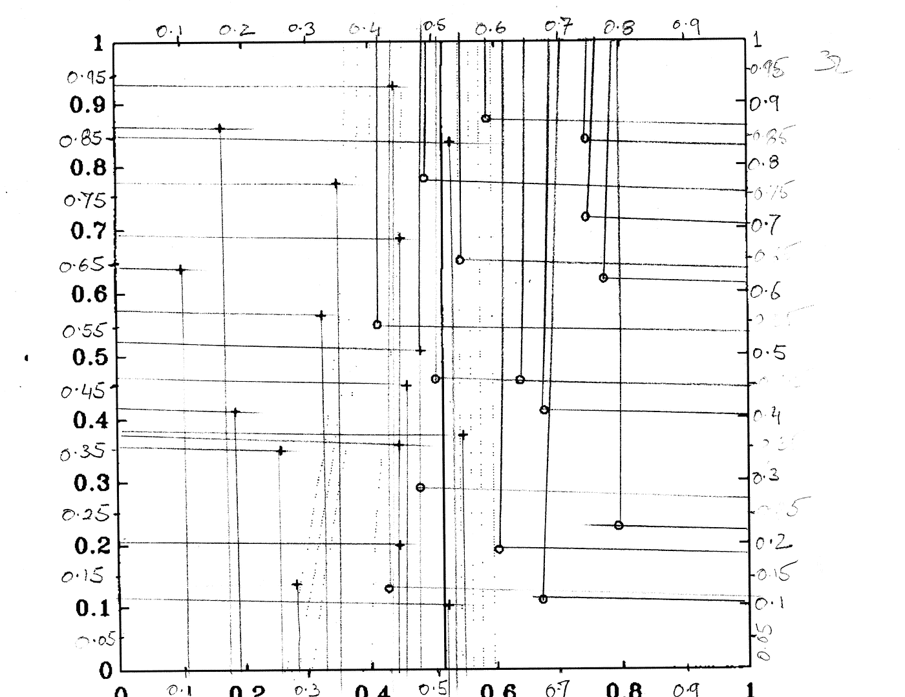
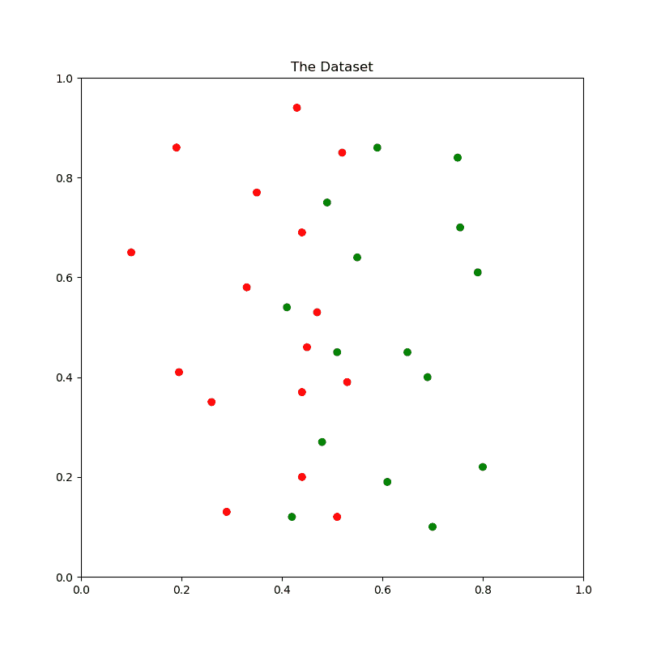
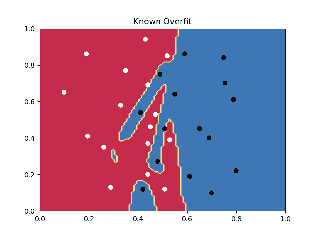
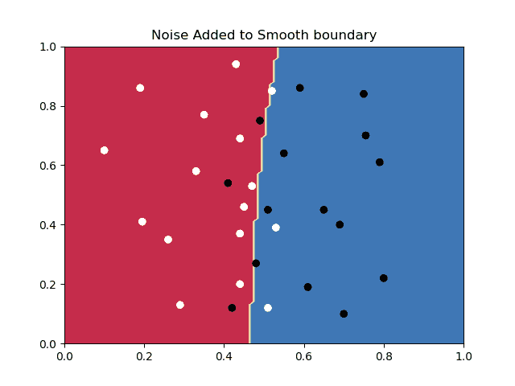
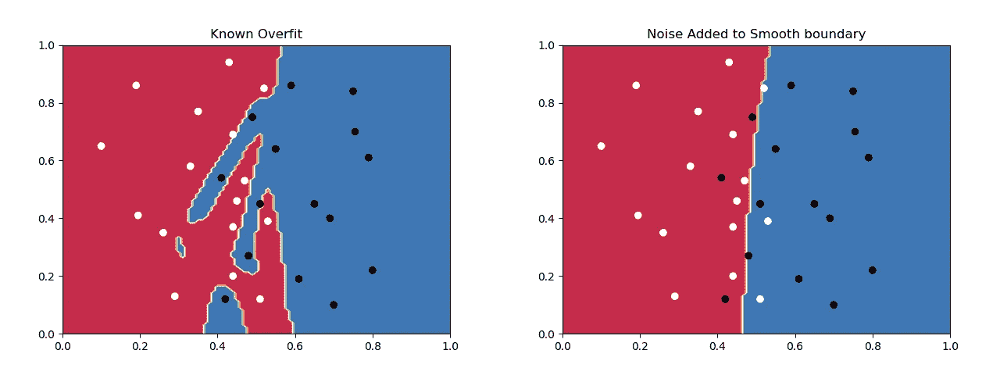

# 抖动训练的不合理效果(例如，如何减少过度拟合)

> 原文：<https://medium.com/mlearning-ai/the-unreasonable-effectiveness-of-training-with-jitter-i-e-how-to-reduce-overfitting-2aaefc3cbfa9?source=collection_archive---------7----------------------->

在许多情况下，我们从一个小数据集学习，一个过度拟合的模型是一个可能的结果。我们的意思是，该模型可能在训练数据上表现良好，但不能很好地推广到测试数据。

在这篇文章中，我们强调了一个简单而有效的方法来减少过度拟合。对于没有耐心的人，[请直接进入代码](https://github.com/aurotripathy/training-with-noise-reduces-overfitting)。

## 数据集

我们的数据集只有 31 个二维点，平均分布在两个类中。我在拉塞尔·里德的开创性著作《T4 神经锻造》(第 282 页)中偶然发现了这个数据集。据我所知，互联网上没有这些数据，所以我不得不手工重新创建(用尺子和铅笔工作很有趣)。请看下面我的作品。这两个类别由“+”和“o”符号表示。



从模拟域(纸张)到数字域(文件)的转换给了我们分布在两个类中的 31 个点。



# 模型

该模型是一个非常简单的 2/50/10/1 多层感知器(MLP)网络，与 Russell Reed 的书中使用的相同。注意，我已经(无意中)切换了隐藏层；到`2/10/50/1`而不是`2/50/10/1`，这可能是决策边界看起来与书中相似的原因。

该模型如下图所示。

# 被训练成故意过度适应

按照 Russell Reed 的说法，“拥有 671 个权重，但只有 31 个训练点，网络的约束非常不足，选择了一个非常非线性的边界”。事实确实如此，正如你在下面看到的。



# 抖动平滑

根据这本书，“使用抖动数据进行训练会阻止训练点附近响应的急剧变化，从而阻止网络出现过于复杂的边界。”按照书中的指导，我们不改变任何训练超参数，除了在训练期间，我们在将数据输入网络时抖动数据。

抖动输入的功能如下所示。

我们注意到，对于相同的时期数和相同的批量大小(实际上，相同的超参数)，训练机制无法在贫乏的数据集上过度拟合(无论我们如何努力)。



# 摘要

总而言之，通过向输入数据添加少量抖动，我们从左侧的有意过拟合情形转向了右侧的更一般情形。



# 代码，重复我的结果，和进一步的实验

代码 [repo](https://github.com/aurotripathy/training-with-noise-reduces-overfitting) 有两个脚本，classify.py 和 utils.py。默认模式是简单地在小数据集上训练一个分类器，故意过度拟合(输入数据中没有抖动)。

```
python3 classify.py
```

训练产生决策边界图`Known-Overfit.png`。

要抖动输入，请键入:

```
python3 classify.py  --jitter
```

抖动训练产生了判定边界图`Noise-Added-to-Smooth-boundary.png`。

# 参考

*神经锻造:前馈人工神经网络中的监督学习(Bradford 图书)图解版，*Russell Reed 著

[](/mlearning-ai/mlearning-ai-submission-suggestions-b51e2b130bfb) [## Mlearning.ai 提交建议

### 如何成为 Mlearning.ai 上的作家

medium.com](/mlearning-ai/mlearning-ai-submission-suggestions-b51e2b130bfb)