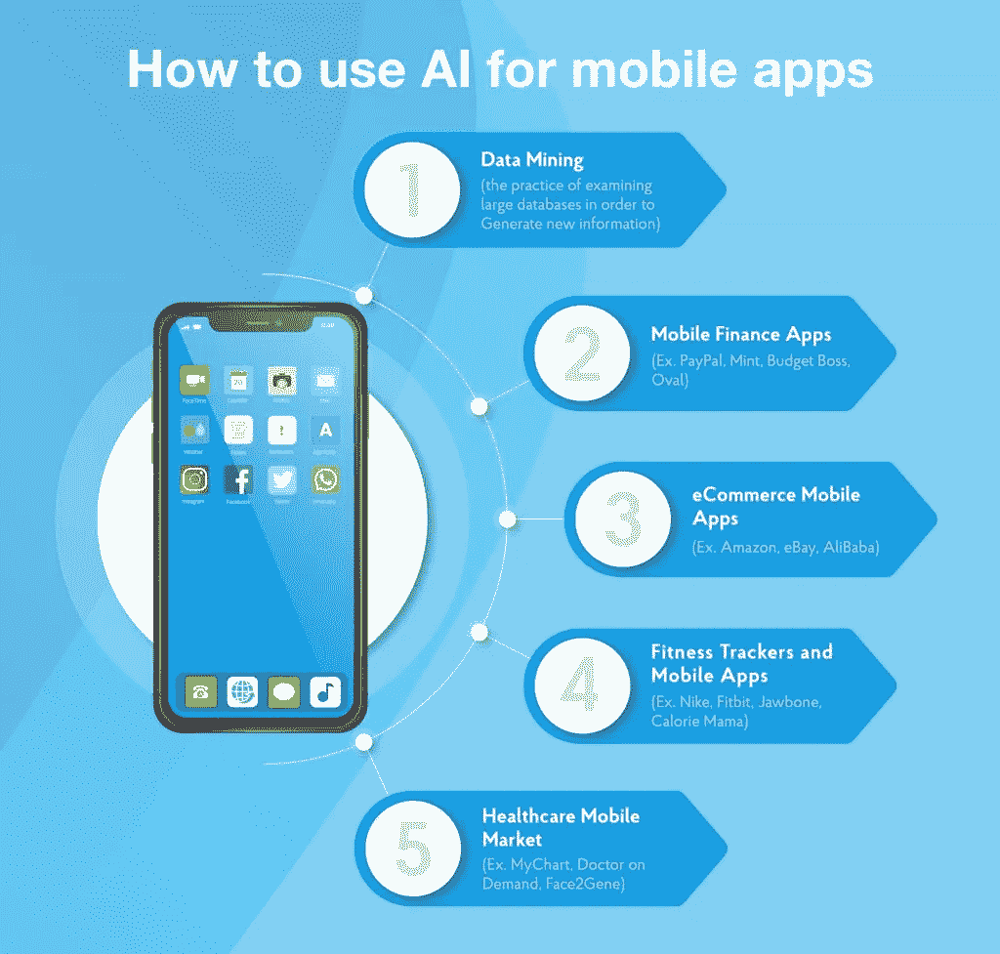
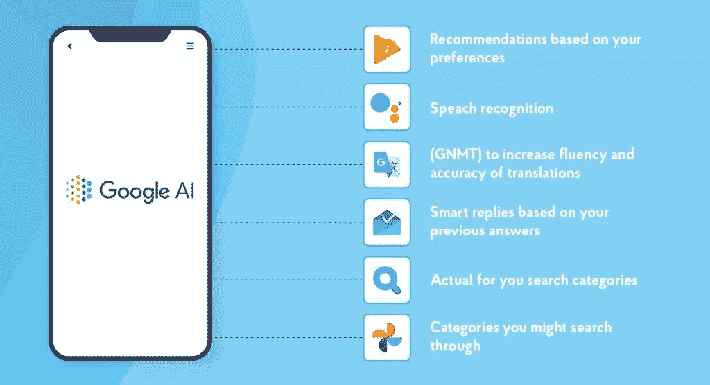
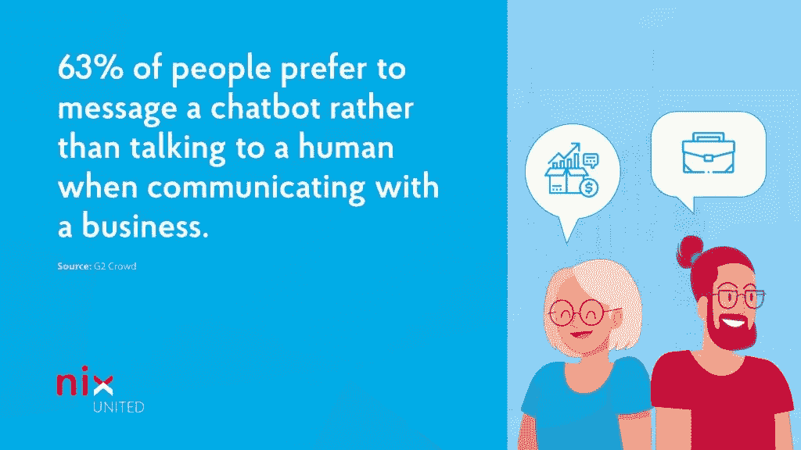

# 人工智能在移动应用程序中的应用:受益良多——NIX United

> 原文：<https://medium.com/mlearning-ai/the-usage-of-ai-in-mobile-apps-reaping-benefits-by-the-dozen-nix-united-da2a93632376?source=collection_archive---------2----------------------->

工业 4.0 时代首先是全面的数字化驱动，渗透到越来越多的商业领域。在充斥全球 IT 市场的软件产品中，移动应用可能是最受欢迎的产品之一，为其创作者带来了巨大的收入，并迎合了全球范围内广泛的客户需求。

然而，移动应用行业的惊人增长可能达不到其承诺，除非该领域的重要参与者能够跟上在第三个千年早期塑造现代文明面貌的创新技术。其中一项技术是[人工智能](https://nix-united.com/services/ai-solutions-artificial-intelligence/)(AI)——这是机器和计算机系统领域的一项颠覆性突破，赋予它们模仿人脑运作解决复杂问题的能力。

**内容:**

将人工智能和移动应用结合起来是提供应用开发服务的公司的目标。保护这样的解决方案使公司相对于竞争对手的产品具有相当大的优势，并提高了用户满意度。这两个至关重要的商业因素结合起来，为企业家带来了源源不断的利润，这些企业家被证明有足够的远见，能够比其他人更快地赶上最先进技术的人工智能潮流。

除了这两个主要资产，在移动应用中实现人工智能还保证了公司和客户的其他好处。

# 移动应用中的人工智能:放大优势

移动人工智能将为推出其应用的公司带来几项额外好处:

*   相关性和个性化。应用程序用户渴望的是感受独特的个人品味，并通过他们使用的技术满足他们的特定需求。AI mobile 通过收集和分析客户人口统计数据、行为、购买模式和其他相关数据来提供这一机会，为智能手机用户提供极其个性化的体验，提供适合他们的产品或服务。
*   **综合自动化**。人工智能应用程序使高度自动化能够处理类似的任务，而不是通过独特的算法处理每个任务。例如，拼车解决方案利用人工智能，通过分析司机以前的旅行，绘制出客户到目的地的最短路线。
*   **用户认证的准确性**。人脸识别技术的一套算法通过即时搜索人脸数据库，并将它们与场景中识别的人脸进行匹配，来帮助实时识别用户。移动应用中的人工智能有助于获得非常高的准确率——大约 99.5%的准确率。它使授权过程更加安全，同时对用户来说更加简单，减少了对移动应用程序上常规认证表格和密码的需要。
*   **客户参与和保持。**这一优势对于利用人工智能算法深度吸引客户并确保其市场份额的企业应用程序所有者来说至关重要，因为它们将整个激励范围扩展到客户，并使他们进一步融入其品牌生态系统。人工智能应用程序从以前与客户的互动中收集数据，并作为理解他们购物行为的基准，使企业家能够相应地修改他们的参与和保留策略。
*   **预测营销。**人工智能技术在跟踪利基市场的流行趋势和异常方面首屈一指，可以洞察未来的市场发展，并相应地规划组织的业务战略。

看到这些毋庸置疑的好处，越来越多的公司将这项技术应用到他们的产品中。

# 在移动应用中使用人工智能的方式

这里有一系列人工智能技术，可以将移动应用程序带到新的功能高度。

# 1.机器学习

机器学习很可能是 IT 界最热门的人工智能技术。ML 是计算机和软件产品从过去的经验中学习做出明智的决定和结论的能力。

这种能力是通过两种技术实现的。首先，监督学习模型通过分析历史输入和输出来预测未来对新数据的响应。无监督学习仅适用于发现持久模式的输入信息(也称为聚类)。无论选择哪种人工智能策略，它都为将它们应用到各种行业的应用中开辟了广阔的前景——从教育和医疗保健到销售和制造。

移动应用中 ML 驱动的人工智能的一个例子是名为 [Oval](https://www.finextra.com/newsarticle/30387/former-uber-italy-ceo-launches-social-savings-app) 的 fintech 解决方案。这个应用程序分析所有用户的消费习惯，为每个客户制定个性化的储蓄策略。此外，作为机器学习的产物，这款应用程序会随着用户输入的每一个新数据集而改进，以提供更有能力的建议。

# 2.语音识别

如今，人们不仅喜欢用智能手机聊天，还喜欢用手机聊天。为设备配备 CUI(对话式用户界面)使它们足够智能，可以服从语音命令，并通过将语音转换为机器可以理解的格式来理解人类的语音。这种人工智能技术已经产生了像 Siri 或 Cortana 这样的虚拟助手，它们“生活”在我们的小工具中，帮助主人找到停车位，播放他们最喜欢的歌曲，预订餐厅和做许多其他事情。

除了为大多数用户提供舒适的 UX 之外，语音识别应用对于视力障碍的人来说也是不可或缺的，他们有机会在没有实际看到屏幕的情况下与智能手机进行交互。

# 3.自然语音合成

[语音合成技术](https://nix-united.com/blog/neural-network-speech-synthesis-using-the-tacotron-2-architecture-or-get-alignment-or-die-tryin/)让你移动设备中的人工智能也能对你说话。然而，事实上，你的设备与其说是与你交流，不如说是大声再现输入其中的文本。这项服务是在 Android 驱动的小发明中提供的，具有可调语音特征(语速和音高)和安装额外语言的选项。

然而，这种基本功能可以通过当前 IT 市场上数量众多的专业应用程序得到显著增强。例如，[解说员的声音](https://play.google.com/store/apps/details?id=br.com.escolhatecnologia.vozdonarrador)不仅可以阅读多种来源的文本，还可以选择多种声音来再现文本，并可以添加音效(如漱口声、回声或合唱)。此外，人工智能可以通过合成器运行你写的文本(并将其保存为 MP3 文件)，这使得该应用程序在 voiceover 演示和幻灯片放映方面非常有用。

# 4.聊天机器人

要让手机应用成为你品牌的一部分，就必须实现与客户互动的自动化。这就是聊天机器人[介入的地方，将你的员工从繁琐的任务中解放出来，比如帮助客户填写反馈表格或回复他们的典型询问。这种人工智能驱动的应用程序现在正成为小公司的必备工具，而商业世界中的所有巨头(苹果、亚马逊、微软、IBM)都在大规模使用聊天机器人技术。](https://nix-united.com/blog/innovative-chatbots-untapped-capabilities-able-to-boost-your-business/)

# 5.图像识别

直到最近，只有人类才能识别和分类图片或视频中的物体。如今，人工智能应用程序可以更准确地做到这一点，这种能力在各个领域都有大量应用——从识别交通法规肇事者的车牌到监控高精度制造中的产品质量。

其中一个应用程序是[卡路里妈妈](https://caloriemama.ai/)，它通过分析食物的照片来帮助人们控制他们摄入的卡路里量。此外，随着时间的推移，向数据库中添加新图片会使营养估计更加准确。

# 6.文本识别

有时，您可能需要从图像中提取字母或数字(甚至是一大块文本),以便输入并用于您的目的。光学字符识别(OCR)应用程序可以帮助你完成这个以前不可能完成的任务。其中最受欢迎的是 Google Keep，它从图片中捕捉文本并以数字格式保存，这样你就不必手动键入任何内容，并且可以完全删除图像，只留下字符。

# 7.生物测定学

人工智能驱动的机制不仅可以识别文本、图像或人类语音，还可以识别我们的物理参数(脸型、体型、指纹)和手势。

这项技术主要用于市场营销，也可以用于其他行业。例如，银行、惩教机构和教育机构可以从使用该软件中受益。

例如， [Face2Gene](https://www.face2gene.com/) 是一个高度专业化的应用程序，旨在为临床医生提供帮助，帮助他们诊断遗传疾病。它被用来分析患者的面部，提供即时反馈，并使医疗保健提供者能够在封闭的小组论坛上分享结果。

# 8.情感和情绪分析

这是对以前技术的阐述，但侧重于识别一个人的情绪。肢体语言、声音波动和面部表情都是能说明问题的迹象，是识别一个人情绪的关键。阅读它们有助于评估消费者对特定产品或广告的态度，评估电视收视率，甚至识别机场、银行、体育场和其他场所的人们的恶意意图。现代应用市场有大量这样的产品，值得一提的是 Noldus 的 Face Reader 和微软的 Project Oxford。

# 最后的想法

人工智能正在许多数字产品中蓬勃发展，使人工智能[应用程序开发](https://nix-united.com/services/mobile-app-development/)成为当今尖端的高科技领域。通过委托 NIX United 的定制 AI 解决方案，您将获得一个高端移动应用程序，它的无缝操作和完美的 UI 设计将给您留下深刻印象。

*原载于 2021 年 10 月 29 日*[*【https://nix-united.com】*](https://nix-united.com/blog/mobile-artificial-intelligence-when-apps-get-smarter/)*。*