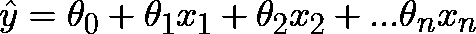
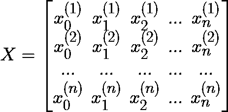
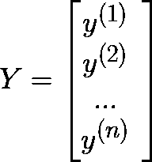
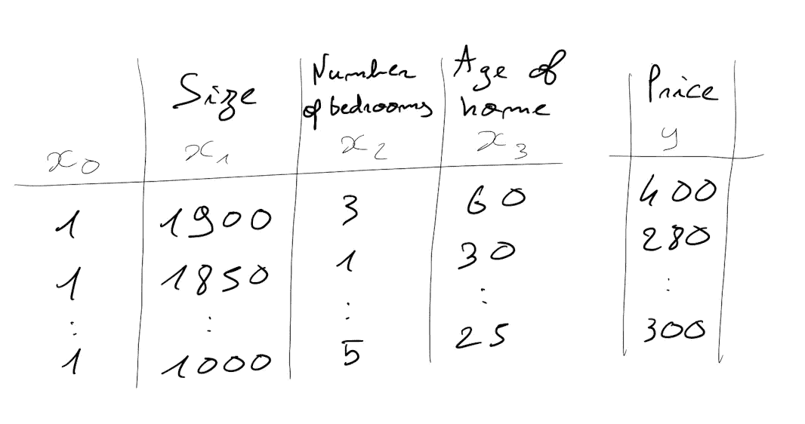
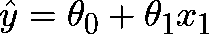
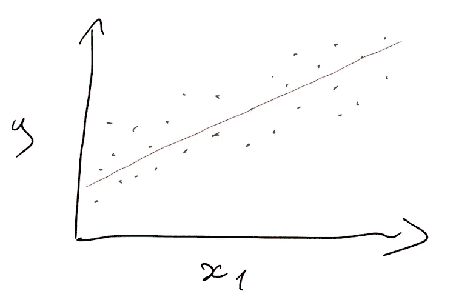
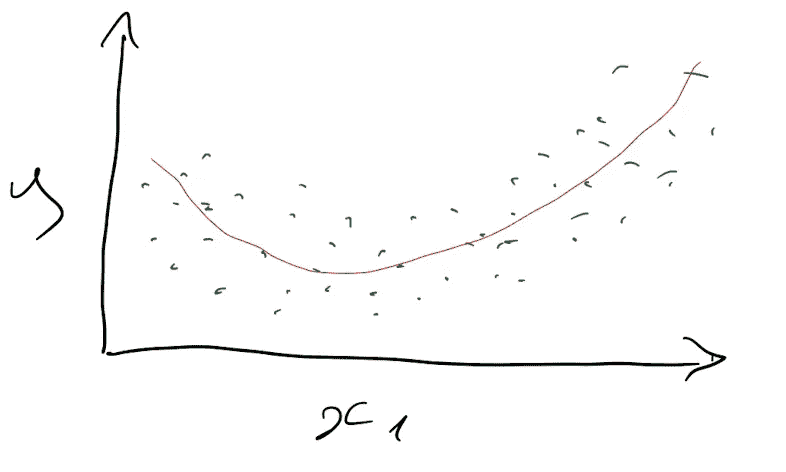
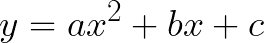
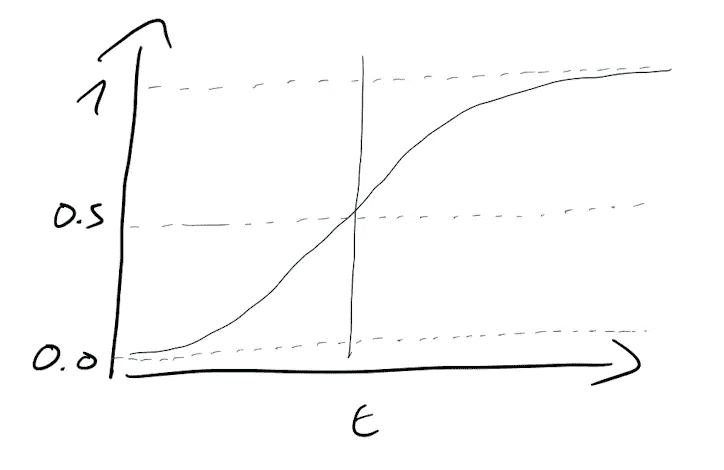

# 众所周知的回归——它是什么？

> 原文：<https://medium.com/mlearning-ai/the-well-known-regression-what-is-it-6dbe5e0b2cd1?source=collection_archive---------4----------------------->

这篇文章从**统计学**的角度和**机器学习视觉**的角度解释了什么是**回归**。

Photo by [Kate Trysh](https://unsplash.com/@katetrysh?utm_source=medium&utm_medium=referral) on [Unsplash](https://unsplash.com?utm_source=medium&utm_medium=referral)

回归问题是**监督学习问题**(用于训练模型的标签问题)，以两种类型的变量为特征。第一组是预测变量，标记为 *X* ，第二组是因变量，标记为 *Y* 。

这个简单的等式说明了一个回归问题:

*   等式左边的**部分**代表因变量(**输出**)，模型试图**预测**这个变量，这就是为什么 *y* 得到了一个帽子。
*   **右边部分**是用于预测输出的**输入**。那样的话，你就有了用*x*s .**θs**表示的 *n* **预测变量**就是回归问题的**参数**。这些参数是试图预测输出的机器学习模型的主要焦点。找到每一个的正确值是能够从输入预测任何输出(具有最低误差幅度)的交易。
    *θ0*表示所有输入为空的情况。每个输入都有其相关的参数。

让我们来了解一下这些在经典数据集中是如何表示的。

# 回归的数据模拟

由于这些问题需要大量的输入，矩阵符号被用来写出更好的数学概念。小写的 *x* (见前)表示数据集的列，可以记为 X，它是所有输入变量的矩阵:

而小写的 *y* 可以记为 Y，输出的向量:

从**数据的角度来看**，这些矩阵可以只是一个常规的数据表，形状为 *n* 乘以 *n.* X 是特征列，Y 是因变量列(你要预测的列):

By the author

我们区分两种回归:

## 单变量的

以唯一预测变量为特征的回归是单变量回归:

在机器学习中，模型将使用一个独特的特征(预测变量)来计算θ的最佳值。

## 多变量的

当回归使用多个特征时，称为多元回归:

可能的功能没有限制，但是模型性能将取决于好的功能，而不是数量。

现在我们有了基础知识，让我们深入研究不同的回归问题，最著名的一个叫做线性回归…

# 线性回归

线性回归问题是可以用直线****线**建模的回归问题:**

****

**A simple linear regression prediction (by the author)**

**特征 x1 增加得越多，输出也增加得越多。它也可以是与随着 x1 增加而减小的线的负相关。**

# **多项式回归**

**当数据不是线性时，使用多项式回归，这意味着它不能用简单的线性回归来解决。然后，该想法将从数据集中现有的特征添加多项式特征，并通过**揭示**输入**和**输出**之间的** **新的** **关系**来创建更高的精度。一旦添加了这些新特征，模型就用经典的线性回归进行训练。**

****

**A polynomial regression prediction (by the author)**

**下面的示例使用了二次多项式:**

****

**让我们以 *x* 为特征， *x* 幂 2 将被创建，以使模型更复杂，更精确。**

**可以无限程度地添加多项式要素，但是添加的复杂度越高，模型就越容易过度拟合，新数据的质量也越差。**

# **正则线性回归**

**正则化一个模型正在为它创建**约束**，更准确地说是为**参数**创建约束。一般来说，这里的想法是防止模型过度拟合(特别是如果函数是非线性的)，因为**超参数** ***alpha*** 会降低特征参数的权重。因此，即使模型对一个特征增加了太多的重要性，由于方差的减少，它的参数将会更小，预测将会更准确(平均而言)。**

**最常用的正则化方法有:**

*   **里脊回归**
*   **套索回归**
*   **弹性网**

**基本上，这三者之间的区别在于它调整模型的方式。**脊**和**套索**都有办法做到这一点，这意味着一些不同，比如套索会把最不重要的特征放在一边。
**弹性** **网**是**脊**和**套索**方法的组合，使用另一个超参数来指定每种方法的权重。**

# **逻辑回归(入侵者)**

**那种类型的回归模型不是用于回归问题而是用于解决**分类** **问题**。事实上，逻辑这个术语来源于以 S 形为特征的逻辑****功能**(**S 形**功能):****

********

****The logistic function (by the author)****

****小写 *t* 介于负无穷大和正无穷大之间，但是**逻辑** **函数** ( *g(t)* )返回一个介于 **0 和 1** 之间的值。这个逻辑函数是模型趋向于最小化的成本函数。根据阈值， *g(t)* 给出在正类中的概率。例如，如果阈值是 0.5，那么对于一个观察返回 0.7 的**概率的逻辑函数将把这个观察分类为正(1)，因为 0.7 大于 0.5(例如:如果一只狗是 1，而 0 是一只猫，则模型调用一只狗)。它将总是返回 0 或 1(类)的结果。******

****感谢您阅读本文，我希望您现在了解什么是**回归**，它如何通过使用解释变量(**特征**)来预测因变量，从而模拟现实生活中的问题。最后，**输入**(特征)和**输出**(因变量)之间的关系可以表征模型将处理的回归问题的类型。****

**** [## Mlearning.ai 提交建议

### 如何成为 Mlearning.ai 上的作家

medium.com](/mlearning-ai/mlearning-ai-submission-suggestions-b51e2b130bfb)****