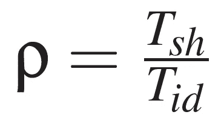
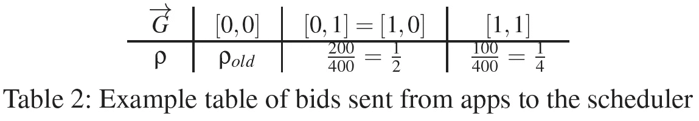
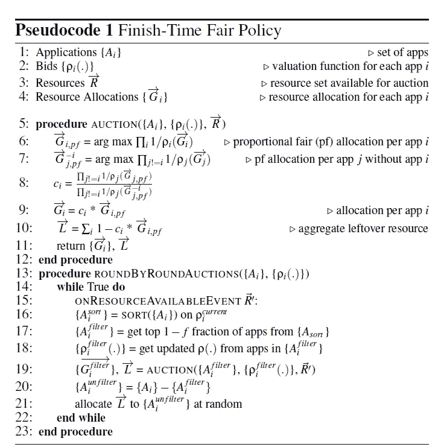

# 《Themis:公平高效的 GPU 集群调度》摘要

> 原文：<https://medium.com/mlearning-ai/themis-fair-and-efficient-gpu-cluster-scheduling-c641441580a?source=collection_archive---------4----------------------->

# 介绍

为了便于分布式 **M** 机器 **L** 收益( **ML** )训练负载的执行，GPU 集群是主流的基础设施。然而，当多个这样的工作负载在一个共享集群上执行时，就会发生严重的争用。这种争用导致底层硬件的利用率和效率降低。Themis [ **1** 的作者提到，可用的集群调度机制不适合 ML 训练工作负载的独特特征。ML 培训工作量通常是需要**联合调度**的长时间运行的任务，它们的性能对任务的相对位置很敏感。他们提出**Themis**[**1**]**作为 ML 训练工作量的新调度框架。该机制是一种 GPU 分配策略，以**结束时间公平的方式**强制完成 ML 训练工作负载*(*具有 N 个应用的共享集群中的运行时间与在 1/N 集群中单独运行的运行时间之比*)。Themis 的目标是最小化所有 ML 应用的最大结束时间公平性，同时有效利用集群 GPU。Themis 使用两级调度架构，ML 作业对中央仲裁机构拍卖的可用资源进行投标。这种类型的调度被认为是为了捕捉布局敏感性并确保效率。拍卖(仲裁)通过在短期内以公平换取效率，但在长期内确保结束时的公平，将 GPU 分配给获胜的投标人。Themis 在[**Apache YARN 3 . 2 . 0**](https://hadoop.apache.org/docs/stable/hadoop-yarn/hadoop-yarn-site/YARN.html)之上实现，并通过重放大型企业跟踪的工作负载进行评估。评估显示公平性提高了 2.25 倍以上，集群效率提高了 5%到 250%。***

# **背景**

**能够让人们分享某样东西的**分享激励** ( **斯**)就是公平。如果 **N 个用户**共享一个由 **C 个 GPU**组成的集群，那么每个用户的性能一定不会低于使用一个大小为 **C/N** 的私有集群。此外，他们不能忍受长时间的等待。试图提供共享集群激励的现有集群调度框架[ **2** 、 **3** 、 **4** ]是针对**大数据工作负载**(对 ML 工作负载无效)而设计的。他们没有考虑 ML 任务的长持续时间和 ML 应用的放置偏好。**

## **使当前大数据调度器不公平的 ML 工作负载特征**

1.  **ML 作业具有需要一起调度的长时间运行的任务，即，联合调度**
2.  **ML 工作是位置敏感的。作业中的每个任务通常会运行几次迭代，同时在每次迭代结束时同步模型更新。这表明沟通在 ML 工作负载中变得很重要。如果一项工作的所有任务都放在同一台机器或同一机架上，由于更快的通信，这将导致显著的加速。**

****基于对 5000 个独立用户共享的 50 个 GPU 上的执行跟踪的观察结果****

1.  **ML 应用程序在资源使用、提交的作业数量和运行时间方面是异构的。它们比大数据分析工作要长得多。大数据作业通常需要几个小时才能完成。**
2.  ****~10%** 的应用有 1 个作业，约 **~90%** 的应用进行超参数勘探，多达 **100 个**作业。**

## **帕累托效率(PE)和嫉妒自由(EF)表达式**

**[**帕累托效率**](https://en.wikipedia.org/wiki/Pareto_efficiency) 是指在不使至少一个个体或偏好标准恶化或没有任何损失的情况下，没有一个个体或偏好标准能够变得更好。**

**[**Envy-Freedom**](https://en.wikipedia.org/wiki/Envy-freeness) 说的是，当资源在权利平等的人之间分配时，每个人都应该得到一份，也就是说，在他们看来，至少和任何其他代理人得到的那份一样好。**

# **拟议机制**

## **术语**

*   ****ML 应用**:一个或多个 ML 模型训练任务的集合，对应于一个用户，用于高级目标，如**语音识别**或**对象检测**(用户训练这些模型，知道适当的超参数**或**通过训练一组超参数来探索它们)**
*   ****作业**:并行任务的集合。在任何给定的时间，作业的所有任务共同处理一个小批量的训练数据。**
*   ****任务**:处理批次的子集，从模型的初始版本开始，执行基础学习算法的多次迭代以改进模型。**

## **动机**

**由于应用程序执行持续时间长，控制容量的用户会给许多其他用户带来很长的等待时间。一些受压迫的用户被迫退出并购买他们的硬件。虽然拥有一个调度程序来确保底层硬件的高利用率是很重要的，但是调度程序应该在 ML 应用程序之间公平地共享资源。**

****结束时间公平性指标。**如下式所示:**

****

**[**1**]**

**T *sh* 是共享完成时间，T *id* 是独立完成时间。**

**分配机制必须为不同的 GPU 分配估计完成时间度量的值。但是，对于调度引擎来说，预测或确定度量值是不可管理的。因此，Themis 建议在应用程序和调度引擎之间建立一个更广泛的接口，允许应用程序表达对每个分配的偏好。*建议应用程序将该信息编码为如下表格*。**

****

**[**1**]**

**每一列都有一个潜在 GPU 分配的排列，以及接收到该分配时的结束时间公平性度量的估计。**

**ML 应用的结束时间公平性是它接收的 GPU 分配的函数。分配策略采用这些结束时间公平性度量和输出分配。**

## **机制**

**一个简单的策略是根据应用程序报告的结束时间公平性指标对应用程序进行排序，并根据它们分配 GPU，这可能是第一个想到的解决方案。然而，应用程序可以提交关于其结束时间公平性度量值的错误信息，增加其赢得分配的机会。为了解决这个问题，作者建议使用拍卖。**

****

**[**1**]**

**两级调度设计在底层包含一个集中式的应用程序间调度器，在顶层包含一个窄 API 来集成现有的超参数调优框架。现有的几个框架[ **5** ， **6** ]可以在单个应用程序中的各个作业之间智能地共享 GPU 资源，并且在某些情况下，如果某个作业的进度不乐观，也可以提前终止该作业。**

**作者认为应用程序的完成时间是最佳模型和相关超参数被识别的时间。在识别这种模型的过程中，应用程序可能会决定提前终止它的一些组成作业。这些模型的次优性可以通过检查验证准确性来识别(例如，最小的一个终止)。对于包含单个作业的应用程序，完成时间是将此模型训练到目标精度或最大迭代次数所需的时间。**

****

# ****结论****

**在集群上调度 ML 工作负载时，传统的大数据拟合框架无法提供帮助。这些工作负载具有独特的特征，必须考虑这些特征才能拥有高效的激励式共享集群(高利用率)。Themis 通过基于类似于真实世界拍卖的概念提出两级调度和资源分配来解决这个问题。但是，当 ML 工作负载没有充分利用底层资源时，应该考虑应用程序在配置时的争用。**

# **参考**

**【**1**k . maha Jan*等*， **Themis:公平高效的 GPU 集群调度，**在 ***第 17 届 USENIX 研讨会*** *关于网络化系统设计与实现(NSDI 20)* ， **2020** ，bll 289–304。**

**【**2**】gho DSI，Ali 等人】**显性资源公平(DRF):多种资源类型的公平分配。***Nsdi*。第十一卷。№2011. **2011 年**。**

** [## 主导资源公平性:多种资源类型的公平分配

### USENIX 致力于开放我们活动中展示的研究成果。论文和会议记录可以免费获得…

www.usenix.org](https://www.usenix.org/conference/nsdi11/dominant-resource-fairness-fair-allocation-multiple-resource-types) 

【**3**】Isard，Michael，等】 **Quincy:分布式计算集群的公平调度。***ACM SIGOPS 第 22 届操作系统原理研讨会会议录*。 **2009** 。

【**4**Grandl，Robert 等】**多资源集群中的利他调度。***第十二届{USENIX}操作系统设计与实施研讨会({OSDI} 16)* 。 **2016** 。

 [## 多资源集群中的利他调度

### USENIX 致力于开放我们活动中展示的研究成果。论文和会议记录可以免费获得…

www.usenix.org](https://www.usenix.org/conference/osdi16/technical-sessions/presentation/grandl_altruistic) 

【**5**】Bergstra，James 等. **Hyperopt:一个用于模型选择和超参数优化的 python 库。***计算科学&发现* 8.1 ( **2015** ): 014008。

[ **6** ] Rasley，Jeff，等.**超光速引擎:探索超参数与 pop 调度***第 18 届 ACM/IFIP/USENIX 中间件会议论文集*。 **2017** 。

【 **7** 】顾，军成，等.**面向分布式深度学习的 GPU 集群管理器。******USENIX****网络化系统设计与实现研讨会(NSDI 19)* 。 **2019** 。*

* [## 忒瑞西阿斯:用于分布式深度学习的 GPU 集群管理器

### USENIX 致力于开放我们活动中展示的研究成果。论文和会议记录可以免费获得…

www.usenix.org](https://www.usenix.org/conference/nsdi19/presentation/gu) 

**最少获得服务(LAS)分配策略**:GPU(或资源)被租用一定的期限，当租约到期时，可用的 GPU 被给予接收最少 GPU 时间的作业。

# 很高兴知道

 [## 10 种梯度下降优化算法

### 深度学习你应该知道的随机梯度下降优化算法

towardsdatascience.com](https://towardsdatascience.com/10-gradient-descent-optimisation-algorithms-86989510b5e9)  [## Mlearning.ai 提交建议

### 如何成为 Mlearning.ai 上的作家

medium.com](/mlearning-ai/mlearning-ai-submission-suggestions-b51e2b130bfb)***