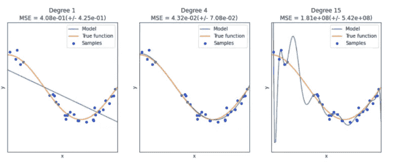
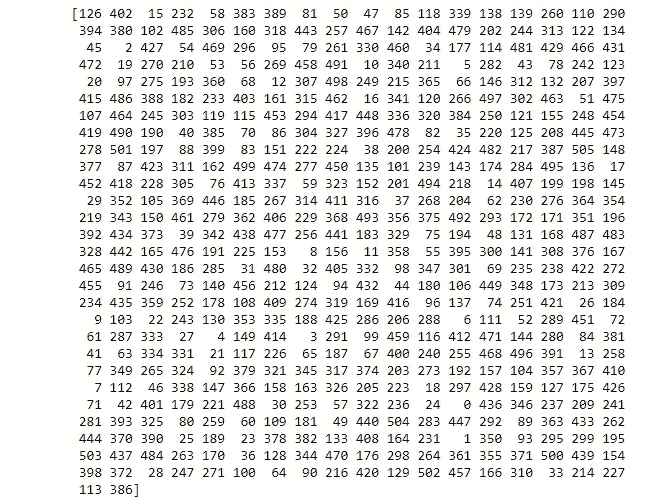
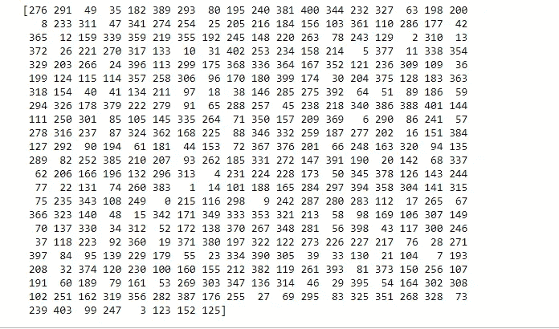
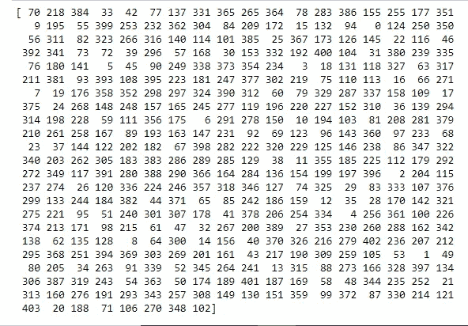
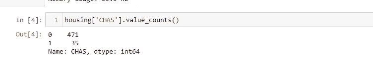
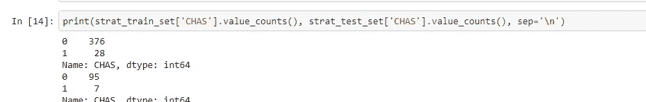
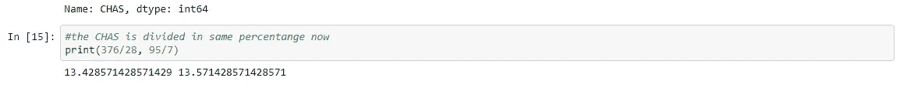

# 关于 train_test_split 你不知道的事

> 原文：<https://medium.com/mlearning-ai/things-you-dont-know-about-train-test-split-41df76cb5dc9?source=collection_archive---------1----------------------->


Connect with me: [https://www.linkedin.com/in/ashmal-vayani/](https://www.linkedin.com/in/ashmal-vayani/)

> **什么是训练和测试数据？**

几乎在每一个机器学习问题或深度学习问题中，都给了你要处理的数据集。你清理数据，执行强制性的 EDA，试图通过查看你的数据找到基本的见解，处理分类的、缺失的、不相关的、不必要的数据，然后应用各自的解决方案来解决你的问题。

如果您正在阅读本文，我希望您知道如何清理和处理原始数据，因为这超出了本主题的范围，所以我们现在不讨论它。

由于幸运的技术进步，修复的技术，我们现在有大量的数据可供我们使用。这都要感谢开源平台和公司让我们与[大数据合作。](https://www.sas.com/en_us/insights/big-data/what-is-big-data.html#:~:text=Big%20data%20is%20a%20term,day%2Dto%2Dday%20basis.&text=It's%20what%20organizations%20do%20with,decisions%20and%20strategic%20business%20moves.)


出于机器学习的目的，我们提供模型从中学习的良好数据块，然后根据看不见的数据预测您的因变量。机器和模型学习的数据称为**训练数据**，我们为机器保存的用于预测或测试未知的数据称为**测试数据。**一个好的分析通常涉及 80/20%的训练和测试数据，但这完全取决于您的问题和您正在处理的场景。

> **我们为什么需要拆分？**

每当数据科学家/分析师/工程师工作时，他都要确保他的模型不会根据提供的所有数据进行训练。它可能在训练数据上给出极好的准确性，但是它在以前没有见过的数据上工作得很差。这被称为 [**过拟合，**](https://www.ibm.com/cloud/learn/overfitting#:~:text=Overfitting%20is%20a%20concept%20in,exactly%20against%20its%20training%20data.&text=When%20the%20model%20memorizes%20the,generalize%20well%20to%20new%20data.) 当统计模型完全符合其训练数据时，或者可能因为您的数据集很小，就会发生这种情况。模型学习模式，让你的结果一般化，这是不够的。



为了解决这个问题，我们需要将我们的数据集分为训练集和测试集，以在看不见的数据上测试机器，看看结果有多准确。

> **如何应用列车测试拆分？**

有两种方法可以分割实际数据集。

1.  创建您的用户定义函数。
2.  使用 sklearn.model_selection 的 API train_test_split。

**制作您的自定义函数:**

使用用户定义的函数不是拆分数据的最流行的方法，您可能不会随时使用它，但这是一种帮助您了解 sklearn 的 API 参数的方法。让我们看看进展如何，然后我们再讨论。

```
**import** **numpy** **as** **np**
**def** split_train_test(data,test_ratio):
    #np.random.seed(42)
    shuffled = np.random.permutation(len(data))
    test_set_size = int(len(data)*test_ratio)
    test_indices = shuffled[:test_set_size]
    train_indices = shuffled[test_set_size:]
    **return** data.iloc[train_indices], data.iloc[test_indices]
```

这些参数包括您的实际数据集和您想要分割的测试比率。我们暂时忽略 np.random.seed(42)。我们一会儿就回来。

```
print(f"Rows in Training Set : **{**len(train_set)**}\n**Rows in Test Set : 
**{**len(test_set)**}**")#Expected output:
#Rows in Training Set : 405
#Rows in Test Set : 101
```

np.random.permutation 随机排列序列或返回数据的排列范围。

现在，我们通过简单地将我们的数据长度乘以测试比率来设置测试大小，并且我们将我们的数据分成 test _ indices 和 train _ indices 并返回它们。让我们看看注释 np.random.seed 行的运行情况，看看它在这段代码中返回了什么:

```
train_set, test_set = split_train_test(housing,0.2)
```

如果我们打印我们的混洗矩阵，这就是我们的输出看起来像:



如果我们重新运行该单元格，我们的输出可能如下所示:



这意味着启动随机排列的基值没有设置，如果我们多次运行我们的笔记本，您的模型可能会看到您的所有实际数据，这将导致过度拟合，并且在训练集上工作不佳。

**解决方案:**

让我们取消 random.seed 行的注释，并设置参数 random_state=42，看看我们的输出如何变化。random_state=42 是一种常规做法，您可以设置一个不同的范围，但这将控制在应用拆分之前应用于数据的混排。您还可以在多个函数调用之间传递一个 int 以获得可再现的输出。

```
**import** **numpy** **as** **np**
**def** split_train_test(data,test_ratio):
    np.random.seed(42)
    shuffled = np.random.permutation(len(data))
    test_set_size = int(len(data)*test_ratio)
    test_indices = shuffled[:test_set_size]
    train_indices = shuffled[test_set_size:]
    **return** data.iloc[train_indices], data.iloc[test_indices]
```

输出:



每次运行该单元时，您将获得相同的矩阵，并且不再有过度拟合的问题，因为您的训练模型将永远不会看到完整的数据，并且将在测试数据上工作良好。

学到了新东西？如果你已经知道这些，那就太好了。我们继续吧。

**使用 sklearn.model_selection 的 API train_test_split:**

这是我们几乎所有人用来分割数据的技术；不言自明，我们使用 sklearn.model_selection 的 API train_test_split 传递参数，它返回数据。

```
*#we will use train test splitting from sklearn*
**from** **sklearn.model_selection** **import** train_test_split
train_set, test_set = train_test_split(housing, test_size=0.2, random_state = 42)print(train_set.shape, test_set.shape)#Output:(404, 14) (102, 14)
```

我们可以看到，两种方法的数据集大小几乎相同，只有 1 条记录的差异。这是因为每种方法处理舍入值的方式都不同。例如:如果您有 506 条记录，80%的训练数据意味着 404.8 条记录。一个当作 404，另一个四舍五入到 405。

> **stratifedshufflesplit**

在离开之前，我们将最后讨论一个基本特性，但在此之前，让我们通过一个例子来讨论它。

假设您的数据集中有一个非常重要的属性，或者与您可能不想操纵的因变量有很强的正相关性。假设您有一个具有 value_counts 的属性，如下所示:



现在想象一下，如果您的 test_data 有 101 条记录，test_data 可能有 0 条记录，其中“CHAS”值为 1，training_data 也是如此。您的模型尚未使用数据进行训练，因此如果任何测试数据的属性值为“1”，可能会给出不确定的结果并导致不准确。

你如何处理这个？

**解决方案:**

为了避免这种情况，或者使某个特定变量在训练集和测试集中均匀分布，我们使用 StratifiedShuffleSplit 来实现这一点。

```
**from** **sklearn.model_selection** **import** StratifiedShuffleSplit
split = StratifiedShuffleSplit(n_splits = 1, test_size = 0.2, random_state = 42)

**for** train_index, test_index **in** split.split(housing, housing['CHAS']):
    strat_train_set = housing.loc[train_index]
    strat_test_set = housing.loc[test_index]
```

您可能会发现参数非常相似，for 循环将为我们平均分配数据。让我们检查一下:



我们来看看比例:



我们已经解决了这个问题。

关于 train_test_split 你就知道这么多了。如果您认为我还需要补充什么，请随时联系我:

[](https://www.linkedin.com/in/ashmal-vayani/) [## Ashmal Vayani -作家-机器学习| LinkedIn

### 我只是一个普通人，追随他对学习不同层次的编码和逻辑构建的热情…

www.linkedin.com。](https://www.linkedin.com/in/ashmal-vayani/)