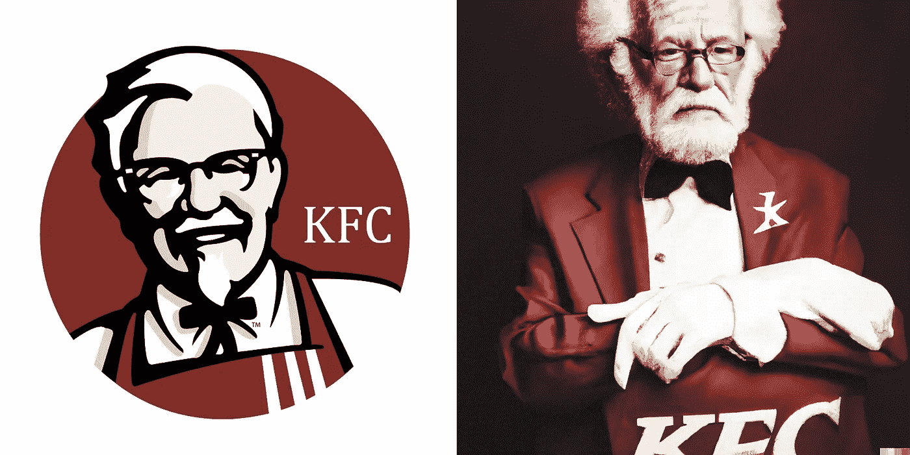

# 这个人工智能把 5 个著名的标志变成了真人

> 原文：<https://medium.com/mlearning-ai/this-ai-transformed-5-famous-logo-into-real-people-110c3bc9476?source=collection_archive---------5----------------------->

Image by [Jim Clyde Monge](https://medium.com/u/819323b399ac?source=post_page-----110c3bc9476--------------------------------)

不可否认，新的 [Dall-E2](https://openai.com/dall-e-2/) 文本到图像的人工智能能力令人印象深刻。从根据书籍描述重新塑造[哈利波特角色到将著名商标转化为真人。](/mlearning-ai/ai-reimagines-10-harry-potter-characters-based-on-book-descriptions-3e6b312720a7)

是的，我创造了一个全新的人工智能实验，将可识别的标志变成真人。结果既令人惊讶又有点令人不安。