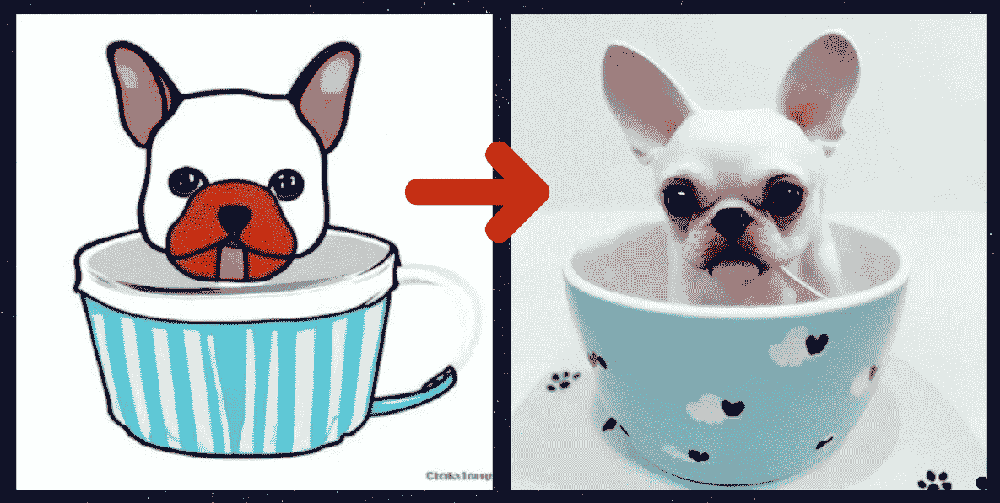

# 这个人工智能将你最基本的涂鸦变成真实的照片

> 原文：<https://medium.com/mlearning-ai/this-ai-turns-your-rudimentary-doodles-into-realistic-photos-da13db23033?source=collection_archive---------0----------------------->

Image by [Jim Clyde Monge](https://medium.com/u/819323b399ac?source=post_page-----da13db23033--------------------------------)

如果你不是一个伟大的艺术家，但仍然想创造逼真的图像，那么你需要看看这个神奇的人工智能工具。

AI 工具叫做**扩散其余的**可以免费访问[这里](https://huggingface.co/spaces/huggingface/diffuse-the-rest)。