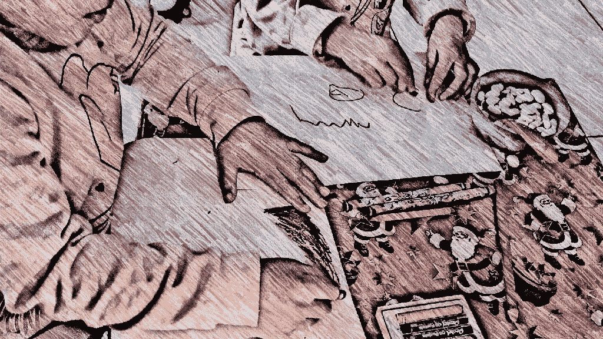

# 这就是我如何使用人工智能来为我女儿的画制作动画。

> 原文：<https://medium.com/mlearning-ai/this-is-how-im-using-ai-to-animate-my-daughter-s-drawings-7f80e6d80005?source=collection_archive---------1----------------------->

My daughters at work

## 脸书的研究人员创造了一个人工智能系统，可以在儿童绘画中制作类似人类的动画。

我四岁的女儿迷上了画“人类”她的画可以有多种形式、颜色、大小和比例，在身体对称、形态和观点上几乎没有相似之处…