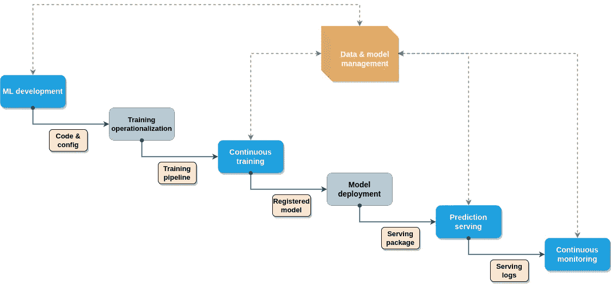

# 这是构建 MLOps 端到端架构所需了解的内容

> 原文：<https://medium.com/mlearning-ai/this-is-what-you-need-to-know-to-build-an-mlops-end-to-end-architecture-c0be1deaa3ce?source=collection_archive---------4----------------------->

将 MLOps 快速引入您的机器学习项目的 7 个原则。

The end-to-end MLOps workflow. Image by Author, inspired by [source](https://services.google.com/fh/files/misc/practitioners_guide_to_mlops_whitepaper.pdf).

MLOps 是由于大多数机器学习项目的高失败率而诞生的新领域。通过失败，我们理解了无法将你新做好的模型一般化，并将其运送到生产环境中，从而为特定人群带来价值。不要…