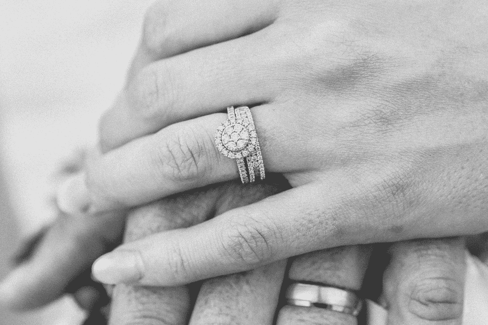
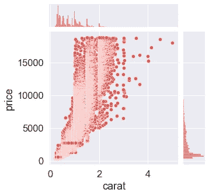
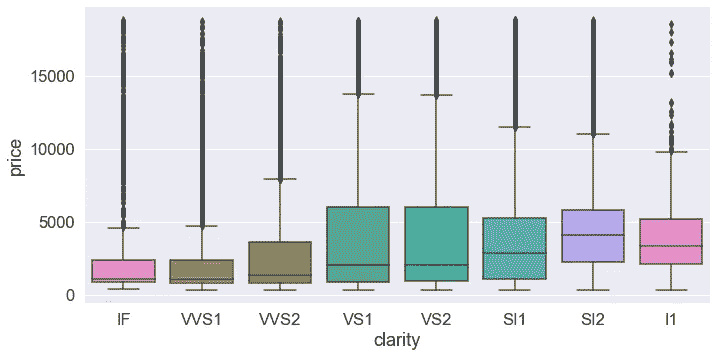
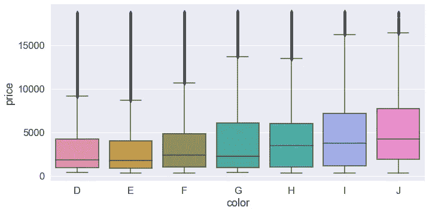
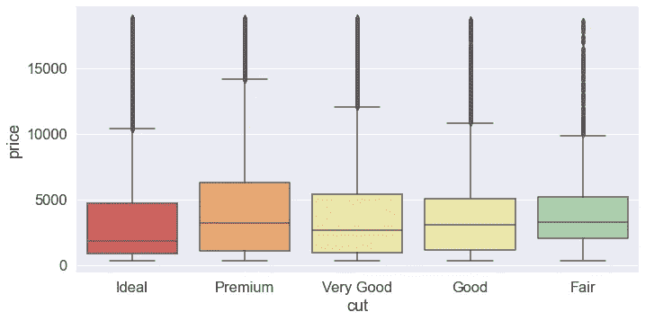
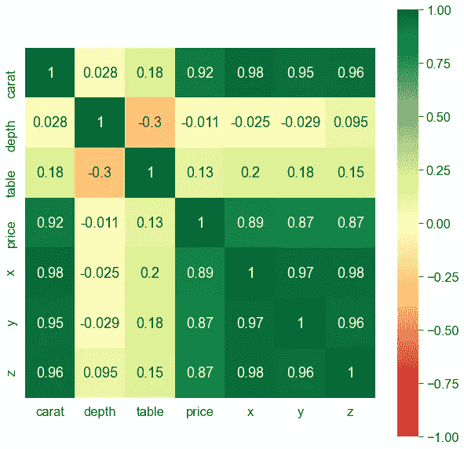
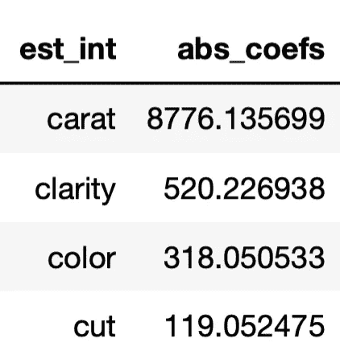

# 这就是你梦想中的钻戒真正的价值

> 原文：<https://medium.com/mlearning-ai/this-is-what-your-dream-diamond-ring-is-really-worth-32d344bbe548?source=collection_archive---------2----------------------->

对 50，000 个钻石列表的研究告诉你你应该付多少钱

Photo by [Nick Karvounis](https://unsplash.com/@nickkarvounis?utm_source=medium&utm_medium=referral) on [Unsplash](https://unsplash.com?utm_source=medium&utm_medium=referral)

# 介绍

所以你终于遇到了合适的女孩。你走进一家珠宝店，当呈现在你面前的是那颗令你前几代人着迷的闪亮钻石时，你的心融化了:永恒而完美的钻戒。

但是在那纯粹幸福的一瞬间，你的逻辑思维突然出现了:你应该付多少钱？他们说，没有两颗钻石是一样的。但是，通过研究数以千计的钻石清单，我们可以对钻石如何定价以及你应该支付多少钱有所了解。今天，我们使用[这个 Kaggle 数据集](https://www.kaggle.com/shivam2503/diamonds)，从 3 个关键角度来探讨钻石定价:

1.  什么是四个 C？它们如何影响你支付的价格
2.  钻石的不同特征之间有关联吗？
3.  我们能仅仅根据它的规格很确定地预测价格吗？

# 第一部分:什么是四个 C，它们如何影响价格

每颗钻石都有四个 C，即:

*   caret——钻石的重量，重量越大，钻石越稀有
*   净度——衡量钻石是否无瑕疵，得分从高到低依次为“f1”、“IF”、“VVS1”、“VVS2”、“VS1”、“VS2”、“SI1”、“SI2”、“I1”、“I2”、“I3”
*   切割——钻石的切割方式，质量得分从“一般”、“良好”、“非常好”到“理想”
*   颜色——钻石颜色的字母等级:“D”是最好的(无色)，J 是最差的(最黄)

你可以在任何零售钻石的证书中找到这四个 C 的分数。你找不到的是这四个 C 如何转化为你所支付的价格。这就是我们要找到的。

**脱字符与价格**

Scatter plot of Caret vs. Price of a diamond

上图中，我们看到了 50，000 颗钻石列表的脱字符号与价格的散点图。我们做了几点观察:

1.  一般来说，随着 Caret 值的增加，价格会呈指数增长——这是意料之中的，因为高 Caret 值的钻石更为罕见；因此，您可能会认为两个 1 脱字钻的总成本低于一个 2 脱字钻的成本。
2.  对于一颗特定的脱字钻，可能有很大的价格范围，例如，一颗 2 脱字钻的价格可能从 5000 美元到 15000 美元以上不等

**净度、颜色和切割与价格**

由于净度、颜色和切工都有一个分类分数，而不是像 Caret 那样有一个连续的数字分数，我们将使用下面的盒须图来显示这些分数，显示中值和下/上四分位数。

Clarity vs. Price

Color vs. Price

Cut vs. Price

如你所见，净度、切工和颜色与价格的相关性都不如 Caret，例如，J 色(最差等级)钻石的中值价格实际上高于最佳等级 B 色。

# 第二部分:钻石的不同特征之间有关联吗？

除了四个 C 之外，钻石还有其他特征:

*   深度:钻石的高度，从其尖端到平面顶部测量，除以其平均环带直径
*   表格:钻石顶部平面的直径
*   x，y，z:钻石的长度、宽度和高度，单位为毫米

为了显示这些特征之间的相关性，我们展示了下面的相关性热图:

Correlations between different features

以上的一些发现:

1.  钻石的价格与克拉及其尺寸密切相关。
2.  克拉(重量)对其价格影响最大
3.  深度与价格成反比。这是因为如果钻石的深度百分比太大或太小，钻石的外观将变得“黑暗”,因为它将不再返回最佳的光量。
4.  长度(x)、宽度(y)和高度(z)都与价格(以及彼此)高度相关

# 第三部分:我们能仅仅根据它的规格来预测价格吗？

简短的回答是肯定的！我们使用上述特征，通过简单线性回归和随机福里斯特对钻石价格进行建模，并分别获得了 0.91 和 0.98 的 R 值。这表明我们的模型能够基于 50，000 个样本列表准确预测价格。

通过研究线性模型的系数，可以有趣地洞察影响价格的因素:

Coefficients of our linear model of diamond prices

从系数中，我们可以推断出价格的最大驱动力是克拉，其次是净度、颜色和切割。

我们可以这样解释每个系数:如果所有其他因素保持不变，平均来说，一个插入符号的增加会使价格增加 8776 美元；同样，清晰度提高 1 级将使价格增加 520 美元；诸如此类。

显然，上述简单的线性模型并不完美，我们可以使用随机福里斯特模型来改进我们的预测——但那是以后的事了！

你可以在我的 [GitHub 这里](https://github.com/j-z-tang/Diamond-Pricing)查看我用来生成这些结果的代码。