# 回归分析中处理异常值的三种简单方法

> 原文：<https://medium.com/mlearning-ai/three-simple-methods-for-dealing-with-outliers-in-regression-analysis-8003ca56734c?source=collection_archive---------2----------------------->

# **我写这个主题的动机**

作为一名自由职业者，我经常被要求解释我是如何处理数据分析中的异常值的。作为一名长期的经济学家，我的第一个答案总是“视情况而定”，接下来是我答案中最重要的部分:为什么要视情况而定。在这篇文章中，我将讨论如何考虑线性回归中的异常值。简单的密度分布图有助于理解异常值如何影响线性回归结果。最后，我将讨论处理异常值的三种方法以及何时使用它们比较合适。

这篇文章将使用随机生成的两个不同社区的房价数据来探索离群值的影响。假设这两个街区的房价是不同的。也许我们是一名房地产经纪人，正在寻找最符合客户预算的社区，或者我们想实施一项社会计划来帮助低收入房主，并想知道这两个社区中的哪一个是我们的目标。不考虑原因，我使用线性回归模型来更好地理解这两个邻域。

第一步是生成正态分布的数据，以模拟两个虚拟社区的房价调查。随机生成的“低价”邻域(Neighborhood_1)将使用平均房价 150，000 美元，样本为 30 户住宅，标准差为 20，000 美元，而“高价”邻域(Neighborhood_2)将使用平均房价 350，000 美元，样本为 30 户住宅，标准差为 50，000 美元。

# **一个奇妙的房价线性回归模型**

我们将首先对使用上述条件生成的数据有所了解，然后应用线性回归模型。下面的密度分布图和两个街区房价样本的汇总统计数据显示，它们的均值分布明显不同，正如我们基于对街区的假设所希望的那样。

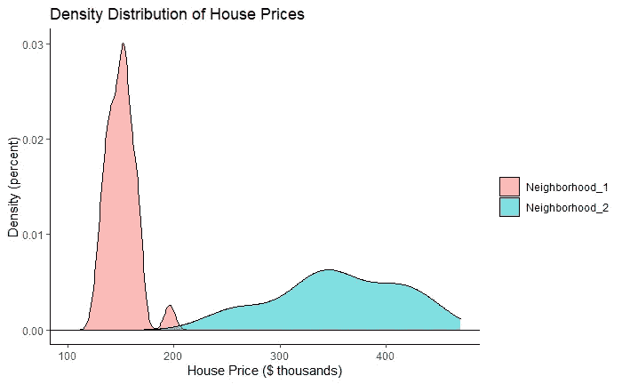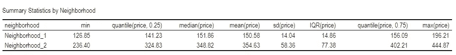

这里有几个重要的要点。首先，样本数据对于每个邻域呈正态分布，这非常适合线性回归建模。第二，样本中的街区之间没有重叠的价格。第三，neighbor _ 1 的平均房价低于 neighbor _ 2 的平均房价。从这些信息中，我们可以很好地感觉到我们对邻居的假设是正确的。

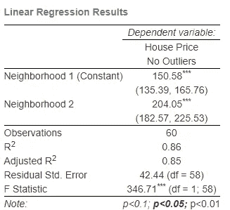

上面的回归结果给了我们很大的信心，相信我们的假设是正确的。回归结果告诉我们，根据我们的样本数据，两个街区的房价相似的可能性极低。

此外，下面的 Q-Q 图以图形方式显示，数据中没有异常值对模型的残值有负面影响，这意味着满足正态分布残差的线性回归假设。

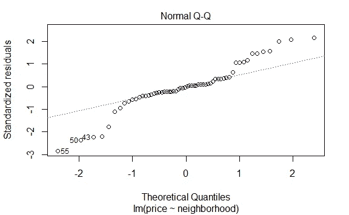

# 仅仅一个异常值就能毁掉一个漂亮的线性回归模型

那么，如果我们将 Neighborhood_1 中的一个房价替换为 500 万美元的房价，上面的分析会是什么样子呢？发生这种情况有几个原因，我将在本文后面讨论这些原因。但是现在，我们既不会假设关于离群值的先验知识，也不会假设当发现离群值时为什么会出现离群值。

同样，我们将从以下密度分布的样本数据和样本房价的汇总统计开始，并应用线性回归模型。

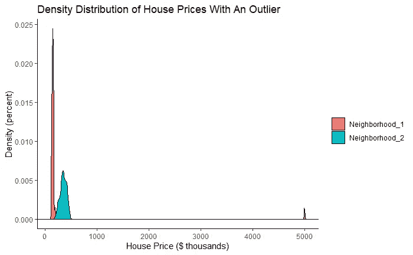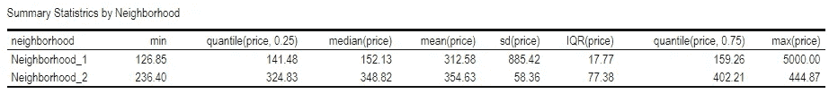

这张密度分布图与之前的图表最重要的区别在于，现在 Neighborhood_2 的所有房价都在 Neighborhood_1 的房价范围内。虽然 Neighborhood _ 2 的价格正态分布在它的平均价格附近，但是我们不能再对 Neighborhood_1 的房价说同样的话，因为我们只有一个异常价格。此外，请注意两个街区之间的平均价格。两个价格之间不再有那么大的差异，当考虑到 Neighborhood_1 价格的巨大标准差时，我们将不得不质疑我们的假设。

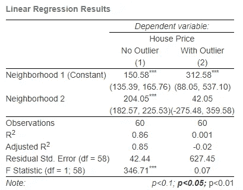

来自具有较大异常值的模型的线性回归结果并没有给我们多少信心来证明我们的工作假设是正确的。虽然常数值(即 Neighborhood_1 中的平均房价)在统计上仍然有意义，但它比没有异常值的模型大 2 倍以上。Neighborhood_2 的系数不再具有统计学意义，这进一步使我们得出结论，这两个街区的房价可能没有差异。虽然第一个模型中的 r 平方度量告诉我们，房价差异的 86%是由邻里之间的差异解释的，但在离群值模型中，这一比例几乎为零。检验基于样本数据的两个总体之间的均值显著不同的可能性的假设的 F 统计不再支持我们的假设。

我们现在可以从 Q-Q 图中看到，价格数据中有一个异常值正在破坏我们原本很棒的线性回归模型！

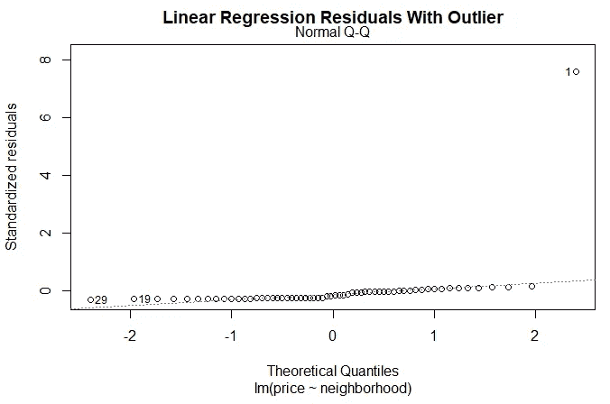

# 处理异常值的三种方法

如何处理异常值取决于对底层数据的理解。

## 方法 1:“Fogetaboutit…”

处理异常值的一个选择是完全丢弃观察值。如果可以通过进一步调查确定调查条目有误，这可能是一个合适的选项。也许搜索一下财产税记录，甚至个人对附近房产的了解，就能得出这个结论。

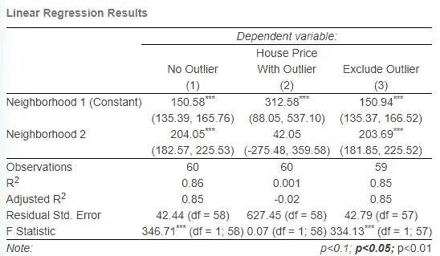

“排除异常值”模型的回归结果与第一次检查的“无异常值”模型的回归结果非常相似，两个模型之间唯一的实际差异是常量值和观察值数量。较大的 r-square 和 F-Statistic 值给了我们很大的信心，根据样本数据，这两个街区的房价并不相似。

请记住，这在很大程度上是因为我有意生成了 2 组正态分布的数据，并且只添加了一个异常值。真实世界的数据集很少如此简单，很可能会生成与“无异常值”情况不太相似的回归结果。

## 方法 2:用另一个值替换异常值

如果有理由相信可能有理由在模型中包含异常值，另一种选择是为相关变量设置上限或下限。如果我们可以假设价格是异常的，这可能是有益的，但有多个独立变量我们可以合理地假设是准确的，并且将有助于包括在模型中。在这里，我们可能知道 Neighborhood_1 的最高房价，196206 美元，是最贵的房子。在不知道异常值的真实值的情况下，我们可以假设它不大于在我们的原始、非异常样本中收集的最大值，因此我们将用“Neighborhood_1”的最大房价替换异常值。

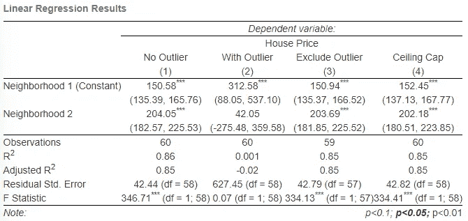

该模型的回归结果类似于“无异常值”和“排除异常值”。同样，较大的平方值和 F 统计值给了我们很大的信心，根据样本数据，两个街区的房价并不相似。请记住，对真实世界的数据使用这种方法也可能会生成与“无异常值”情况不太相似的回归结果。

## 方法 3:给异常值分配一个虚拟变量

在处理异常值时，这通常是我的首选。它允许模型使用所有的样本数据，并给出关于数据中异常值的信息。在这里，我将简单地创建一个虚拟变量，如果房价高于 500，000 美元，则等于“1 ”,如果低于 500，000 美元，则等于“0”。

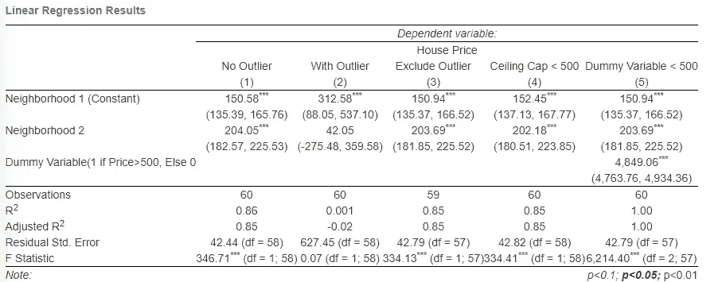

在这个模型中需要注意的区别是，我们已经从单变量回归模型变成了多变量回归模型。再次回忆一下，由于我们使用的是二元变量，我们只是计算每组的平均值。Neighborhood_1 的平均值与排除异常值时的平均值相同，Neighborhood_2 的系数也是如此。将 Neighborhood_1 均值与虚拟变量的系数相加，得出异常值的房价为 5，000，000 美元。所有这三个系数在统计上都是显著的，并且 F 统计给了我们很大的信心，根据样本数据，两个街区的房价并不相似。

有趣的是，现在等于 1.00 的 r 平方度量告诉我们，邻域和虚拟变量的变化完全解释了房价的变化。这也部分是因为正常生成的数据。但另一个需要考虑的问题是，添加到线性回归模型中的任何额外的独立/解释变量，如本例中的虚拟变量，将生成更大的 r 平方统计量。无论添加的变量在统计上是否显著，都是如此。

 [## Mlearning.ai 提交建议

### 如何成为 Mlearning.ai 上的作家

medium.com](/mlearning-ai/mlearning-ai-submission-suggestions-b51e2b130bfb)