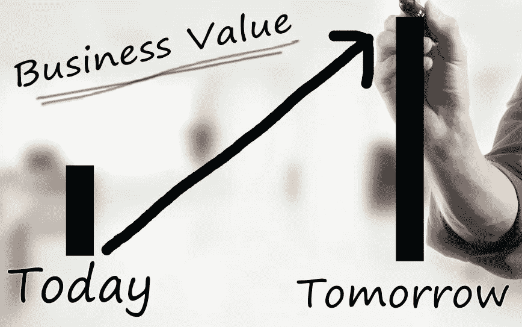

# 评估(和保护)您的分析投资的三个步骤

> 原文：<https://medium.com/mlearning-ai/three-steps-to-valuing-and-protecting-your-analytics-investments-fbac004e44c4?source=collection_archive---------7----------------------->

在生活中，意识到自己拥有有价值的东西是令人愉快的意外收获。就像一个鉴定师告诉你，你在周末的车库拍卖中花一美元买的假古董花瓶实际上是一件珍贵的古代文物，或者在你床下的旧鞋盒中发现了一张罕见而抢手的棒球卡。

然而，在分析领域，你不想让任何人感到惊讶。

对于您的管理团队来说，没有比现在更好的时机来提醒您，您的工作对今天的优先事项产生了巨大的积极影响。收入、利润和生产率等重要的东西，而此时一切的预算都受到首席财务官和任何理财人员的审查。在今天的环境下，你不能指望价值得到认可。

你要避免的是在最后一刻匆忙收集证据，疯狂地试图说服支票簿持有者，在像今天这样的经济动荡的情况下，你的工作不仅是值得的，而且是必要的。

你可能认为这是显而易见的，但实际上并非如此。

在分析师岗位上支持日常决策的员工往往会形成一种惯例。他们是一个系统的一部分，这个系统期望得到持续的支持。稳定。对于数据科学卓越中心的其他人来说，更少但更复杂的项目正在展开，系统也定义了成功，但通常是以部署到系统和应用程序中的机器学习模型的形式。

在理想的情况下，所有数据驱动的工作最初都通过一个价值过滤器，这样资源就被应用到最有潜力的用例中。通过测试的结果将被整理、评估和交流。用例以几个微妙但相互关联的方式创造价值，你现在必须比以往任何时候都认识到这一点。

**1 号**

创造价值的一种方式是工作变得更容易。节省了时间，减少了错误，提高了服务水平。周末每个人都更开心，压力也更小。

对于分析师来说，也许与业务合作伙伴的更多合作突然成为可能，因为他们有新的时间开会探讨分析应如何反映更好地描述过程、条件或结果的其他数据源。也许数据科学开始变得不像一个小批量手工酿酒商，而更像一条精细调整的大规模生产流水线。

我在这里描述的一部分是弄巧成拙的“洞察工厂”思维模式，这种思维模式让所有人都忽略了任何类型的数据分析的真正价值:可观察到的、得到高管认可的持续改进。一个工厂可以用更少的工人生产同样的产品；生产率对盈利能力来说很重要，但对被解雇的员工来说就不那么好了。

**二号**

创造价值的第二种方式发生在工作本身很少或没有重复劳动、冗余或盲点的时候，通常是“技术债务”的定义或组织在实施技术时为自己挖的洞，而没有考虑更大的前景，最终花费的成本比任何短期收益都多。

分析工作因产生技术债务而臭名昭著，而受电子表格约束的分析是主要原因之一。“Spreadmarts”，或笔记本电脑上独立的数据库，为重要决策提供信息，如以什么价格向谁出售什么，这不是自信地经营企业的方式。

当迁移到承诺解决这些缺点的解决方案时，重要的是不要因为忽视解决数据一致性和决策质量方面的不足而再次犯同样的错误。

数据的一致性确保每个人都按照相同的剧本操作——苹果和苹果比较，而不是和橘子比较。从技术上讲，这是如何发生的并不重要。最常见的是有许多相互依赖的技术在发挥作用:像 Tableau 或 PowerBI 这样的 BI 工具，像 Alteryx 这样的分析自动化工具，来自超大规模或像雪花和 Databricks 这样的公司的云数据仓库和数据湖，以及像 SAP、Salesforce 和 Llamasoft 这样的各种应用程序。

在替换电子表格时，不要忽略确保数据以一致的方式得到使用、重复使用和更新的机会，以便用于预测的销售数据与用于定价更新和计划营销活动的销售数据相同。事实上，相同的数据应该加速数据科学团队的假设测试，以便他们将影响结果的最佳用例公之于众。

决策质量是这种方法做得好的结果:当业务依赖数据和洞察力作为准确和鼓舞信心的因素时，数据驱动的决策更多地发生在员工中，否则他们会犹豫接受除直觉之外的任何东西。他们很感激。这些工人成为你的冠军。当信心较低时，依赖不良决策习惯的倾向较高。

新启蒙的数据驱动工人和经理是首席数据和分析官领导的提升技能计划的先行者和传播者的金矿，使每个人都能独立做出更明智的决策。

**数字 3**

第三种创造价值的方式可以说是唯一一种重要的方式，只是因为前两种方式成功地奠定了基础。最终，分析必须支持围绕改善和效率的组织优先事项，以收入、利润和生产力增长的形式实现。

然而，如果您与内部业务客户和技术团队合作，计算这些指标并逐级上报给负责的高管，这是看到您的工作被认可为值得继续投资的最有把握的方式。

如果你做得对，那些高管会从基线中辨别趋势改善。您不仅为历史绩效提供了清晰的视角，而且还与 IT 和业务部门协作，支持影响与最重要的组织优先级相关的指标的决策。

用于衡量和交流运营绩效的相同方法同样可以衡量数据科学引领的努力的影响，这些努力通过机器学习为流程改进带来预测和规定能力。

所有这些都有助于组织的分析成熟度的增长，这被广泛认为是在经济景气和经济不景气时提高财务绩效的主要因素。这就是作为效率引擎的分析与作为新的价值创造者的分析之间的区别。

最先进的数据和分析用户几乎是无意识地做到这一点的，你应该不会感到惊讶。然而，即使是领导人有时也会犯错。我描述的三个价值驱动因素在所有组织中都一直存在并且不断变化。它需要所有各方之间深思熟虑的合作，以保持共同的线索，导致最高价值的结果。

当这些价值驱动因素从一开始就被设计成用例策略时，对人员、流程和技术的分析投资的价值对您的管理团队来说是最明显的。以便管理人员看到业务价值的增长和发展与他们的优先级相关。如果你还没有做，现在就做你能做的，否则很快就不可能了。

现在，我们来了解一下如何在您的组织中做到这一点:

1.首先，我建议记录今天用例的价值，并交流它们的底线影响。你可以从完成这个[发现指南](https://www.alteryx.com/resources/data-sheet/analytics-business-use-case-discovery-guide)中的练习开始，我创建这个指南是为了识别、优先排序和指定与 Alteryx 最一致的结果。关注支持收入、利润和生产率等组织目标的用例。同样的逻辑适用于任何技术支持的任何分析用例，而不仅仅是 Alteryx。

2.第二，您应该自动收集用例组合中的业务成果，以便您的执行团队可以查看最新的结果。像这样的洞察力也将招募其他的领导者和工作者来模仿他们领域中的类似改进。这个用例[特别适合 Alteryx](https://www.alteryx.com/analytic-process-automation) ，但是不管你怎么做，这都是明智之举。

3.第三，一旦你记录了当前的状态并建立了沟通流程，帮助你的领导了解如何将事情推进到下一个阶段。大多数公司不了解他们相对于竞争对手的分析成熟度。为了开始做出真正的改进，与高管一起进行一次类似于[分析成熟度评估](https://alteryx.valuestoryapp.com/maturity/)的练习，将您的组织与您所在领域的最佳组织进行对比。如果你已经做了记录现值的跑腿工作，领导会投入时间。完成评估后，我们会提出尽可能提高影响的建议。当高管们的支持几乎没有风险，但却有很多好处时，他们更有可能优先考虑资金，因为他们知道，一个鼓舞信心的基金会已经到位，它重视分析投资。

 [## Mlearning.ai 提交建议

### 如何成为 Mlearning.ai 上的作家

medium.com](/mlearning-ai/mlearning-ai-submission-suggestions-b51e2b130bfb)