# 整洁星期二:选择大学专业的经济指南

> 原文：<https://medium.com/mlearning-ai/tidy-tuesday-economic-guide-to-picking-a-college-major-9b2fd5275d9b?source=collection_archive---------3----------------------->

## 使用 Pandas 和 Plotnine 实现了著名的 Tidy Tuesday 数据集。


Photo by [Vasily Koloda](https://unsplash.com/@napr0tiv?utm_source=medium&utm_medium=referral) on [Unsplash](https://unsplash.com?utm_source=medium&utm_medium=referral)

[**Tidy Tuesday**](https://github.com/rfordatascience/tidytuesday) 是 R 的一个每周社交数据项目，用户每周探索一个新的数据集，并在 Twitter 上与# **TidyTuesday** 分享他们的发现。

Tidy Tuesday 主要是使用 R 生态系统的人使用的。在本系列中，我将尝试使用 Python，主要是 *Pandas* 和 *Plotnine* 库来完成数据分析和可视化。

这个项目背后的动力来自于 [***大卫·罗宾逊***](https://www.youtube.com/user/safe4democracy) 所做的数据截屏。在这些视频中，大卫看着数据集，并开始现场分析它，而之前没有看到它。

# 获取数据

这个项目的数据可以从 Tidy Tuesday 的 github 库获取。这是一个维护得非常好的存储库，还包括原始数据集以及非常需要的数据字典。

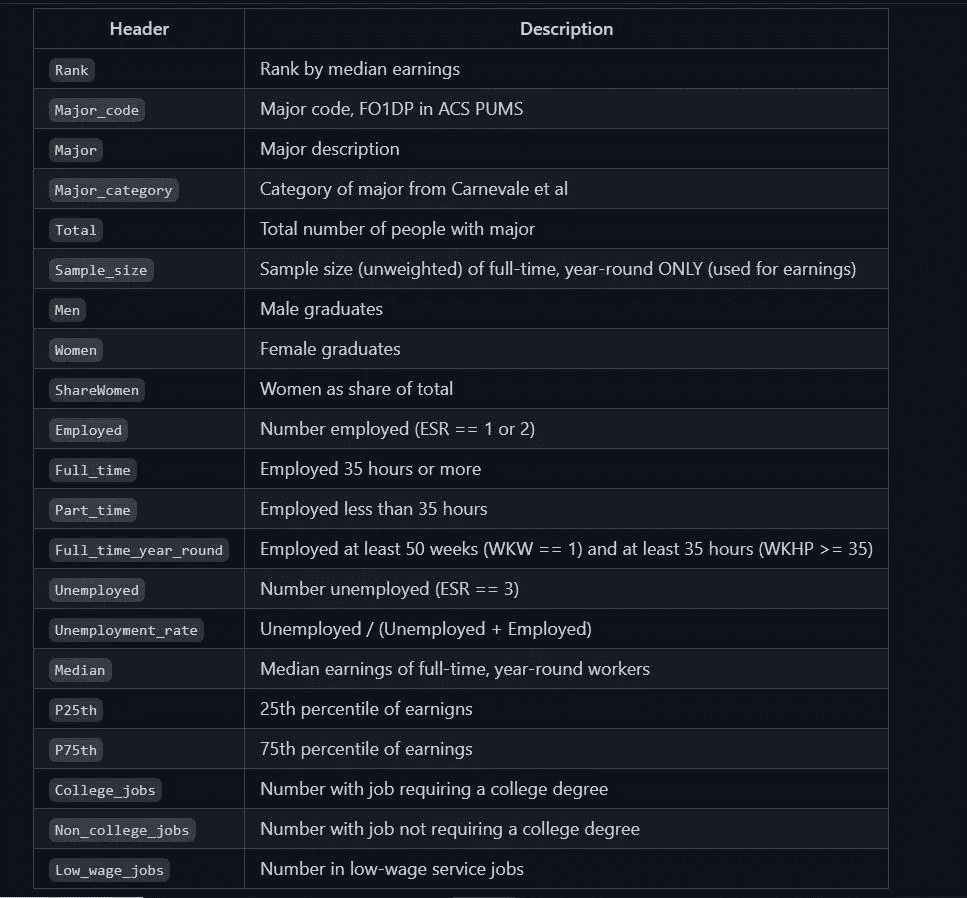

Source : Image by Author

现在，您可以使用`read_csv()`方法将 CSV 文件读入 Pandas 中的数据帧。数据导入后，您就可以开始分析数据了。

# 数据探索和分析

我将继续阐述一些问题，并通过构建情节来回答这些问题。

## 最常见的专业和最常见的专业类别有哪些？

我首先要看的是每个专业，每个专业类别有多少毕业生报名。

让我们从最常见的主要类别开始。我将按*专业类别*列对数据进行分组，得出每个类别的毕业生总数，并用水平条形图绘制出来。

```
most_common_category = recent_grads.groupby('Major_category')['Total'].sum().sort_values(ascending=False).reset_index()most_common_category
```

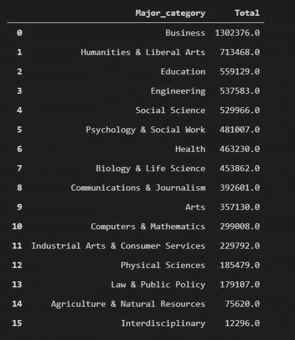

Source : Image by Author

我们现在可以使用 *Plotnine 绘制一个柱状图。*在 ggplot 或 plotnine 中，图形是逐层构建的，这就像使用+运算符并在基本图形上添加更多对象一样简单。

```
(
    ggplot(data = most_common_category)
    + geom_col(aes(x = 'Major_category', y = 'Total', fill = 'Major_category'))
    + scale_x_discrete(limits = most_common_category['Major_category'].to_list()[::-1])
    + scale_y_continuous(labels = custom_format('{:,}'))
    + coord_flip()
    + labs(x = "", y = 'Number of Total Graduates', title = 'Most common Majors Category by Total Number of Graduates')
    + theme(legend_position = 'none')
)
```

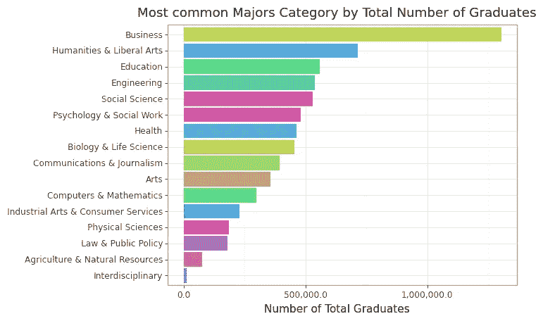

Source : Image by Author

类似地，我可以按照*专业*列分组，得到最常见专业的柱状图。但是，由于我们有 173 个专业，我将只看最常见的 20 个专业。

```
most_common_major = recent_grads.groupby('Major').sum().sort_values(by = 'Total', ascending=False).reset_index()(
    ggplot(data = most_common_major.head(20))
    + geom_col(aes(x = 'Major', y = 'Total', fill = 'Major'))
    + scale_x_discrete(limits = most_common_major['Major'].head(20).to_list()[::-1], labels = [item.title() for item in most_common_major['Major'].head(20).to_list()[::-1]])
    + scale_y_continuous(labels = custom_format('{:,}'))
    + coord_flip()
    + labs(x = "", y = 'Number of Total Graduates', title = 'Top 20 most common Majors')
    + theme(legend_position = 'none')
)
```

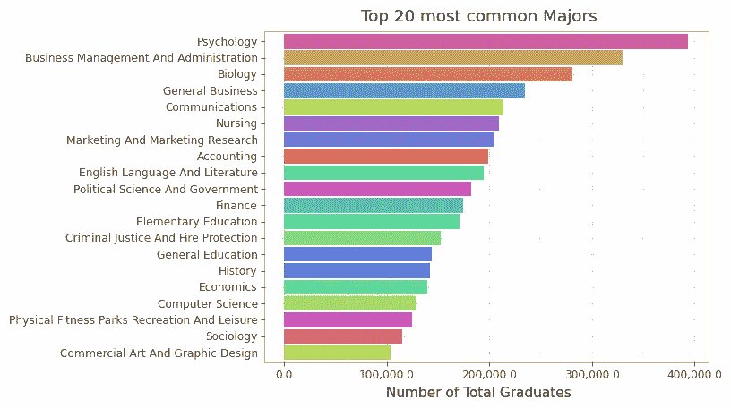

Source : Image by Author

在这里，你可以看到最常见的专业类别是商业，而心理学是最常见的专业。

## 根据工资中位数，收入最高的专业类别是什么？

我可以用两个图来回答这个问题，即条形图和箱线图。在 EDA 阶段，我可以玩两个图，但在报告时，我会放弃其中一个。

对于条形图，我将按主要类别分组，并对中值薪金应用中值聚合函数。这将使我获得每个主要类别的最高工资中位数。

```
median_per_major = recent_grads[['Median', 'Major_category']].groupby('Major_category').median().sort_values('Median', ascending=False).reset_index()median_per_major
```

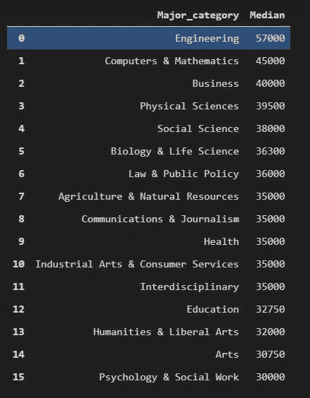

Source : Image by Author

```
( ggplot(median_per_major, aes(x = 'Major_category', y = 'Median'))
    + geom_col()
    + scale_x_discrete(limits = median_per_major['Major_category'].to_list()[::-1])
    + scale_y_continuous(labels = currency_format('$', big_mark = ','))
    + coord_flip())
```

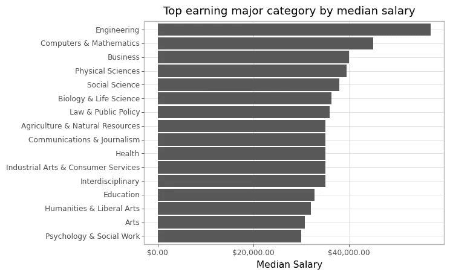

Source : Image by Author

类似地，一个更好的可视化方法是查看每个主要类别的工资中位数的分布。这将在一个图中给出中值、百分位数和异常值。

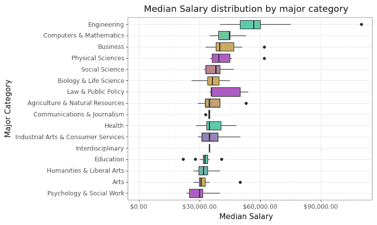

Source : Image by Author

在这里，你可以看到异常值。在初始阶段，这是理解异常值是否重要的重要一步。这里，异常值的出现是因为样本量非常小。例如，对于工程类的石油工程来说，只有 36 名毕业生接受了调查，而石油工程师的工资却非常高，约为 110，000 英镑。

## 收入最高的专业有哪些？

正如上一节所讨论的，样本量有很大的变化。因此，我将筛选样本量> 100 的专业，并按*中位数*降序排列，只得到前 20 个专业。

```
(
   ggplot(data = majors_processed.head(20))
    + geom_point(aes('Major', 'Median', color = 'Major_category'))
    + scale_x_discrete(labels = [item.title() for item in majors_processed['Major'].head(20).to_list()[::-1]], limits = majors_processed['Major'].head(20).to_list()[::-1])
    + geom_errorbar(aes(x = 'Major', ymin = 'P25th', ymax = 'P75th', color = 'Major_category'))
    + expand_limits(y=0)
    + scale_y_continuous(labels = currency_format('$', big_mark = ','))
    + labs(title = 'What are the highest-earning majors?', x = "Major", y = 'Median salary of graduates')
    + coord_flip()
)
```

请记住，该点两端的竖线是第 25 和第 75 个工资百分点，而不是置信区间。

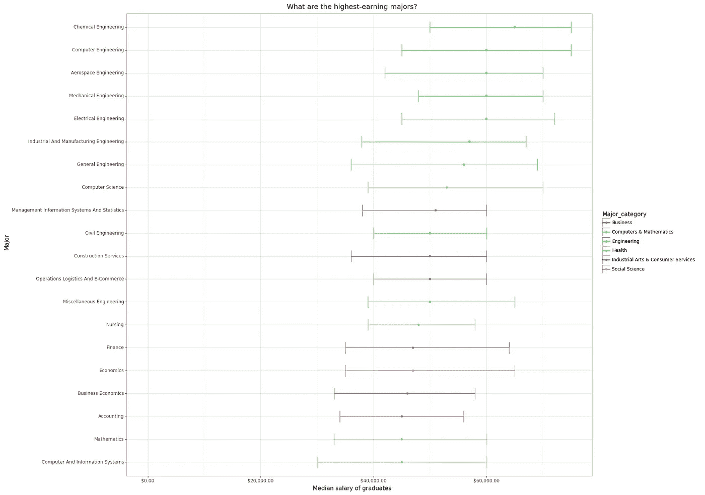

Source : Image by Author

你可以做的一个重要观察是，工程学涵盖了排名前 20 的大部分专业。

## 收入最低的专业有哪些？

类似于最高收入专业图，我也可以得到最低收入专业图。我只需要看排序数据的尾部而不是头部。

```
(
    ggplot(data = majors_processed.head(20))
    + geom_point(aes('Major', 'Median', color = 'Major_category'))
    + scale_x_discrete(labels = [item.title() for item in majors_processed['Major'].head(20).to_list()[::-1]], limits = majors_processed['Major'].head(20).to_list()[::-1])
    + geom_errorbar(aes(x = 'Major', ymin = 'P25th', ymax = 'P75th', color = 'Major_category'))
    + expand_limits(y=0)
    + scale_y_continuous(labels = currency_format('$', big_mark = ','))
    + labs(title = 'What are the highest-earning majors?', x = "Major", y = 'Median salary of graduates')
    + coord_flip()
    + theme(figure_size=(16, 16))
)
```

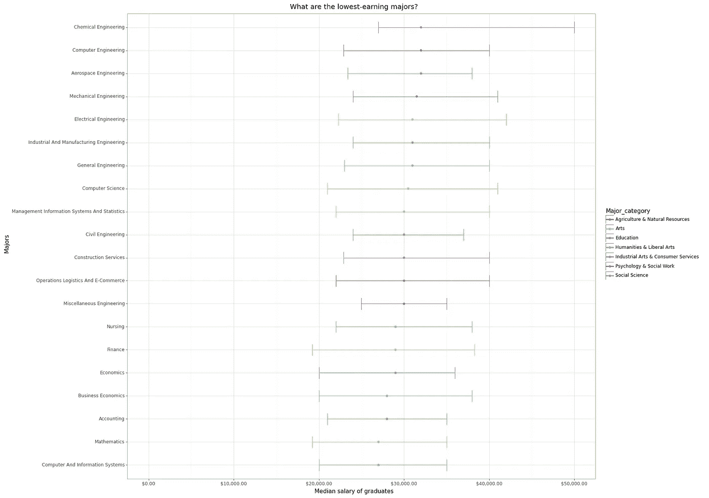

Source : Image by Author

在收入最低的专业，你几乎看不到任何 STEM 项目。

## 性别细分与典型收入有什么关系？

一个更重要的分析是查看按性别划分的收入(高收入主要类别图)，即每个高收入主要类别中有多少女性和男性。

为了进行这种分析，我将首先按照毕业生总数降序排列数据框架。这将帮助我获得前 20 个最常见的主要类别。然后，我将使用`pd.melt()`函数将*男性*和*女性*列转换为一个名为*性别*的列。

```
gender_earnings = recent_grads.sort_values('Total', ascending=False).head(20).melt(id_vars = ['Major', 'Major_category', 'Total'], value_vars= ['Men', 'Women'], var_name='Gender', value_name='Number')gender_earnings
```

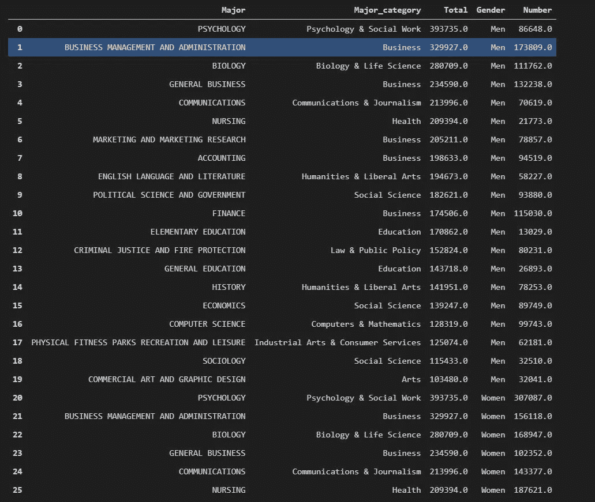

Source : Image by Author

如您所见，对于每个主要类别，将有一行是男性及其总数，一行是女性及其总数。

```
(
    ggplot(gender_earnings, aes(x = 'Major', y = 'Number', fill = 'Gender'))
    + geom_col()
    + scale_x_discrete(limits = gender_earnings['Major'].head(20).to_list()[::-1], labels = [item.title() for item in gender_earnings['Major'].head(20).to_list()[::-1]])
    + scale_y_continuous(labels = custom_format('{:,}'))
    + coord_flip()
    + labs(title = 'Ratio of Men and Women Graduating in top 20 most common majors', x = "Majors", y = 'Total Number of Graduates')
)
```

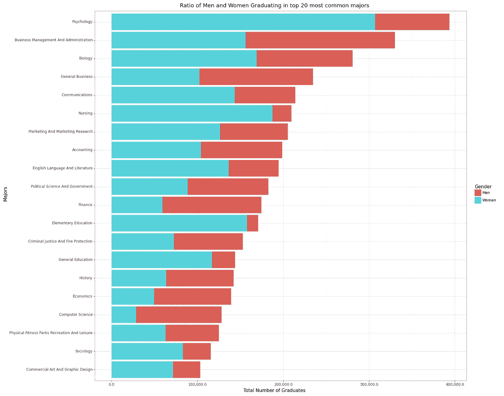

Source : Image by Author

# 结论

这只是对如何处理 Tidy Tuesday 数据以及如何使用 Plotnine 在 Python 中制作 ggplots 的简单介绍。

你可以在我的 Github 上找到完整的代码:[https://github.com/hemantrattey/TidyTuesday](https://github.com/hemantrattey/TidyTuesday)

请随时给我同样的反馈。

感谢你的阅读，我希望它能激励你继续前进，做你自己的分析。我真的建议你去看大卫·罗宾逊的电影。

本周晚些时候，我将发布另一份来自 Tidy Tuesday 数据集的分析。

过来打个招呼。在 Twitter 和 T2 的 Linkedin 上告诉我，这样你就不会错过分析。