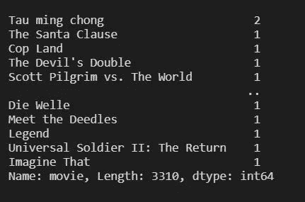
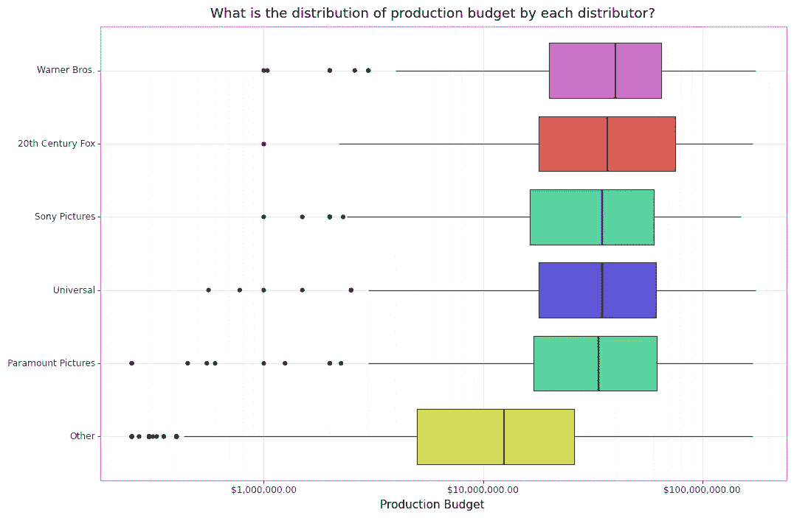
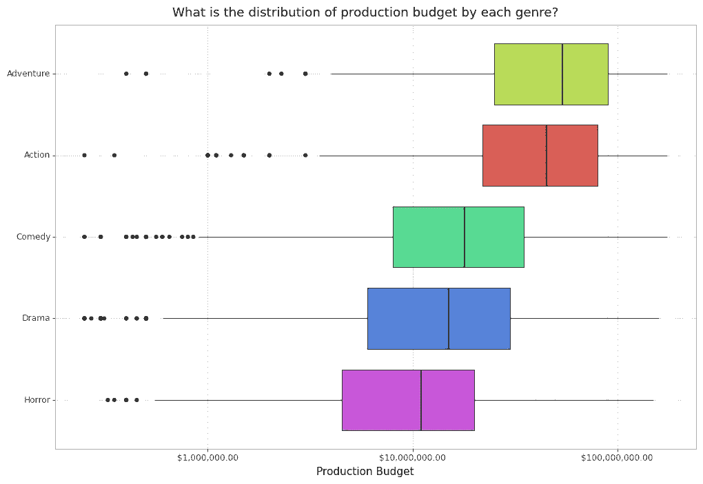
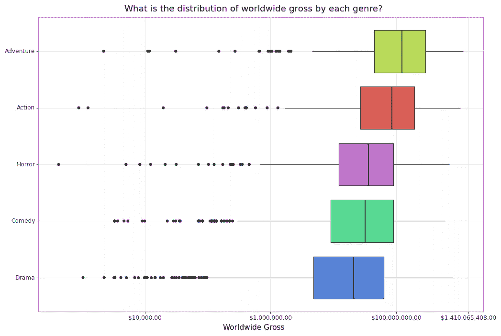
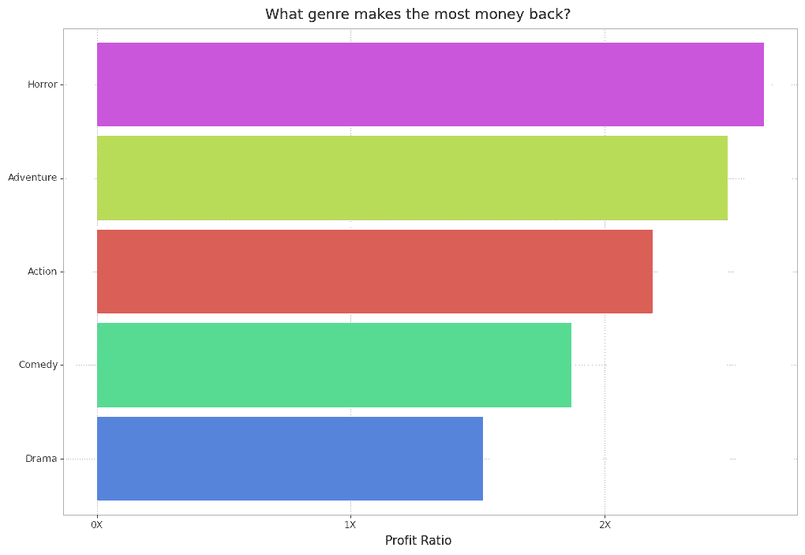
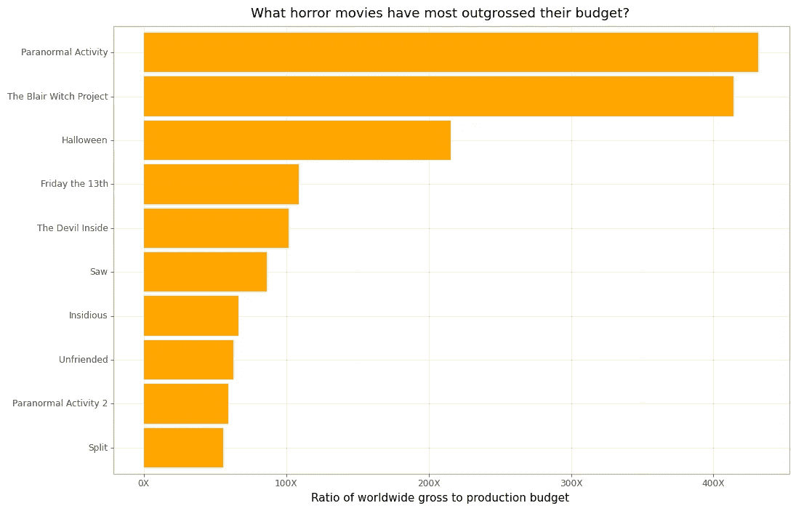
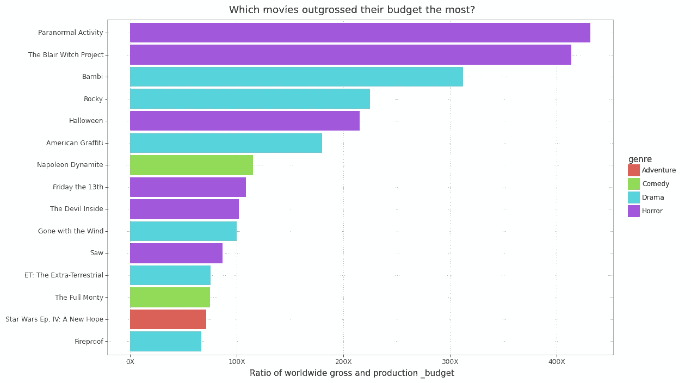
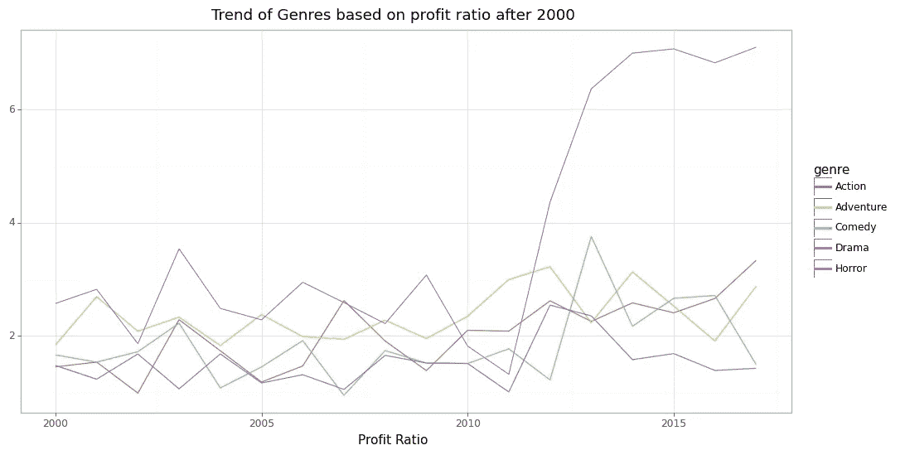

# 今天:恐怖电影利润

> 原文：<https://medium.com/mlearning-ai/tidytuesday-horror-movie-profits-13643797ce89?source=collection_archive---------3----------------------->

## 使用 Python 分析恐怖电影利润


Photo by [Stefano Pollio](https://unsplash.com/@stefanopollio?utm_source=medium&utm_medium=referral) on [Unsplash](https://unsplash.com?utm_source=medium&utm_medium=referral)

这是第二部分 ***整理星期二*** 数据集在 Python 系列中的实现。你可以在这里找到第一部[。](/mlearning-ai/tidy-tuesday-economic-guide-to-picking-a-college-major-9b2fd5275d9b)

# 获取数据

这个项目的数据可以从 Tidy Tuesday 的 Github 库[中获取。这是一个维护得非常好的存储库，还包括原始数据集以及非常需要的数据字典。](https://github.com/rfordatascience/tidytuesday/tree/master/data/2018/2018-10-23)


Source : Image by Author

现在，您可以使用`read_csv()`方法将 CSV 文件读入 Pandas 中的数据帧。数据导入后，您就可以开始分析数据了。

# 数据清理和预处理

数据清理和预处理是一个来回的过程。您清理数据并创建一些新列，分析数据，然后回来进一步预处理。因此，不要按顺序阅读 jupyter 笔记本，而是要理解这个过程。

## 清理和过滤数据集

*release_date* 列应该是 datetime，所以将其转换为 datetime 对象。

```
df['release_date'] = pd.to_datetime(df['release_date'])
```

此外，该数据集是 2018 年制作的，包含 2018 年以后的电影。这样的电影对国内和全球的票房没有价值。因此，只过滤并保留*上映日期* < 2018 年和*全球票房* > 0 的电影。

```
movie_profit = df[(df['release_date'] < '2018') & (df['worldwide_gross'] > 0)]
```

现在，只有一个重复的电影可以丢弃。

```
movie_profit['movie'].value_counts()
```



Source : Image by Author

```
movie_profit = movie_profit.drop_duplicates(subset=['movie'], keep = 'last')
```

## 数据预处理

我现在将创建两个专栏，帮助我了解一段时间内的趋势。一个是*十年*栏，另一个是*利润率*栏，是全球总利润除以生产预算。

```
movie_profit[‘decade’] = (movie_profit[‘release_date’].dt.year//10) * 10movie_profit['profit_ratio'] = movie_profit['worldwide_gross'] / movie_profit['production_budget']
```

在查看生产预算直方图时，我想到只保留前 5 名分销商，而不是所有 183 名分销商。因此，我将其余的转换为*其他*类别。

# 数据分析和可视化

这组数据是基于一篇《T21》的文章，这篇文章关注的是恐怖电影及其在过去几十年中的利润率。

## 各经销商的生产预算分配是怎样的？

生产预算变化很大，因为有独立的大经销商。因此，最好以对数尺度来看所有的数字变量。

```
(
    ggplot(movie_profit, aes(x = 'distributor', y = 'production_budget', fill = 'distributor'))
    + geom_boxplot()
    + scale_x_discrete(limits = budget_per_distributor.sort_values('production_budget', ascending=False)['distributor'].to_list()[::-1])
    + scale_y_log10(labels = currency_format('$', big_mark=','))
    + coord_flip()
    + theme(legend_position='none', figure_size=(12, 8))
)
```



Source : Image by Author

这是有道理的，因为大经销商公司可以投入大量资金，而许多独立经销商往往花费少得多。

## 各分销商的全球销售总额分布情况如何？

同样，我们可以查看每个分销商的全球总收入。

```
(
ggplot(movie_profit, aes(x = 'distributor', y = 'worldwide_gross', fill = 'distributor'))
    + geom_boxplot()
    + scale_x_discrete(limits = budget_per_distributor.sort_values('worldwide_gross', ascending=False)['distributor'].to_list()[::-1])
    + scale_y_log10(labels = currency_format('$', big_mark=','))
    + coord_flip()
    + theme(legend_position='none', figure_size=(12, 8))
    + labs(x = '', y = 'Worldwide Gross', title = 'What is the distribution of worldwide gross by each distributor?')
)
```


Source : Image by Author

## 各流派的制作预算分配如何？

文章的关键谈了为什么恐怖片是最好的投资。这篇文章声称，许多恐怖电影的预算很低，但最终却在全球范围内取得了巨大的成功。

```
( 
    ggplot(movie_profit, aes(x = 'genre', y = 'production_budget', fill = 'genre'))
    + geom_boxplot() 
    + scale_x_discrete(limits = budget_per_genre.sort_values('production_budget', ascending=False)['genre'].to_list()[::-1])
    + scale_y_log10(labels = currency_format('$', big_mark=','))
    + coord_flip() 
    + theme(legend_position='none', figure_size=(12, 8))
    + labs(x = "", y = 'Production Budget', title = 'What is the distribution of production budget by each genre?')
)
```



Source : Image by Author

在这里，显然恐怖电影的预算中值是最少的。

## 各流派的全球总收入分布情况如何？

```
(
    ggplot(movie_profit, aes(x = 'genre', y = 'worldwide_gross', fill = 'genre'))
    + geom_boxplot()
    + scale_x_discrete(limits = budget_per_genre.sort_values('worldwide_gross', ascending=False)['genre'].to_list()[::-1]) 
    + scale_y_log10(labels = currency_format('$', big_mark=','))
    + coord_flip()
    + theme(legend_position='none', figure_size=(12, 8))
    + labs(x = "", y = 'Worldwide Gross', title = 'What is the distribution of worldwide gross by each genre?')
)
```



Source : Image by Author

显然，恐怖电影的预算最少，但最终却在全球总收入中赚得盆满钵满。

## 哪些流派的派息率最大？

再一次，通过查看支付比率的条形图，我们可以了解哪些类型赚了最多的钱。

```
(
ggplot(median_profit_ratio, aes(x = 'genre', y = 'profit_ratio', fill = 'genre'))
    + geom_col() 
    + coord_flip()
    + scale_x_discrete(limits = median_profit_ratio['genre'].to_list()[::-1])
    + scale_y_continuous(labels = custom_format('{:n}X'))
    + theme(legend_position='none', figure_size=(12, 8))
    + labs(x = "", y = 'Profit Ratio', title = 'What genre makes the most money back?')
)
```



Source : Image by Author

显然，中等水平的恐怖电影赚了最多的钱。

## 哪些恐怖电影的票房收入超过了他们的预算？

既然，文章说的是恐怖片，那就按盈利比例来看看排名靠前的恐怖片就好了。

```
(
ggplot(horror_movies.sort_values('profit_ratio', ascending=False).head(10), aes(x = 'movie', y = 'profit_ratio'))
    + geom_col(fill = 'orange')
    + coord_flip()
    + scale_x_discrete(limits = horror_movies.sort_values('profit_ratio', ascending=False).head(10)['movie'].to_list()[::-1])
    + scale_y_continuous(labels = custom_format('{:n}X'))
    + labs(x = "", y = 'Ratio of worldwide gross to production budget', title = 'What horror movies have most outgrossed their budget?')
    + theme(figure_size= (12, 8))
)
```



Source : Image by Author

这很有趣，因为灵异活动和布莱尔女巫项目最终的预算超过了 400 倍。这两部电影的预算都很少，因为它们是纪录片，但最终却赚回了数百万美元。

## 有哪些电影赚回来的钱最多？

同样，我们可以看所有的电影，而不仅仅是恐怖片。我们看到在利润比排名前 15 的电影中，大部分都是恐怖片。



Source : Image by Author

## 近年来体裁的总趋势是什么？

看看近年来流派的趋势是如何变化的会很有趣。



Source : Image by Author

我们看到 2010 年后中值利润率突然上升。这表明很多恐怖电影为他们的发行商赚了很多钱。

# 结论

因此，我们可以看到，恐怖电影往往是分销商的最佳投资，并最终赚了很多钱，特别是在过去的二十年里。

你可以在我的 Github 上找到完整的代码:[https://github.com/hemantrattey/TidyTuesday](https://github.com/hemantrattey/TidyTuesday)

请随时给我同样的反馈。

感谢你的阅读，我希望它能激励你继续前进，做你自己的分析。我真的建议你去看一下[](https://www.youtube.com/user/safe4democracy)****的截屏。****

**我将在下周发布另一份来自 Tidy Tuesday 数据集的分析。**

**过来打个招呼。在推特[和 Linkedin](https://twitter.com/hemantrattey) 上告诉我，这样你就不会错过分析。**