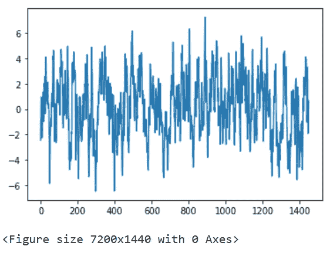
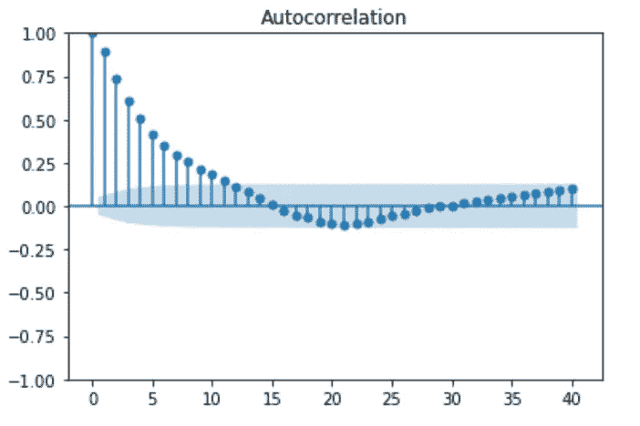
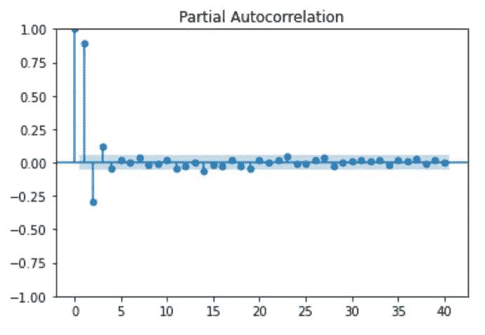
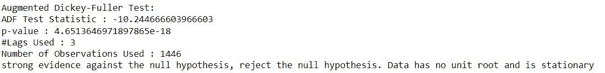
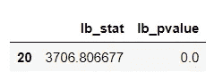
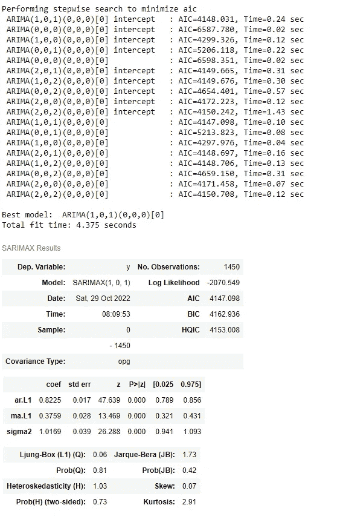
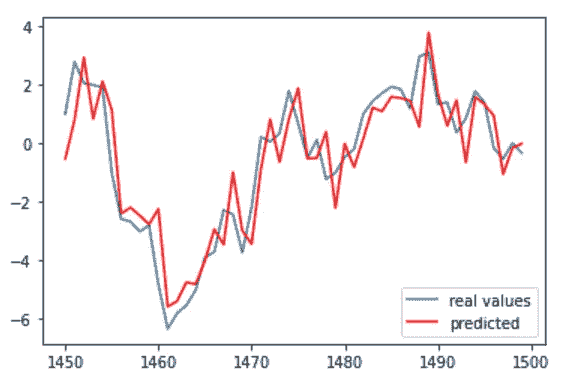
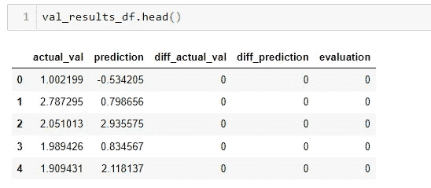
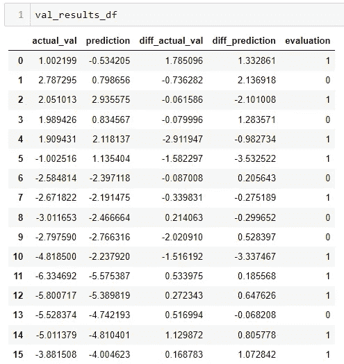
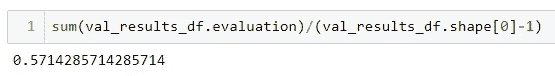

# 时间序列:ARMA 示例

> 原文：<https://medium.com/mlearning-ai/time-series-an-arma-example-c8d2ae0b092c?source=collection_archive---------3----------------------->

本文由[阿尔帕斯兰·梅斯里](https://medium.com/u/fe99f0a4a612?source=post_page-----c8d2ae0b092c--------------------------------)和[黑尔·克孜尔杜曼](https://medium.com/u/233c859ccc6?source=post_page-----c8d2ae0b092c--------------------------------)撰写。

[Bruno Ticianelli](https://www.pexels.com/tr-tr/@bruno-ticianelli-210264/) by Pexels

本研究的目的是通过对合成数据的时间序列模型进行估计，从视觉和方向预测两个角度检验该模型的成功性。

您可以通过[链接](https://github.com/simplextable/Time_Series_ARMA)访问这些文件。

首先制造所需的进口品。

然后需要读取 CSV 文件和 df 文件被分割成训练和测试变量。列名从“y7”更改为“actual_val”。df 文件包含 1500 行。最后 50 行分配给验证阶段。前 1450 行用于训练部分。

df_train 的图叫做。

在时间序列分析中，需要检查数据的相关图。第一个相关图是关于 ACF(自相关函数)的。在随机数据中，图形需要突然变小，以显示行之间没有相关性。在这种情况下，可以看出数据没有长期记忆。在 15 行之后，相关性不再存在。这意味着数据是静态的。这个想法将会在 ADF 上得到更深入的验证。是否平稳表明所用模型是 ARMA 还是 ARIMA。

其次，考察了 PACF(偏自相关函数)图。

现在将进行 ADF(扩展的 Dickey-Fuller 检验)测试，以了解数据是否平稳。如果有单位根，可以说数据是非平稳的。

在下一阶段，将进行 Ljung-Box 测试，以了解数据是否具有时间序列结构。

H0:缺乏序列相关性

Ha:序列相关性的存在

p 值小于 5%，这意味着 H0 假设被拒绝。因此，在这种情况下可以使用 ARMA。在下一个代码块中，将调用 ARMA 模型，并为每个变化计算 AKA (Akaike 的信息标准)值。

根据 AKA 值确定最佳模型为 ARMA(1，1)。在下一阶段，将在图表中比较预测值和观察值。

蓝线代表实际观察值，红线代表预测值。可以看出，预测值与实际值差别不大。所以可以说 ARMA(1，1)模型效果不错。

接下来，ARMA 结果被赋给 results_series 变量，并被转换为 dataframe。df_val 变量的索引被重置。添加了 diff_actual_val、diff_prediction 和 evaluation 列。

获得 val_results 后，计算新列的值。

在这种情况下，评估标准将是实际数据中的方向是否被正确估计。如果根据实际数据正确预测增减，则在评估栏中写为 1，如果预测错误，则写为 0。

结果，我们的模型在 57%的时间里正确预测了涨跌的方向。

 [## Mlearning.ai 提交建议

### 如何成为 Mlearning.ai 上的作家

medium.com](/mlearning-ai/mlearning-ai-submission-suggestions-b51e2b130bfb)