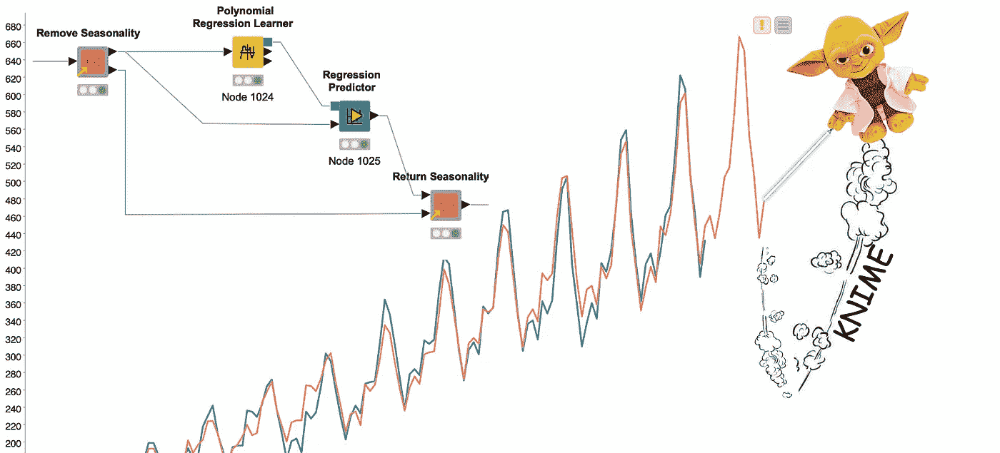

# 基于 KNIME 的时间序列分析——介绍

> 原文：<https://medium.com/mlearning-ai/time-series-analysis-with-knime-an-introduction-7ce01a7ce055?source=collection_archive---------0----------------------->

## 了解使用 KNIME Analytics 平台执行时间序列分析的基本步骤，无需编写一行代码，仍然使用 python 库。

# 介绍

在本例中，我们将了解时间序列的属性以及如何对它们建模以计算预测。

fig 1: Yodime forecasting Time Series (image by author)