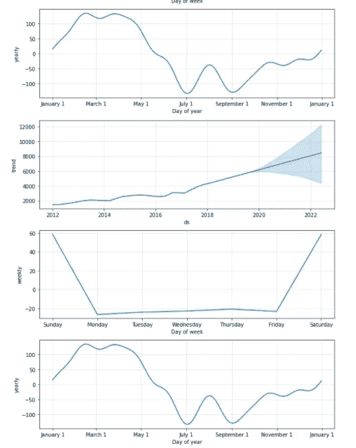

# 时间数列预测法

> 原文：<https://medium.com/mlearning-ai/time-series-forecasting-445e2dde194c?source=collection_archive---------0----------------------->

## 使用 Prophet 预测时间序列数据

Time Series(Source: By Author)

时间序列数据由一段时间内测量的数据点组成，这段时间可以是小时、天、周、月等。一个基本的例子可以是一个公司逐月的销售数据。这有助于分析一段时间内的趋势。