# 利用 SARIMAX 进行时间序列预测

> 原文：<https://medium.com/mlearning-ai/time-series-forecasting-using-sarimax-ca98dd7238a0?source=collection_archive---------1----------------------->

大家好，在我以前的一篇帖子中，我们讨论了如何使用经典时间序列模型(ARIMA)预测变量。在本帖中，我将向你展示如何使用一个经典的时间序列模型(SARIMAX ),以防你的数据集有相关的季节性趋势。看起来每个人都很兴奋，让我们快点开始吧。如果你不确定 ARIMA 模式，请跟进以下帖子:

 [## 基于 PYTHON 的 ARIMA 单变量时间序列预测

### 问题陈述:我试图解决一个问题陈述，这将有助于预测单变量…

medium.com](/mlearning-ai/univariate-variable-time-series-forecasting-using-arima-using-python-2faa012413e1) 

**理论:** SARIMAX 是四个不同模块的组合，即

S->它代表季节性。如果您发现数据模式每月/每年都重复，那么是的，这是季节性的。

AR->自动回归意味着我的当前值依赖于所有滞后值或过去值。

I->如果你的数据集不是稳定的，你就像我们在上面提到的帖子中所做的那样，在 ARIMA 模型的情况下，继续尝试使它稳定。I 代表我们用以前存在的价值创造的差异的数量。

移动平均线，在某种程度上我们需要把它卷起来。

X->它代表导致变量变化的其他外部变量。当我们做多变量时间序列分析时使用它。

让我们开始编码吧，因为我们要让经典时间序列模型的实现变得非常容易。

让我们首先从导入非常基本的模块开始:

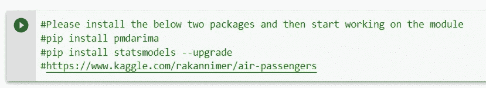

Please import the packages as it is required for the practicals

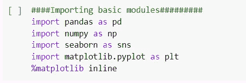

Basic modules imported

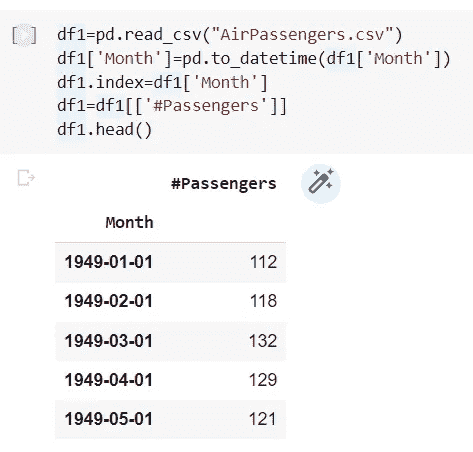

Reading the dataset from Kaggle and setting the date column as index

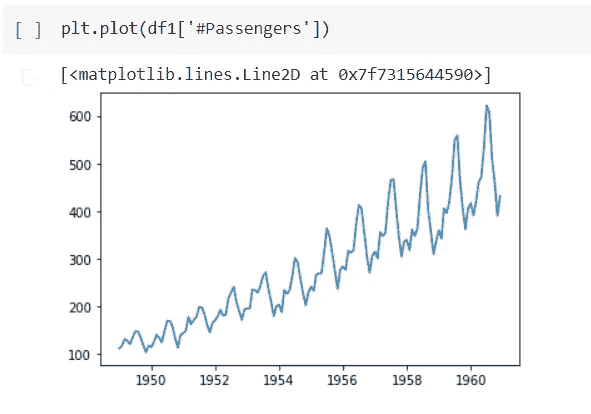

Visualizing the dataset

我可以用我的探索性数据分析技巧想象出数据有上升的趋势、每年的季节性和小的残差。让我们尝试应用更多的编码技巧。

我们需要检查并确定我的数据集是否是静态的。我相信你们都知道如何检查。如果你不喜欢，请阅读上面的博客。我也提到了简短的代码片段。

在这种情况下，我应用 ADF 测试(增强的 Dickey Fuller 测试)。我将用两种不同的方式向你展示如何去做(**老方法**):

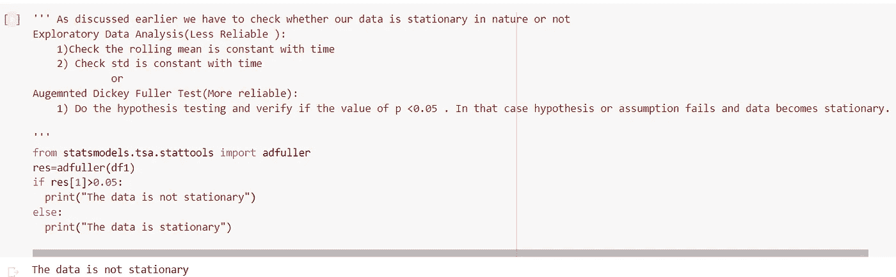

Data is not stationary. fails hypothesis test.

让我们用另一种方式做同样的测试(**新方式**):

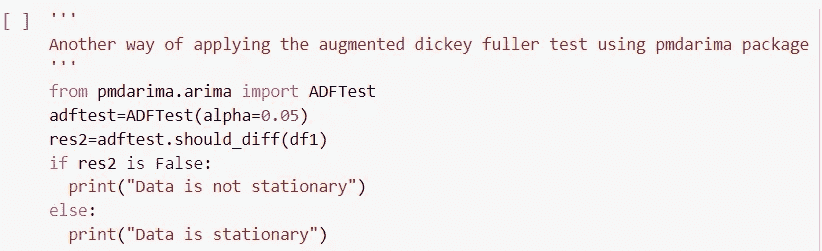

Data is not stationary. fails hypothesis test.

让我们尝试将数据的四个组成部分形象化，这四个组成部分依次构成一个时间序列。

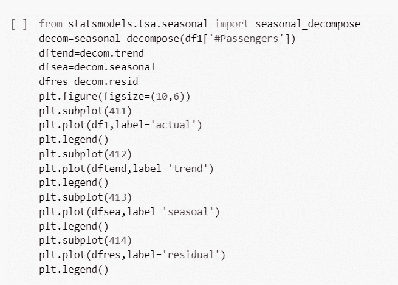

Code for seasonal_decompose

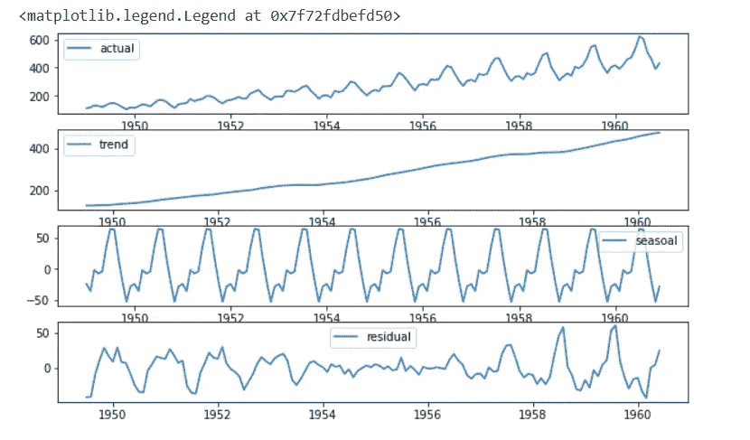

EDA for 4 components in time series

现在，当我发现我的数据不是稳定的，我必须做大量的数学，微分和许多其他东西，使数据稳定，以应用时间序列模型。此外，我还必须执行 pacf(部分自动相关)和 acf(自动相关)测试，以确定 p 和 q 的值。让我们使用 auto_arima 包来简化这个过程。

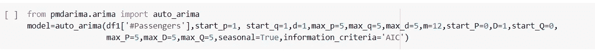

Just one line solves all our problem

我命令我的代码尝试 p、d 和 q 的多种组合，从值 1 开始，一直到最大值 5。它基于 AIC 值进行检查，并尝试返回 p、d 和 q 的最佳值。看起来如此简单和容易。

简言之，降低 AIC 的价值，作为回报，你会得到更好的模型。

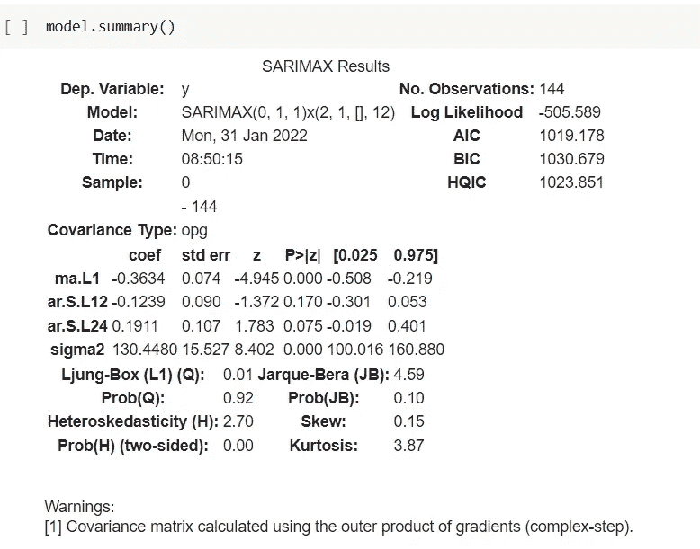

Computer suggested me to use SARIMAX. I even got the parameters (wowwww) moment!!!

现在，让我们尝试将数据分为训练数据集和测试数据集。我们必须用 Sarimax 训练我们的模型，测试它，然后预测未来的值。这是我们的主要目标。

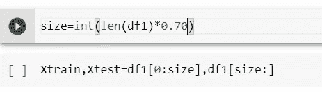

Splitting

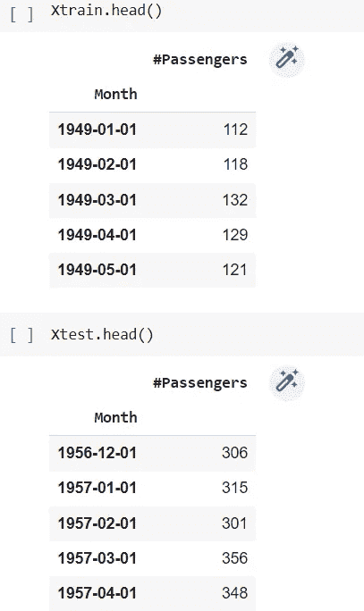

Checking the look and feel of train and test dataset

让我们引入 statsmodels 包的使用，并尝试将 SARIMAX 模型实施到行动中。

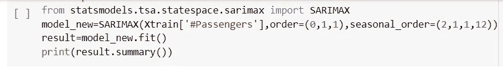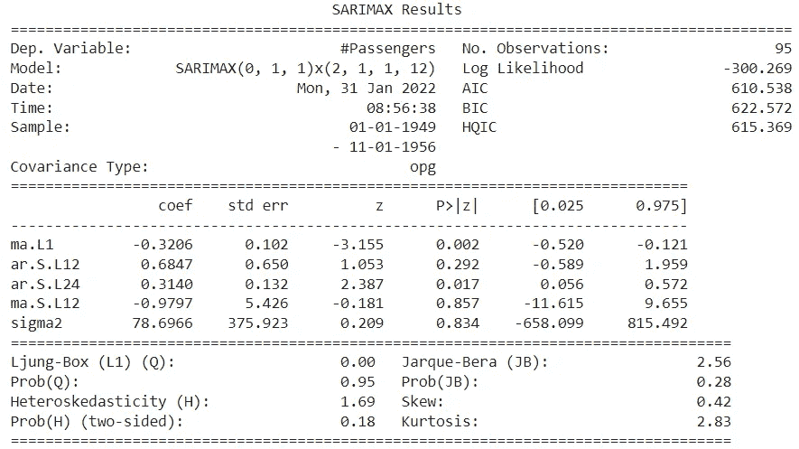

让我们预测测试数据集的结果。这个过程非常有趣，有点不同，因为它是一个时间序列模型。

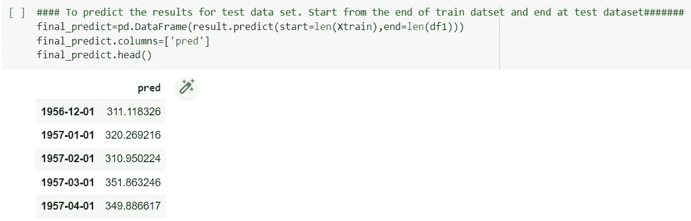

让我们把预测值和实际值连接起来，并把它们放在一起。

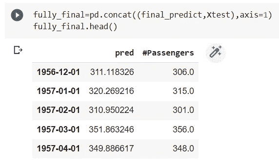

seems good

让我们尝试将实际值、预测值和预测值可视化。我得到了惊人的结果。

Seems awesome right!!!

请记住，SARIMAX p，d，q 值也可以通过以前的 pacf 和 acf 测试方法来确定，就像在以前的帖子中讨论的那样。我试图让这个过程变得简单一点，这样即使一个非技术人员也可以实现和使用它。如果你有任何疑问或担心，请让我知道。任何评论都可以帮助我更快地走向数据科学之路。

 [## Mlearning.ai 提交建议

### 如何成为 Mlearning.ai 上的作家

medium.com](/mlearning-ai/mlearning-ai-submission-suggestions-b51e2b130bfb)