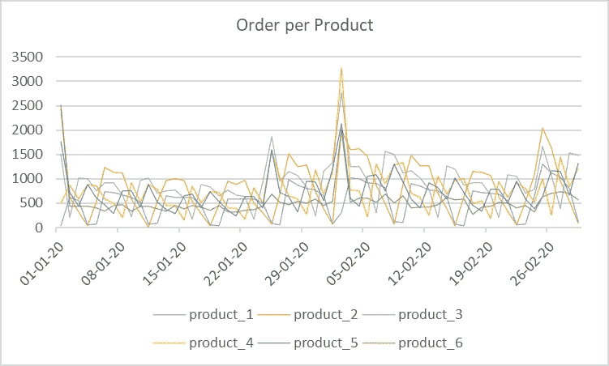
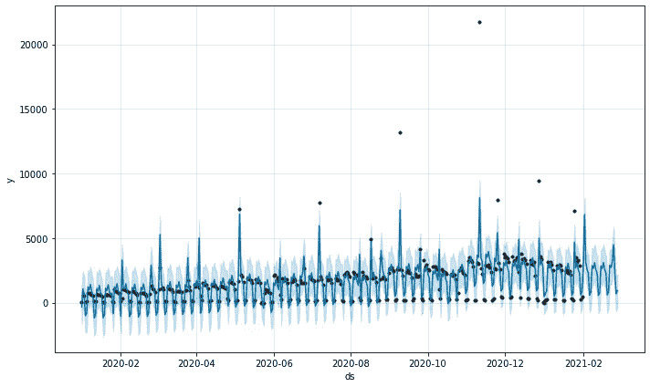
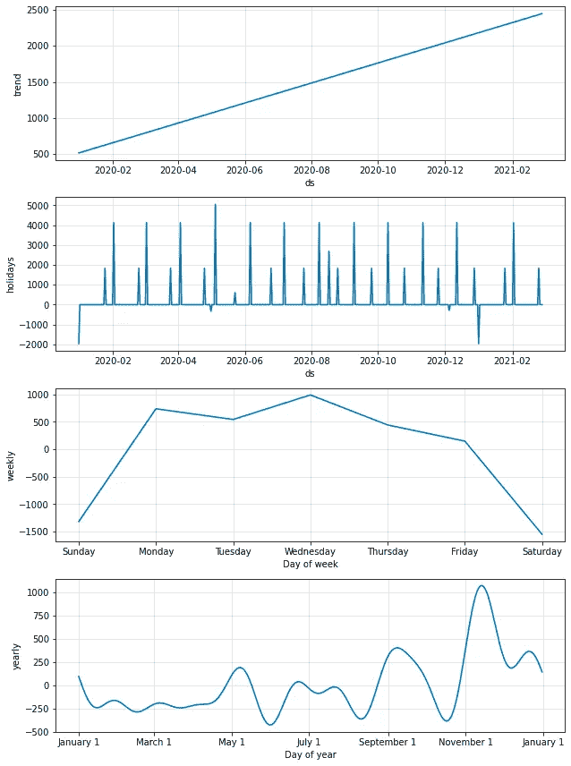
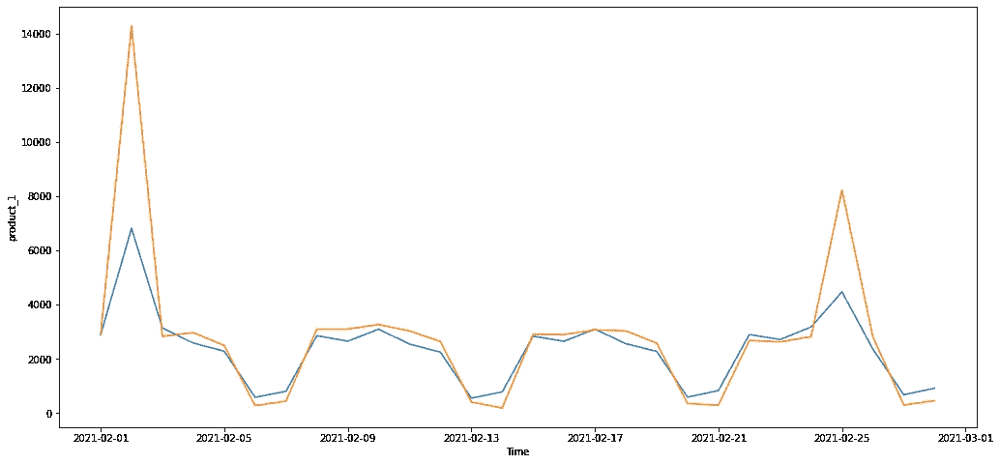

# 利用 FBProphet 进行考虑假期的时间序列预测

> 原文：<https://medium.com/mlearning-ai/time-series-forecasting-while-considering-holidays-with-fbprophet-cccde95572e1?source=collection_archive---------0----------------------->

Photo by [Link Hoang](https://unsplash.com/@linkhoang?utm_source=medium&utm_medium=referral) on [Unsplash](https://unsplash.com?utm_source=medium&utm_medium=referral)

FBProphet 是一个经过验证的时间序列预测项目库。与其他时间序列预测库相比，它的一些优势包括:

*   可以适应季节性数据，无论是每年，每月，每周，甚至每天。
*   能够很好地处理异常值和缺失数据。
*   易于添加特殊的日子，如假期和用户定义的日期，要考虑的学习过程。
*   能够应对趋势的极端变化。

该库本身非常容易实现，不需要太多的努力来清理数据。

在这个故事中，我们将看到 FBProphet 在时间序列预测案例上的实现。该库将帮助我们预测某电商一整月的几个产品订单。

由于其特点，一个电子商务可以在 **节日和特殊日期(如情人节)或重复编号的日期(如 11-11(11 月 11 日)**)进行多次**促销。这是创建时序预测模型时应该考虑的重要信息。**

# 时序数据

让我们检查一下这个电子商务历史交易的综合数据。**您可以在这里** 访问 csv 和 ipynb 文件 [**。**](https://github.com/evanbudianto/forecasting-with-fbprophet)

Number of order per product for 1 Jan 2020–29 Jeb 2020

这里可以看出，重复编号日期的活动对订单数量的增加起到了重要作用。你可以看到 01–01–20 和 02–02–20 的峰值。这可能是大规模促销计划或其他营销活动的结果。

# 预测

使用这些数据，我们将**预测上个月(2021 年 2 月)**每种产品的订单。然后将预测的数字与当月的实际订单数据进行比较。

为了做到这一点，我们需要两个数据:

*   历史订单编号
*   特殊日期参考(节假日、促销日等)。)

首先，我们需要导入所需的库和相关数据集。

在数据集上实现 fbprophet 模块之前，拥有正确的列名是至关重要的。

然后，拟合和预测过程非常简单，就像其他常规的机器学习库一样。我们将首先对一列进行预测。

该模型可以接受季节性和节假日作为其参数。您可以调整此参数，以寻找模型的最佳拟合。

预测值可以直接从模型中绘制出来:

The dots represent the actual data while the line represent fitting and predicting result

您可以看到该模型预测了未来一个月(2021 年 2 月)的订单。

该模型还可以显示数据中的相关信息，例如:

*   一般趋势
*   特殊日期对订单编号的影响
*   每周/每年的季节性

# 测量误差

为了衡量预测结果和实际数据之间的误差，我们将使用 MAPE 和梅。

您可能会发现实际值和预测值之间存在差距，尤其是在订单数量非常多的日期。

Actual data (orange) vs predicted data (blue)

在这个阶段，您可以通过进行超参数调整来尝试改进您的模型，以更好地拟合数据。然后，您可以将该过程应用于其他剩余的列。

# 摘要

FBProphet 是一个非常强大但易于使用的时间序列预测库。从该算法中获得最佳结果的关键是首先理解您的数据，然后将其特征作为参数进行拟合，如季节性、节假日等。

 [## Mlearning.ai 提交建议

### 如何成为 Mlearning.ai 上的作家

medium.com](/mlearning-ai/mlearning-ai-submission-suggestions-b51e2b130bfb)