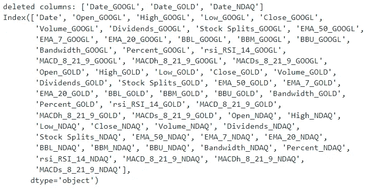
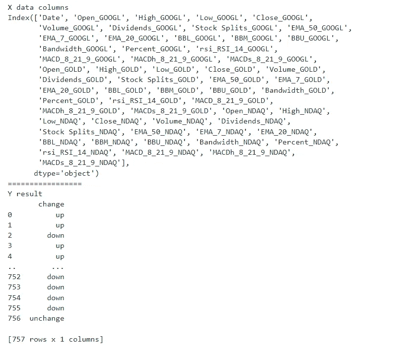
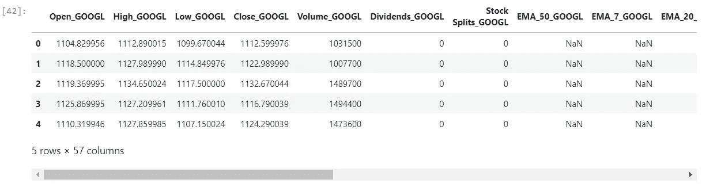
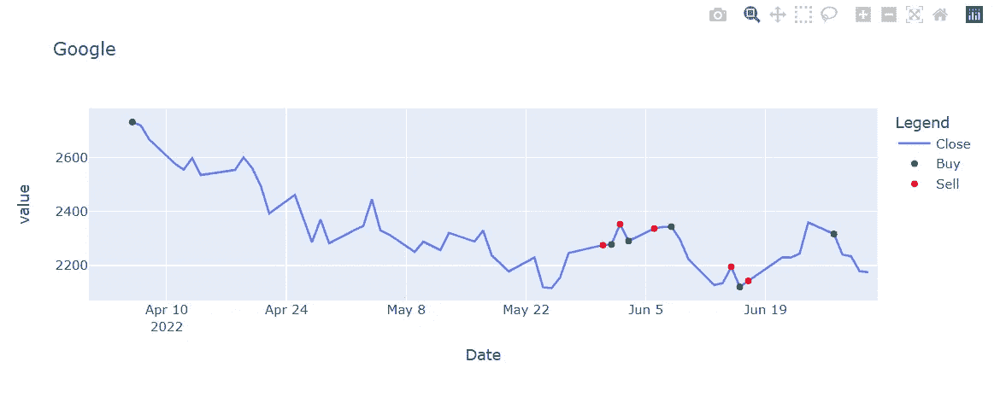

# 采用新数据方法的时间序列建模

> 原文：<https://medium.com/mlearning-ai/time-series-modelling-with-a-new-data-approach-e5a8e385a5be?source=collection_archive---------11----------------------->

增强数据结构，增强数据处理


Photo by [Pierre Borthiry](https://unsplash.com/@peiobty?utm_source=medium&utm_medium=referral) on [Unsplash](https://unsplash.com?utm_source=medium&utm_medium=referral)

时间序列数据是按时间顺序索引的数据点序列。时间序列数据最常见的例子是股票市场的每日收盘价。时间序列分析可以帮助组织了解一段时间内趋势或系统模式的根本原因。

在本帖中，我们将用股市上实用的机器学习模型展示 **Time_Series_Transform** 包。时间序列转换可以帮助我们重新格式化时间序列数据，并简化特征工程过程。

[](https://pypi.org/project/time-series-transform/)

**你可以从以前的帖子中找到更多关于该包的细节，请看看吧！！**

**[](https://jchiang1225.medium.com/a-new-data-approach-in-time-series-analysis-2d6c97f209cd) [## 时间序列分析中一种新的数据方法

### 增强数据结构，增强数据处理

jchiang1225.medium.com](https://jchiang1225.medium.com/a-new-data-approach-in-time-series-analysis-2d6c97f209cd)** 

# **装置**

```
pip install time-series-transform
```

***注意:确保 tensorflow 和 plotly 安装在您的机器上***

# **我们开始吧**

**机器学习是人工智能的一个分支，也是提供数学模型预测数据的最常用方法之一。**特征工程**是将原始数据转化为模型所需特征的基本步骤。我们能够从原始数据中生成新的特征，以便简化、加速和提高模型精度。**

**这个演示将使用 sklearn、Stock_Transformer 和 Time_Series_Transformer 来训练一个机器学习模型，以预测每日股票的动量。随后，我们将使用动量生成买入/卖出信号，并使用 Time_Series_Transformer 绘制一个图。**

***注意:本教程旨在演示如何使用时间序列转换器，而不是演示如何投资股票***

**通过使用纳斯达克和黄金，我们可以丰富的功能。我们将 Nasdaq 和 Gold 扩展为专题专栏。接下来，我们使用 make_lead 特性结合 up_down_transform 函数来生成下一个时间段的定价时刻。**

************

**通过将数据分为训练集和测试集，我们准备好建立我们的机器学习管道。在这个例子中，我们将只构建一个简单的模型。**

```
 precision    recall  f1-score   support

        down       0.40      0.12      0.19        33
    unchange       0.00      0.00      0.00         1
          up       0.40      0.77      0.53        26

    accuracy                           0.40        60
   macro avg       0.27      0.30      0.24        60
weighted avg       0.39      0.40      0.33        60

[[ 4  0 29]
 [ 0  0  1]
 [ 6  0 20]]
```

**我们基于我们的机器学习模型生成预测。**时间序列变换**也可以帮助我们实现可视化。**

**在我们创建图之前，我们需要处理我们的结果以生成一些买入/卖出信号。为了生成信号，我们使用以下规则:**

1.  **第一期应该是买入。**
2.  **买入并持有，直到卖出**
3.  **当预测值上升时买入**
4.  **当预测值下降时卖出**

****

**尽管这个模型并没有给出一个非常有希望的结果，但是这个软件包帮助我们处理数据并且很容易地将结果可视化。**

# **下一步是什么…**

**在这个例子中，我们通过利用 **time_series_transform** 包来构建机器学习模型。这个包也可以帮助我们用 tensorflow 的力量构建**神经网络**模型特征。我们能够用一行代码将数据转换成 tfRecord。**

**你可以在[文档](https://allen-chiang.github.io/Time-Series-Transformer/introduction.html)中找到更多细节。**

**感谢您的阅读，祝您有美好的一天！！**

**[](/mlearning-ai/mlearning-ai-submission-suggestions-b51e2b130bfb) [## Mlearning.ai 提交建议

### 如何成为 Mlearning.ai 上的作家

medium.com](/mlearning-ai/mlearning-ai-submission-suggestions-b51e2b130bfb)**