# 时间序列比例数据分析

> 原文：<https://medium.com/mlearning-ai/time-series-proportion-data-analysis-3ce9071b37ac?source=collection_archive---------2----------------------->

比例数据分析常用于监测传染病的严重程度。例如，城市 A 与城市 b 的 COV19 患病率进行比较。通过使用比例数据，我们可以对用于控制情况的措施有一个总体了解。

以下是这两个城市随时间变化的流行率。(此为模拟数据，非真实)。总体来看，随着时间的推移，A 组的阳性率高于 B 组。但问题是，我们如何给出一个**统计陈述**来描述这个？

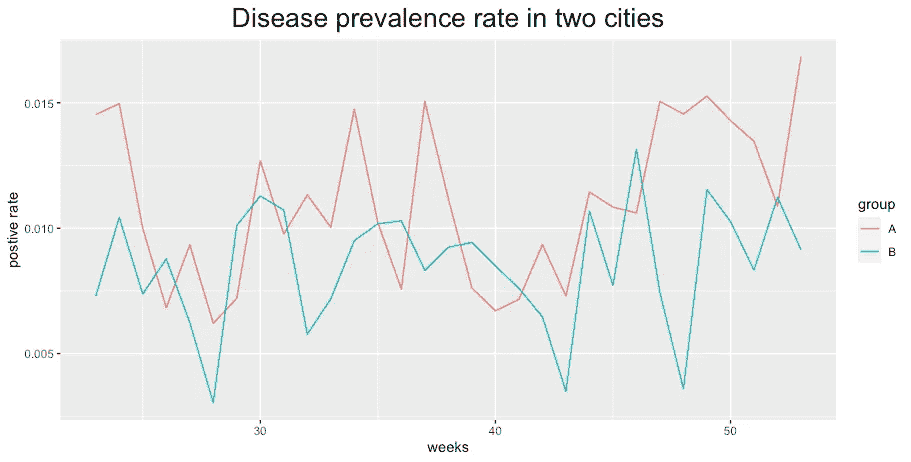

# 动机

我们想知道 ***随着时间*** 的推移，A 组的患病率是否高于 B 组。也就是说，时间效应不是我们感兴趣的因素，而是群体效应。

# 工作数据

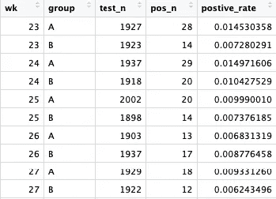

# 建模

我将执行以下 4 个模型。

1.  线性模型
2.  二元回归
3.  泊松回归
4.  自回归

本练习的目的不是预测，因此模型的 MSE 或交叉验证可能不是确定模型用途的好方法。相反，我想更多地关注数据类型、模型假设，当然还有应用某个模型的潜在危险。

# 线性模型

线性回归永远是起点！

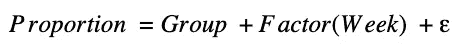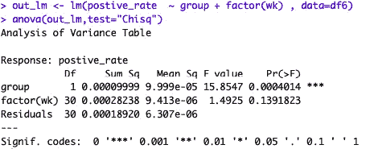

这里我们可以看到群体效应是显著的。

**优点:易于理解，易于运行**

**缺点:**

1.  **因变量在[0，1]之间，不从 Infinite 到无穷大**
2.  **周效应被认为是独立的**
3.  **很明显根本不是线性的**

# 二项式回归

本文详细介绍了二项式回归

 [## 二项式回归模型:你需要知道的一切

### 外加一个使用 Python 和 statsmodels 的逐步教程

towardsdatascience.com](https://towardsdatascience.com/the-binomial-regression-model-everything-you-need-to-know-5216f1a483d3) 

我们在这里选择最常用的 logit 作为连接函数，这与 logistic 回归非常相似。

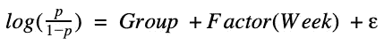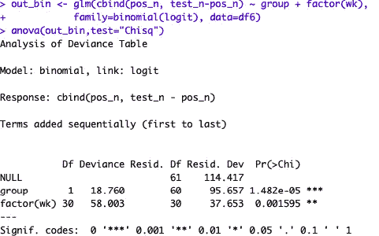

p 值太显著了！

**优点:该模型用于预测数据**

**缺点:忽略时间效应**

# 泊松回归

泊松回归有一些模型假设

1.  **泊松响应**响应变量是每单位时间或空间的计数，由泊松分布描述。
2.  独立性观察值必须是相互独立的。
3.  **均值=方差**根据定义，泊松随机变量的均值必须等于其方差。
4.  平均速率的对数 log(λ)必须是 x 的线性函数。

 [## 第 4 章泊松回归|超越多元线性回归

### 关于广义线性模型和高年级本科生多水平模型的应用教科书，具有许多…

bookdown.org](https://bookdown.org/roback/bookdown-BeyondMLR/ch-poissonreg.html) 

在我们的例子中，如果 N(总测试样本量)远大于 p(正率)N>>p，那么泊松分布可以用来近似二项分布。

为了考虑总的测试次数，我们在模型中加入了偏移量。偏移项用于斜率已知的协变量。这种情况可能发生在您为估计人口规模而校正事件数量的情况下。

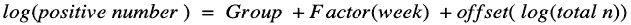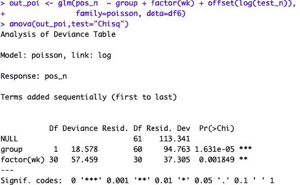

我会假设阳性的数量相对于整个人口来说是非常小的。因此，我包括这个模型。但是！！如果正数不符合泊松分布。这需要谨慎使用。

# 自回归

AR 模型的使用是在假设前一时间点的因变量与当前时间点相关的情况下进行的。时间序列分析有很多讨论，AR，MA，…

为了简化我们的任务，我假设当前的阳性率只与上周的阳性率相关。它是 AR(1)。

为了建模的目的，我将数据重新排列如下

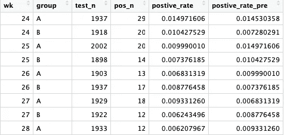

模型是

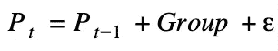

但是我想将[0，1]转换为(Infinite，Infinite)，所以我将公式改写为

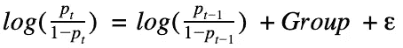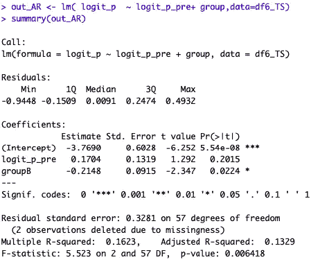

在这种情况下，我们考虑数据类型和时间点之间的相关性

# 最终比较

时间序列模型同时考虑数据类型和时间相关性。这似乎是我们用例中的最佳解决方案。

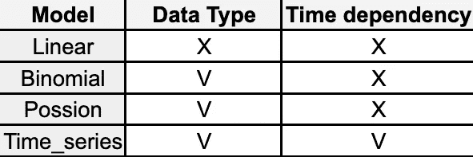

# 结论

在这个用例中，我们应用了 4 个模型。还有一些选项我没有在这里列出，比如[曲赛-二项式](/@mohsin.eee/quasi-binomial-logistic-regression-5cc50a8eb67f)、[贝塔回归](https://rcompanion.org/handbook/J_02.html)。此外，除了 AR 模型之外，还有另一种时间序列模型可以使用。

但别忘了， ***所有型号都是错的，但有些是有用的***

有时候，最简单的模型最好！

 [## Mlearning.ai 提交建议

### 如何成为 Mlearning.ai 上的作家

medium.com](/mlearning-ai/mlearning-ai-submission-suggestions-b51e2b130bfb)