# 沃尔玛股价数据的时间序列回归

> 原文：<https://medium.com/mlearning-ai/time-series-regression-on-walmarts-stock-price-data-13f8402e8437?source=collection_archive---------2----------------------->


Image by [pixabay](https://pixabay.com/photos/store-stacks-shelves-stock-5619201/)

时间序列分析将日期时间数据作为主要输入，将目标变量作为输出。

在本文中，分析将聚焦于沃尔玛 2012 年至 2016 年的股价，数据集可点击此处下载[。](https://www.kaggle.com/code/kelvinprawtama/walmart-statistical-data-modeling/data)

数据集包含日期时间值和基于条件(开盘、收盘、盘高和盘低)的不同价格。这里的主要目标是预测每天的收盘价。

数据定义:

1.  日期:股票价格的日期值
2.  开盘价:股票市场在给定日期开盘时的开盘价
3.  高:某一特定日期股票的最高价格
4.  低:某一特定日期股票的最低价格
5.  收盘价格:股票市场在某一特定日期收盘时的收盘价

指导方针:

1.  数据准备
2.  统计数据分析
3.  模型开发和评估

## **1。数据准备**

在第一部分中，像往常一样，我们将进行几次数据检查，以查看数据集内部是否有任何异常。

由于我在以前的文章中已经多次这样做了，所以我不会在这里展示代码，在本文的结尾，我会发布一个链接，供大家参考我为本文编写的代码。

以下是数据检查的总结。

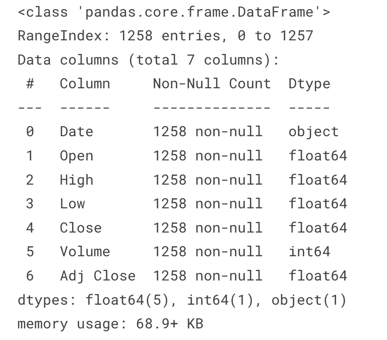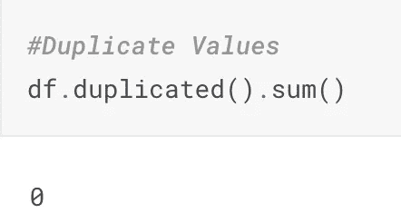

数据集中只有 1258 行数据和 7 个唯一的列。毫不奇怪，Kaggle 的数据不包含任何重复/空值，尤其是数据点数量较少的情况下。

但是，由于“日期”列数据类型是一个对象，我们必须将其转换为日期时间数据类型，以便进行分析。

```
from datetime import datetime as dt

df['Date'] = pd.to_datetime(df['Date'])
df['Month'] = df['Date'].dt.strftime('%Y-%m')

df.head()
```

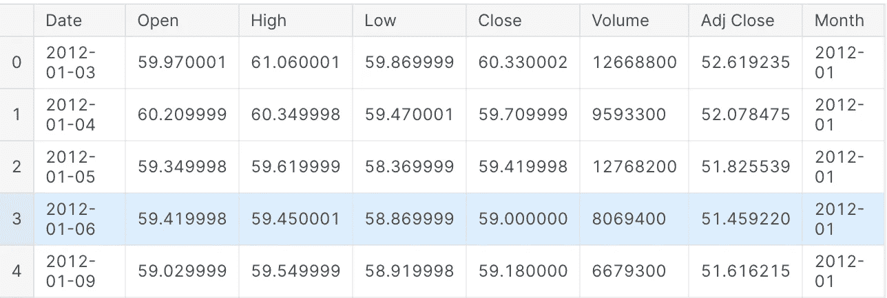

一切都准备好了，我们准备对下一部分进行分析。

## 2.统计数据分析

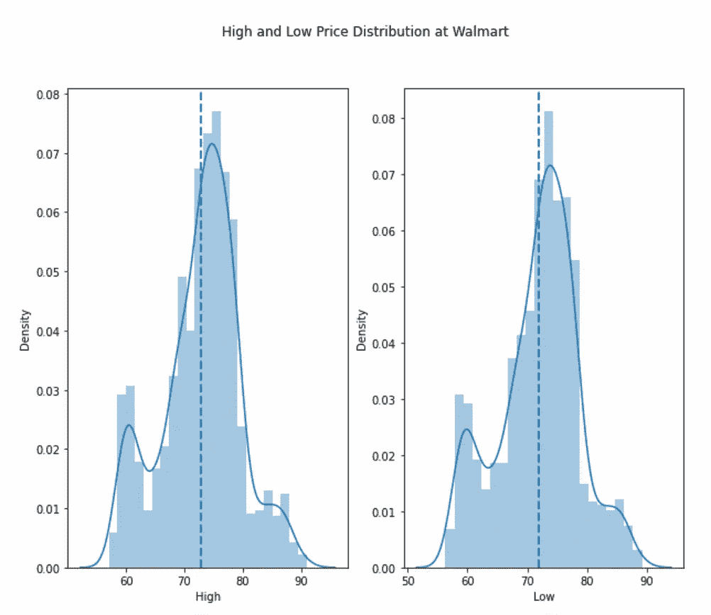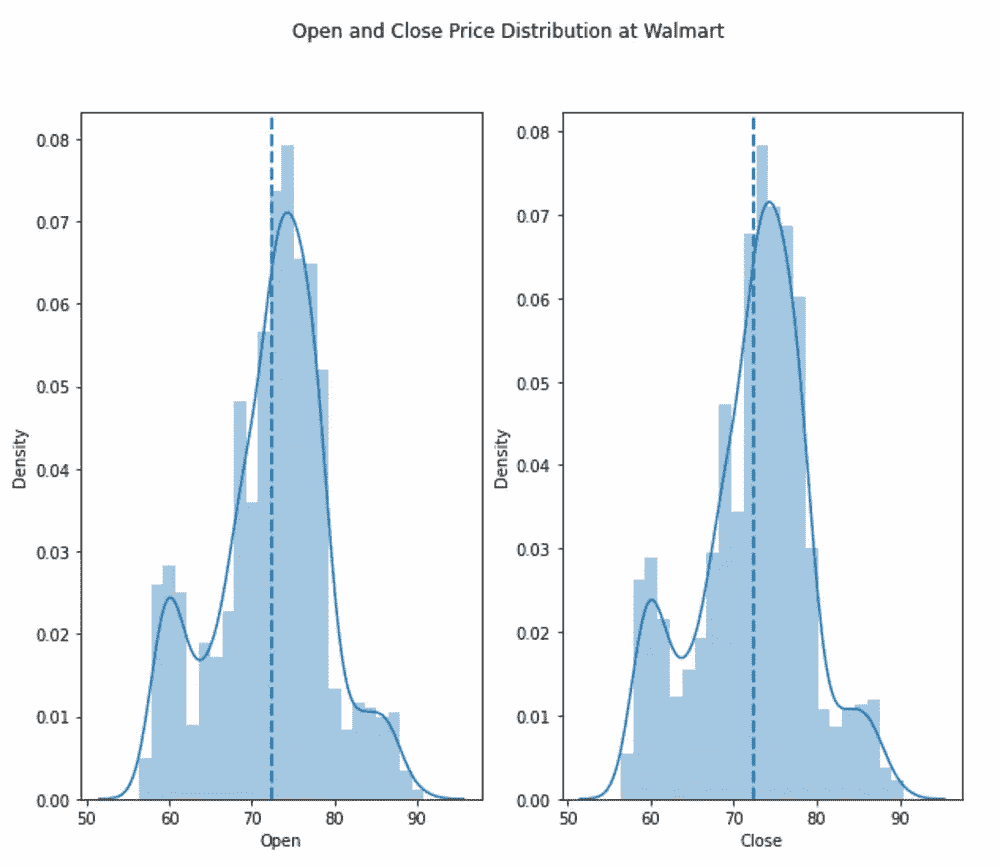

所以上面的图像是每个价格行为的价格分布。我们可以看到，沃尔玛的股价通常在 70-80 美元之间，80-90 美元在较高区间，60 美元在较低区间。

由此我们可以得出结论，购买沃尔玛股票以获得最大利润，我们应该瞄准 60 美元区域，当它达到 80-90 美元区域时卖出。

此外，如果价格停留在 70 美元左右，那么建议保持这个价格，直到随着时间的推移出现牛市。

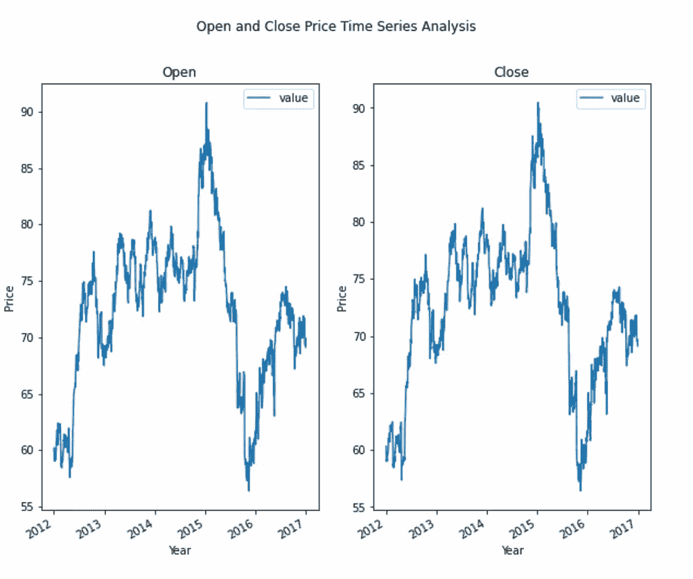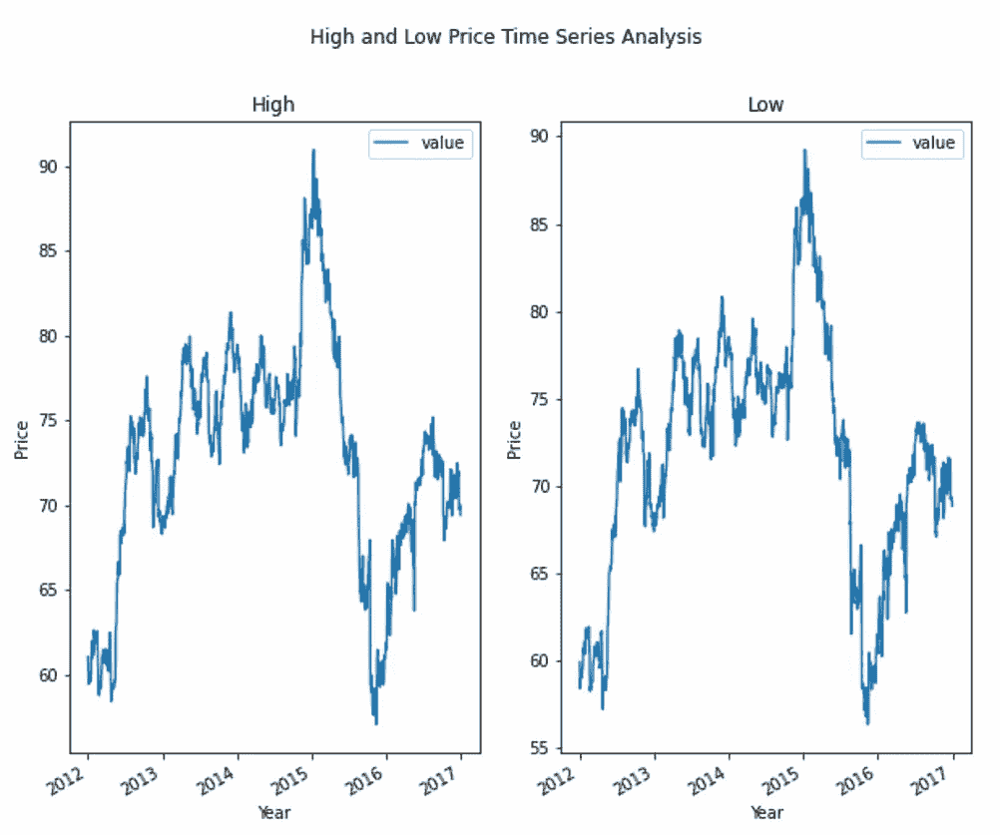

不同状态的模式或多或少类似，从 2012 年到 2015 年初呈上升趋势，随后在 2016 年暴跌。

基于股票价格条件(假设历史重演)，那么基于当前的价格行为(2016 年末约 70 美元)，做多是没问题的。由于价格分布图也表明 70 美元是最常见的数字，那么我们仍然可以投入一些美元美元，并持有直到它达到 90 美元的峰值(约 20%的利润)，如果历史重演，这可能需要持有 2 年。

现在，让我们用 T 检验来看看开盘价与收盘价、最高价与最低价之间的关系。我相信有了这个假设，我们可以安全地假设日内交易的价格结果。

开盘价与收盘价的 t 检验结果:

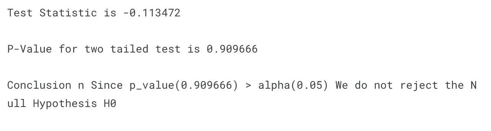

对于开盘价和收盘价，根据日线图，沃尔玛的开盘价和收盘价大致相同。那么单日买卖就不理想了(因为毕竟不会有什么区别)。

让我们来看看高价和低价:

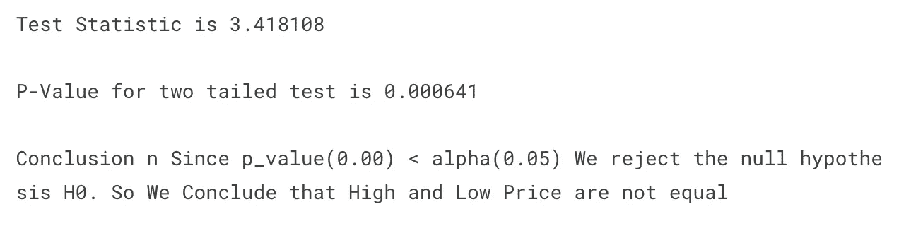

很明显，即使没有 T 检验，也可以确定高价格和低价格是否有任何相似之处。

因此，沃尔玛股价在某一特定日期的高点和低点会有所不同，交易员可以利用这一点来获利。

## 3.模型开发和评估

在最后一节中，我将开发一个简单的线性回归模型来预测数据集的连续结果。

但实际上我相信结果会产生一个很高的精度，并且它是过度拟合的(没有足够的数据点)。

因此，如果你们中的任何人可能有一个更大的股票市场数据集，请随意复制粘贴代码，并根据您的数据集进行调整，越多越好。

```
*#Regression Model for Time Series Data*
from sklearn.linear_model import LinearRegression
from sklearn.model_selection import train_test_split
from sklearn.preprocessing import StandardScaler
from sklearn.pipeline import Pipeline
from sklearn.compose import ColumnTransformer
from sklearn.metrics import accuracy_score, r2_score, mean_squared_error, mean_absolute_error

df['Month'] = df['Date'].dt.month
df['Year'] = df['Date'].dt.year
df['Day'] = df['Date'].dt.day

*#Feature Engineering*
X,y = df[['Year','Month','Day','Open','High','Low','Volume']], df['Adj Close']

X_train,X_test,y_train,y_test = train_test_split(X,y,test_size = 0.2, random_state = 0)

*#Data Preprocessing*
num_features = [x for x **in** range(len(X.columns))]
num_transformer = Pipeline(steps = [
    ('scale', StandardScaler())
])

preprocessing = ColumnTransformer(transformers = [
    ('preprocess', num_transformer, num_features)
])

lr_model = Pipeline(steps = [
    ('preprocessor',preprocessing),
    ('LinearRegression', LinearRegression())
])

*#Train Model*
lr_model.fit(X,y)
y_pred = lr_model.predict(X)

r2_score = r2_score(y,y_pred)
RMSE = np.sqrt(mean_squared_error(y,y_pred))
MAE = mean_absolute_error(y,y_pred)
print(f'R2 Score : **{**round(r2_score,3)**}**')
print(f'RMSE Score : **{**round(RMSE,3)**}**')
print(f'MAE Score : **{**round(MAE,3)**}**')
```

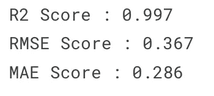

如果我们从上面的模型中得到结果，这并不奇怪，因为该模型实际上读取了所有的数据点。

为了更清楚地看到过度拟合的样子，让我们画出结果。

```
*#Let's try to plot the prediction results*

train = pd.merge(X, y, right_index=True, left_index = True)
train['Date'] = train['Year'].astype(str) + '-' + train['Month'].astype(str) + '-' + train['Day'].astype(str)
train['Date'] = pd.to_datetime(train['Date'])
train = train.drop(['Year','Month','Day'], axis = 1)

y_pred = pd.DataFrame(y_pred)

df_pred = pd.merge(X, y_pred, right_index = True, left_index = True)
df_pred['Date'] = df_pred['Year'].astype(str) + '-' + df_pred['Month'].astype(str) + '-' + df_pred['Day'].astype(str)
df_pred['Date'] = pd.to_datetime(df_pred['Date'])
df_pred = df_pred.drop(['Year','Month','Day'],axis = 1)
df_pred = df_pred.rename(columns = {0 : 'Close'})actual = train[['Date','Adj Close']]
actual_2 = actual.melt(id_vars = ['Date'])
actual_2 = actual_2.set_index('Date')

predicted = df_pred[['Date','Close']]
predicted_2 = predicted.melt(id_vars = ['Date'])
predicted_2 = predicted_2.set_index('Date')

fig,ax = plt.subplots(1,1, figsize = (10,8))
actual_2.plot(ax=ax, legend = 'Actual')
predicted_2.plot(ax=ax, legend = 'Predicted')
ax.set_title('Actual Vs Predicted')
ax.set_xlabel('Year')
ax.set_ylabel('Price')
ax.legend(['Actual','Predicted'])
```

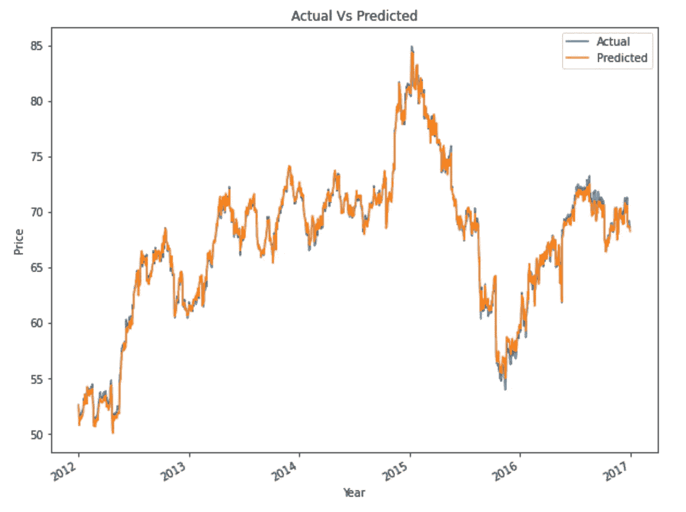

我们可以看到，预测结果与实际结果几乎完全吻合，这表明模型“读取”了数据点并导致过度拟合。

为了获得更好的结果，我们希望开发一个模型，它可以概括结果并显示趋势(可能 80%的准确性就足够了)。

现在，如果你有一个连续的目标变量，你可以创建一些简单的统计数据分析和回归模型。

我希望你喜欢这篇文章，我想向所有支持我的文章并为我鼓掌的关注者和读者致意。

所以，如果你有任何意见或问题，请随时联系我，我会尽力回答你们。

参考资料:

[](https://www.kaggle.com/code/kelvinprawtama/walmart-statistical-data-modeling) [## 沃尔玛统计数据建模

### 使用 Kaggle 笔记本探索和运行机器学习代码|使用 2012-2016 年沃尔玛库存数据

www.kaggle.com](https://www.kaggle.com/code/kelvinprawtama/walmart-statistical-data-modeling) [](https://www.statisticshowto.com/probability-and-statistics/statistics-definitions/discrete-vs-continuous-variables/) [## 离散变量与连续变量:如何区分

### 观看视频，或阅读下面的文章:在统计学入门课上，你首先要学习的是…

www.statisticshowto.com](https://www.statisticshowto.com/probability-and-statistics/statistics-definitions/discrete-vs-continuous-variables/) [](/mlearning-ai/mlearning-ai-submission-suggestions-b51e2b130bfb) [## Mlearning.ai 提交建议

### 如何成为 Mlearning.ai 上的作家

medium.com](/mlearning-ai/mlearning-ai-submission-suggestions-b51e2b130bfb)