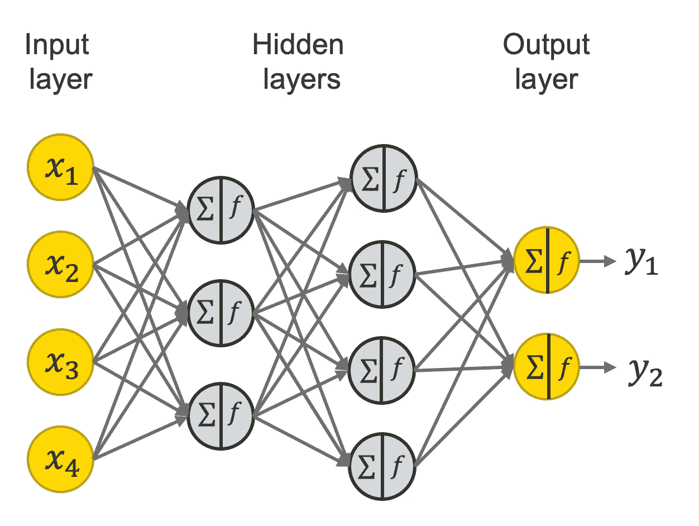

# 训练神经网络的提示和技巧

> 原文：<https://medium.com/mlearning-ai/tips-and-tricks-for-training-neural-networks-b0fad16d915c?source=collection_archive---------2----------------------->

像我们许多人一样，今天试图训练神经网络，并在某些点上坚持提高其性能。在某一点上停滞不前的原因不可能只有一个，这里有一个解释清单，可以发挥作用，你可以用它来提高绩效。

**超发单批**
如果没有达到满分，就要看看自己的管道了。你在某个地方有一个错误。

**平衡批次**
考虑重新平衡您的批次。即使在不平衡的数据集上，这有时也会大大提高性能。

**设置输出层的偏置**
为最终层设置更好的偏置可以大幅减少训练次数！对于 sigmoid 层，偏差可以计算为偏差= log(正/负)

**调整学习率**
如果你寻找任何要调整的超参数，关注学习率。不需要更多的话。

**添加一个虚拟类**
引入另一个没有分配训练样本的类。这个额外的类代表了“我不知道”的标签。在预测过程中，有时你会发现网络输出的概率更高(相对于其他样本，对吗？这毕竟是一个训练集中没有样本的类)。
这些模糊的样本，往往就是以某种方式搞乱网络的样本。看看他们！

**提取嵌入的自动编码器**
使用具有足够大潜在空间的自动编码器(比如 300 或 600..)以确保实现合理的低重建损失。然后使用剩余的编码器网络来生成嵌入:你甚至可以尝试使用编码器作为主网络的主干。

**批量大小**
如果使用混合精度:选择能被 2 的 4 或更大倍数整除的批量大小
否则；您希望批量大小尽可能小。【我只是让评论上的一些人真的生气了；)]

**数据生成器**
对于小型项目，使用自定义生成器或简单的”。合身。在大型项目中预测:使用专门的数据集机制。在 TensorFlow 的情况下:tf.data .这确实加快了训练的速度！

**微调**
微调冻结前几层，然后在数据集上进行微调。

**在验证集上进行微调**
在您的验证集上训练更多的纪元。注意不要搞砸了。

**自动编码分支**有时，这极大地提升了你的主要预测分支。

**尝试不同的定标器**
尝试均值-标准差定标器和秩高斯定标器，并确保尝试用层范式组范式和权重范式替换批次范式。
有时你会不知不觉地错误地限制了你的网络表达能力。试试看什么最有效。

**训练时扩大批量**
训练时扩大批量。这通常有助于提高网络的整体性能。

**用知识-蒸馏进行伪标注**
Ok ok，我知道了。这很牵强。但我在不断尝试这样做:
训练一个更小的网络来模仿另一个庞大网络的预测，然后用它来 peuso 标签(吵闹的学生时尚)。

谢谢你

请关注更多

 [## Mlearning.ai 提交建议

### 如何成为 Mlearning.ai 上的作家

medium.com](/mlearning-ai/mlearning-ai-submission-suggestions-b51e2b130bfb)