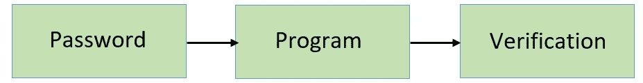
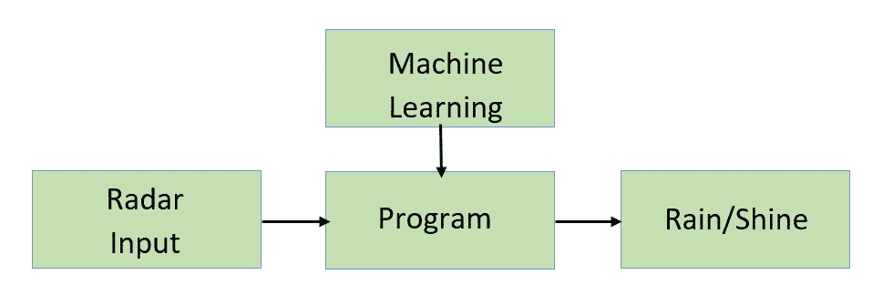

# 去 ML 还是不去 ML

> 原文：<https://medium.com/mlearning-ai/to-ml-or-not-to-ml-aac5dd449db2?source=collection_archive---------12----------------------->


Photo by [Stephen Dawson](https://unsplash.com/@dawson2406?utm_source=medium&utm_medium=referral) on [Unsplash](https://unsplash.com?utm_source=medium&utm_medium=referral)

机器学习或 ML 是一个研究领域，主要关注通过利用数据和算法来自学计算机程序，以通过经验逐渐变得更准确地解决给定的问题。

阿瑟·塞缪尔在 1952 年为跳棋游戏编写了一个程序，IBM 计算机在每玩一局后都有所改进，并在 1959 年创造了“机器学习”这个术语。机器学习是人工智能的一个子领域，迄今为止被广泛认为是相同的。多年来，更新的算法和方法被设计并应用于 AI 和 ML 领域，到了 20 世纪 90 年代，机器学习开始作为一个独立的研究领域蓬勃发展，从而导致 ML 成为一种非常受欢迎的技术，并在研究和行业中广泛使用。

今天，ML 应用于各种技术、工艺和软件中。从智能手机键盘的自动更正到诊断癌症，ML 正被广泛使用。很多时候，人们很容易被当前使用人工智能“彻底改变”一切并将 ML 融入每个解决方案的运动所左右，而不管它的实际必要性。

# 任务分析

假设以下关系:

```
[3,5,8] → 1[4,2,7] → 0[7,1,0] → 0[2,3,4] → 1[5,7,9] → 1
```

什么算法可以用来将给定的数组映射到 0 或 1？

这个问题可以通过简单的逻辑来解决吗，或者我们需要使用一个 ML 模型吗？

上面的问题相当简单。如果数组按升序排序，则映射为 1，否则映射为 0。因为给定的数组很小，也就是说，它们只包含 3 个元素，所以可以使用简单的逻辑对它们进行映射。然而，如果阵列更大并且包含 12 个元素，这样的解决方案可能是不可行的。对于更大的阵列，我们可能需要完全不同的或者 ML 模型。

# 将任务分析扩展到现实世界

## 密码验证

可以很容易地编写一个简单的程序来验证密码。一个简单的算法如下

```
Step 1\. Initialize the Login Account
Step 2\. Enter User Id or Login Id
Step 3\. In the First place element: Enter Alphanumeric Password
Step 4\. If: The ID, Password coordinates and are authenticated,
Step 5\. Then: Authentication approval by Admin. Proceed.
Step 6\. Else: Id or Password may be invalid or wrong
Step 7\. Try again by repeating steps 1 through 6
```

密码验证的规则可以是硬编码的，通常不需要或只需要很少的变化和例外。因此，为这样的任务应用 ML 模型不会在使用更多资源的同时以有意义的方式使整个过程变得更好。



Process of Password Verification

## 天气预报

天气预报长期以来一直是困扰人类的一个难题。但是随着时间的推移，我们已经发明了分析方法和计算机程序来识别天气模式，进而预测未来几天的天气。即使在气象学领域取得了这样的进步，仍然没有一套可以预测天气的规则。

因此，天气预报程序不能硬编码，因为有无数的因素影响它。用数学术语来说，有很多变量需要考虑。然而，这使得它成为一个可以使用 ML 解决的理想问题。有关天气模式的大量可用数据有助于 ML 算法有效地处理大量变量，并以高精度预测天气。



Process of Weather Prediction using Machine Learning

# 嘶嘶作响

FizzBuzz 问题是一个经典问题。任务很简单:打印整数 1 到 N，但是如果一个整数能被 3 整除，则打印“Fizz”，如果一个整数能被 5 整除，则打印“Buzz”，如果一个整数能被 3 和 5 整除，则打印“FizzBuzz”。

我们将在传统编程和 ML 解决方案中实现 FizzBuzz 问题，并比较结果以检查 ML 实现是否真的有必要。

## 常规方法

显而易见，该程序将按预期运行，没有任何错误，也就是说，具有 100%的准确性。

## 机器学习实现

```
Accuracy of K-Neighbor Classifier = 55.319148936170215 
Accuracy of Support Vector Machine Classifier =  64.8936170212766
```

你可以在这里看到整个工作簿[。](https://colab.research.google.com/drive/1b7IhcHsKoEmLFwXBbFOGNBzegdzjSg6A?usp=sharing)

我使用了一个 K-Neighbor 分类器和一个支持向量机分类器来获得最大似然解的精确度，并且比传统方法好得多。

然而，通过向模型提供更多数据并使用其他模型(如神经网络),可以使这些模型更加精确。这里可以看到一个这样的实现，其中模型的精确度高达 98%，但仍然无法与传统解决方案的精确度相匹配。

# 什么时候 ML？

在观察了上述情况之后，可以断言使用机器学习的适当方式。

机器学习只应在以下情况下使用:

**●规则不能硬编码。**

—许多任务，例如天气预报问题，无法使用确定性的、基于规则的代码来充分解决。很多因素都会影响答案，而且要考虑的变量实在太多了。在这种情况下，最大似然法可以用来寻找一种准确有效的方法来解决问题。

**●解决方案不可缩放。**

—人们可能能够手动识别我们在前面提到的*关系*中遇到的一些数组中的模式，但是这项任务变得繁琐，并且对于数百万个数组来说可能是不正确的。ML 解决方案可以用来有效地处理大规模问题。

**●有足够的数据。**

—当且仅当有足够的数据可用于从数据中得出正确的推论并识别其中存在的正确模式时，才应使用 ML 解决方案。缺乏高质量的数据可能会导致解决方案在一个或多个方面无法正确解决问题。

# 结论

自诞生以来，机器学习一直是一个伟大的工具，并帮助我们构建和修补了各种技术和解决方案，这些技术和解决方案以前效率不高或干脆不复存在。这使得 ML 在技术领域引起了轰动。它现在被无数的解决方案使用，因为它实际上增加了解决方案的价值，或者，坦率地说，只是因为使用 ML 给它增加了某种合法性，使它与其他“ML 解决方案”不相上下，而没有增加任何真正的价值。我们需要记住，机器学习可能是一个友好的邻居超级英雄，但并不是所有的邻居都需要拯救。

[](/mlearning-ai/mlearning-ai-submission-suggestions-b51e2b130bfb) [## Mlearning.ai 提交建议

### 如何成为 Mlearning.ai 上的作家

medium.com](/mlearning-ai/mlearning-ai-submission-suggestions-b51e2b130bfb) 

[成为 ML 写手](/mlearning-ai/mlearning-ai-submission-suggestions-b51e2b130bfb)