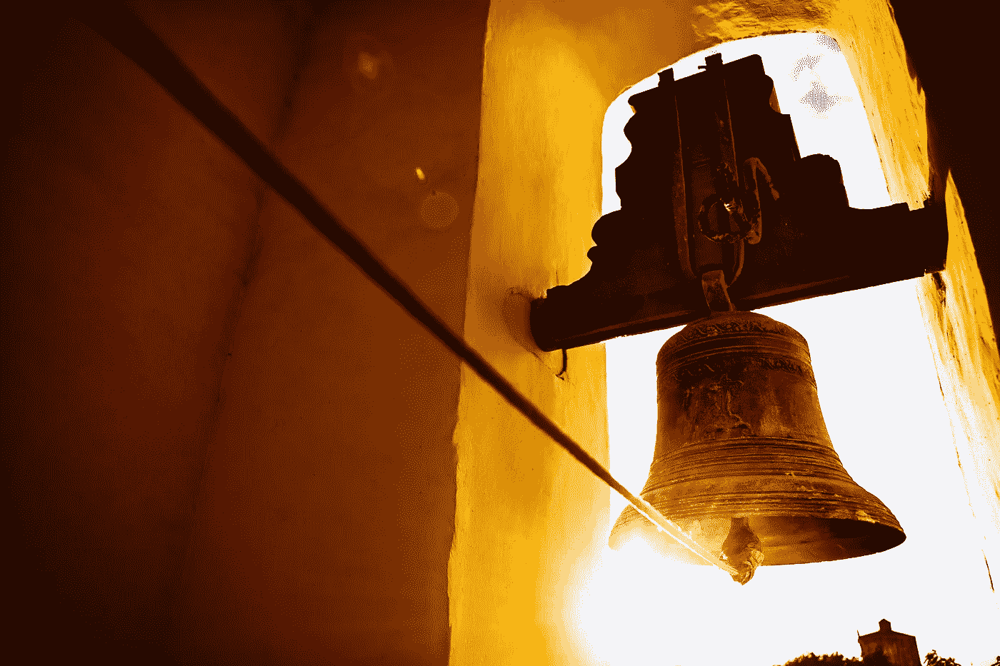

# 为了生存，我们需要中世纪的钟声

> 原文：<https://medium.com/mlearning-ai/to-survive-we-need-medieval-bells-8acb23dfa7b0?source=collection_archive---------7----------------------->

## 机器学习

## ML 能防止气候灾难吗？

Photo by [Jonathan Borba](https://www.pexels.com/@jonathanborba?utm_content=attributionCopyText&utm_medium=referral&utm_source=pexels) from [Pexels](https://www.pexels.com/photo/brass-bell-on-yellow-wall-5379735/?utm_content=attributionCopyText&utm_medium=referral&utm_source=pexels)

今年夏天德国的洪水已经造成 210 多人死亡，经济损失巨大。许多人想知道为什么应急系统不起作用。