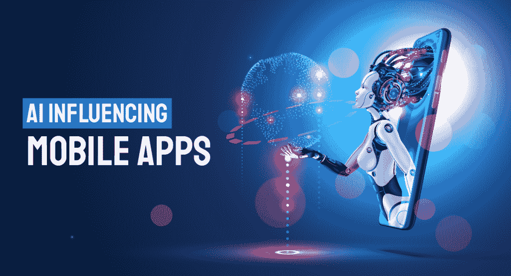
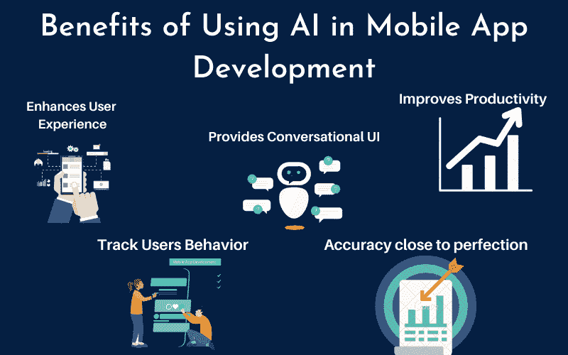

# 移动应用开发的 4 大人工智能工具

> 原文：<https://medium.com/mlearning-ai/top-4-artificial-intelligence-tools-for-mobile-app-development-ba5f87a29ab9?source=collection_archive---------3----------------------->

人工智能已经被证明是一项伟大的技术，可以帮助初创公司和企业在竞争激烈的世界中脱颖而出。适应性和一些人工智能的应用为无数的发明和潜力打开了大门，为众多的部门提高他们的服务。如今，每个大品牌都在他们的移动应用程序开发中利用人工智能，使产品更加创新和智能。人工智能技术正在通过机器学习、深度学习和预测分析等细分领域帮助行业达到高度。

在本帖中，我们将讨论移动开发中的 AI 以及用于移动应用创建的顶级 [AI 工具](/mlearning-ai/when-was-the-last-time-you-felt-the-power-of-ai-art-9c3c3d990ba)。让我们开始吧:

# 移动应用开发中的人工智能

人工智能在如何执行任务和在收集的信息来源上改进自己方面模仿人类智能。人工智能在移动应用程序创建中扮演着重要的角色，它允许你构建智能应用程序，可以改变和缓解人类的需求。这项新兴技术利用机器理解和回复刺激的能力来提供最佳的客户体验。

人工智能有助于根据消费者早期的购物模式来理解他们的行为。因此，您可以修改您的应用程序，以满足用户的期望和要求，从而提高用户参与度和保留率。这为你提供了一个从竞争对手中脱颖而出的机会，让你的业务更上一层楼。

# 一些关键数据让你相信投资人工智能不会让你心烦意乱

*   根据一份报告，到 2025 年，人工智能的全球市场价值将超过 890 亿美元。
*   人工智能商业应用的全球收入预计将从 2018 年的 16.2 亿美元增长到 2025 年的 312 亿美元。
*   根据一份报告，到 2025 年，大约 75%的企业和种子资金投资者将利用人工智能收集信息。
*   一项研究称，到 2030 年，这个市场将增长到超过 1.5 万亿美元。
*   如果你[雇佣开发者](https://www.yourteaminindia.com/hire-developers)在应用程序中实现人工智能，生产率可以提高 40%。科技将让人们更有效地利用时间。

# 以下是构建移动应用的 4 大人工智能工具

**##Core ML:** 机器学习框架由苹果公司于 2017 年公布。Core ML 的开发旨在通过专注于设备的内置 ML 来改善客户隐私。它是一个有能力的 ML 框架，提供了适度的拖放式用户界面和丰富的特性，包括:

*   **自然语言框架**允许你学习自然语言文本、句子和单词，将它们分成段落，并标记关于这些分区的信息。
*   **声音分析框架**在分析音频方面很有用，可以帮助你区分交通噪音或啁啾鸟鸣等声音。
*   **语音框架**有助于识别现场和预录音频中多种语言的语音。

您可以利用这一出色的工具来创建智能 iOS 应用程序，这些应用程序具有文本检测、人脸检测、条形码检测、脚本识别等功能。这个人工智能工具可以以两种不同的方式嵌入，包括利用顶级 API 和将其功能直接集成到应用程序中。

## 核心 ML 的优势

*   易于与应用程序集成。
*   它附带了一个转换器工具，支持 Keras、Caffe 等培训包。
*   还执行逻辑回归、决策树和其他 ML 模型。

## 核心 ML 的缺点

*   仅支持 iOS 11 及更高版本。
*   没有灵活性。

**##TensorFlow:** 它是一个开源的、基于 Python 的 ML 平台，开发于彻底学习神经网络之上。TensorFlow 使用一个通用符号将机器学习和深度学习算法结合在一起。其简单的设计让越来越多的个人构建人工智能驱动的应用程序。该平台可用于理解、分类、发现、恢复和预测。

包括 Airbnb、可口可乐和英特尔在内的热门品牌都在使用通过 TensorFlow 创建的人工智能技术。此外，谷歌将这一人工智能工具用于复杂的 ML 模型，如谷歌翻译和大脑排名。

**tensor flow 的优势**

*   开源平台
*   非常可定制
*   保持应用程序创建流畅和代码精简

**tensor flow 的缺点**

*   不支持 OpenCL
*   你必须了解 ML，线性代数和高等微积分。

**##ML Kit:** 是 Google 推出的移动 SDK。ML Kit 使开发人员能够创建智能 Android 和 iOS 应用程序。您可以使用其有影响力的视觉和自然语言 API 来遇到许多应用程序问题和挑战，以提供出色的用户体验。所有工具都由谷歌顶级的机器学习模型提供支持，并且是免费的。以下是 ML 试剂盒提供的一些功能:

*   **视觉:**这个图像和视频分析 API 用于检测条形码，识别人脸，以及标记图像、文本和对象。
*   **自然语言:**API 检测并翻译 58 种语言的文本，并提供建议。
*   **定制开发:** TensorFlow 提供 AutoML Vision Edge 来创建模型，执行测试，并使用 ML 工具包发布它们。

**ML 套件的优势**

*   让开发人员随时更新模型，甚至无需重新编译应用程序
*   它可以使用 Firebase 启动

**ML 套件的缺点**

*   仅支持 TensorFlow lite
*   这是它的测试版，因此一些功能仍在发展中。

**##OpenCV:** OpenCV 是一个开源库，用于构建实时机器视觉跨平台应用。它有 C++、Java 和 Python 接口，支持不同的操作系统。而且 OpenCV 支持 TensorFlow 和 Poarch 深度学习框架。这个人工智能工具专注于视频捕捉、图像处理以及物体和人脸识别等功能。让我们来看看 OpenCV 的优缺点:

**OpenCV 的优势**

*   提供 2500 多种经典和当代算法
*   与其他工具相比，增强的文档
*   像 IBM、丰田和谷歌这样的公司信任 OpenCV

**OpenCV 的缺点**

*   面部检测对图像的变化非常敏感
*   不适合利用自定义数据集构建新的深度模型

## **一些基于人工智能的顶级安卓应用**

*   谷歌助手
*   埃尔莎
*   亚马逊 Alexa
*   数据机器人
*   Face App
*   科尔塔纳
*   快捷键键盘等。

## **一些顶尖的基于人工智能的应用开发公司**

*   富根克斯科技公司
*   USM 业务系统
*   BR 软件技术
*   科技前沿
*   SoluLab
*   融合信息学
*   适马数据系统公司
*   Quy 技术等。

# **结论**

所以，这是几个最好的[人工智能 API](https://www.signitysolutions.com/blog/artificial-intelligence-apis/) ，可以帮助开发者让移动应用变得智能。人工智能工具允许程序员在应用程序中添加计算机视觉、产品推荐、语音识别等功能。在创建任何智能移动应用程序时，请记住，人工智能是为了帮助您开发更具创新性和吸引力的应用程序。因此，在选择上面提到的任何一个工具之前，你应该从应用程序用户的角度来考虑。始终根据消费者的要求和您的业务需求做出决定，并考虑离岸软件开发服务。

 [## Mlearning.ai 提交建议

### 如何成为 Mlearning.ai 上的作家

medium.com](/mlearning-ai/mlearning-ai-submission-suggestions-b51e2b130bfb)