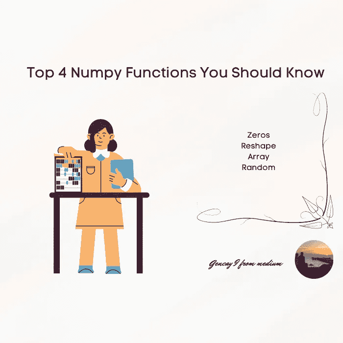

# 你应该知道的四大数字函数

> 原文：<https://medium.com/mlearning-ai/top-4-numpy-functions-you-should-know-6d6cc7586494?source=collection_archive---------4----------------------->

## 机器学习及其在 Python 中的实现

Image by Author

# 介绍

用 Python 编程学习机器学习的时候，库很少，你应该能胜任。

*   Numpy
*   熊猫
*   Sci-kit 学习
*   Matplotlib 或 Seaborn 或两者