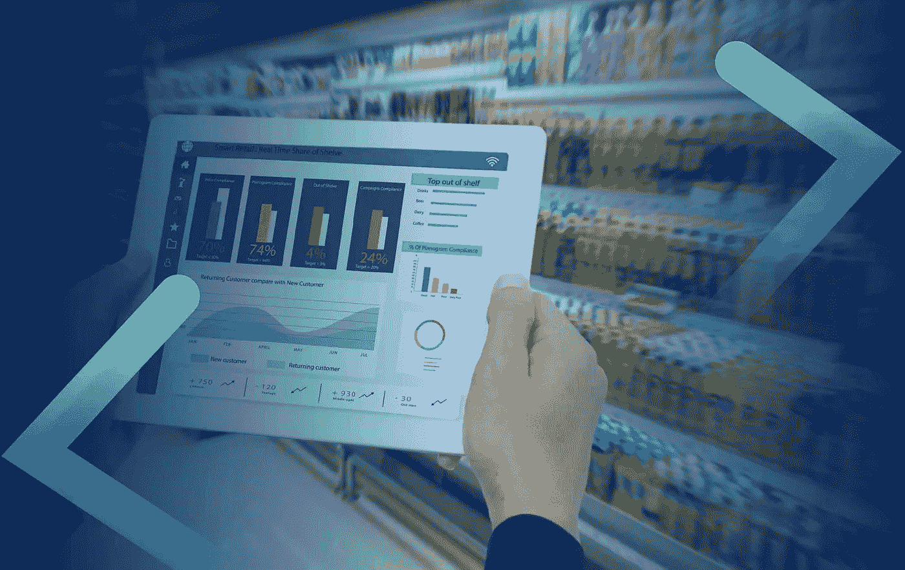
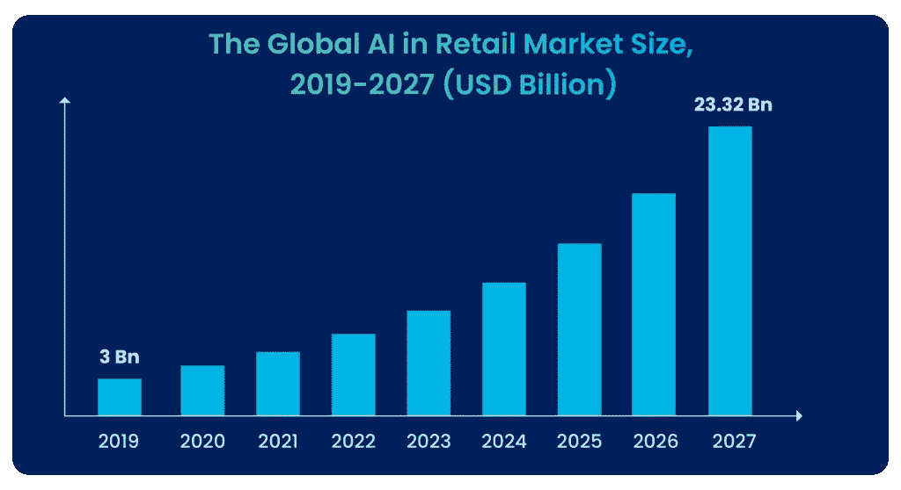

# 2022 年及以后，每个零售商都应该关注的 5 大人工智能趋势

> 原文：<https://medium.com/mlearning-ai/top-5-ai-trends-every-retailer-should-watch-for-in-2022-and-beyond-cd811a0baa51?source=collection_archive---------1----------------------->

人工智能(AI)无处不在。我们都见证了人工智能在过去十年中的伟大崛起——它几乎进入了每个行业和商业流程。尤其是在零售领域，它产生了重大影响，其使用量也在不断增长。

根据 Statista 的数据，到 2027 年，全球人工智能零售市场预计将从 2019 年的 30 亿美元达到 233.2 亿美元。

The Global AI in Retail Market Size

许多零售商已经开始利用人工智能来提高客户保留率，最大限度地提高客户忠诚度，并提高营销投资回报率。而那些还没有的人，正急于加入人工智能的行列。

然而，在我们进入新的一年(2022 年)之前，零售商必须找出利用这项技术的最佳方式，这一点至关重要。因此，他们可以从中获得最大收益，并对其业务产生重大影响。

想知道，你需要专注于人工智能的哪个领域，才能保持你的人工智能游戏的领先地位，并提高你的零售业绩？好吧，这里列出了 2022 年的 5 个人工智能趋势，每个零售商都必须关注。

# 1.人工智能聊天机器人的崛起

如果你是一个在线零售商，你必须意识到快速响应客户的查询是转化他们的关键，聊天机器人可以帮助你做到这一点。

这是几乎每个在线零售商都在使用人工智能聊天机器人的主要原因——以高度个性化的客户体验提供快速的客户服务。

但是在 2022 年，这些由人工智能驱动的聊天机器人将会走得更远，变得比以前更加先进和人性化。怎么会？带着情绪 AI。借助情感人工智能技术:面部编码和眼球追踪，你可以深入了解用户的潜意识偏好，并利用这些情感洞察使每个用户通过聊天机器人进行的对话更具情境性，并为他们添加人情味。

虽然这种技术已经存在了一段时间，但仍然很少有在线零售商利用它。或者甚至不熟悉它，但是，在 2022 年，这将不再是事实。毕竟，人工智能聊天机器人不足以提供一个真正的人类 CX。

因此，除非你想留下来，否则一定要升级你的聊天机器人，用情感人工智能技术为它们提供动力。

# 2.情感人工智能驱动的购物者洞察

今天的消费者希望在购物过程的每个阶段都个性化。根据艾司隆的研究，80%的人更倾向于从提供定制体验的公司购买。要推动个性化，你需要深入的客户洞察。收集和挖掘这些深刻的客户见解是很困难的。但随着人工智能的进步，这变得越来越容易。通过利用 emotion AI 的力量，您可以轻松地收集和分析这些见解，并使用它们来提供量身定制的体验。

情感人工智能正在改变我们理解消费者情感的方式。事实上，它正在彻底改变消费者洞察行业，使其成为 2022 年值得关注的重要趋势之一。

要了解 Emotion AI 如何帮助您的业务，请阅读 Emotion AI 可以为您的业务做的 3 大[事情](https://entropiktech.com/blogs/top-3-things-emotion-ai-can-do-for-your-business/)。

# 3.人工智能驱动的价格优化

众所周知，零售业竞争激烈且对价格敏感，增加需求和提高盈利能力的最简单方法就是优化价格。借助人工智能，零售商可以做到这一点——他们可以根据产品需求、竞争、季节趋势等调整价格。

此外，人工智能解决方案可以通过分析多种定价模型的功效，帮助零售商为他们的产品选择正确的价格。

对于拥有人工智能的零售商来说，优化价格变得超级容易，这也正是这项技术很快就会在零售商中获得大量宣传的原因。为什么不呢——毕竟，这项技术有潜力增加零售商的底线。这使得它成为一个有利可图的人工智能趋势，每个零售商都必须密切关注。

# 4.人工智能驱动的产品搜索

另一个我们认为将在 2022 年流行的趋势是人工智能搜索。零售电子商务正在增长，并将在未来几年继续增长。据 [Statista](mailto:https://www.statista.com/statistics/379046/worldwide-retail-e-commerce-sales/) 统计，2020 年，全球零售电商销售额达 4.28 万亿美元；预计 2022 年将增长到 5.4 万亿美元，这使得零售商关注他们的现场搜索功能变得至关重要。

在线零售完全是为了方便，难以找到产品可能会损害在线购物者的体验——所以人工智能搜索将变得至关重要。

# 5.用情感人工智能增强店内体验

众所周知，如果你想获得并留住更多的客户，提供卓越的客户体验是必须的。大多数零售商已经开始利用人工智能来了解他们的客户需求并取悦他们。但是了解顾客的需求还不足以脱颖而出——零售商还需要了解顾客的情绪和情感——才能脱颖而出并改变他们的店内体验。

越来越多的零售商开始使用 emotion AI 技术，通过读取购物者的面部表情和眼球运动来分析他们的感受和情绪，以了解消费者对其产品的定价、包装、品牌等的感受。，实时。因此，他们可以快速确定差距和改进领域，使其成为一个有利可图的人工智能趋势，值得零售商保持警惕。

# 包扎

人工智能已经不是什么新技术了。许多行业已经在利用这项技术，零售业也不例外。事实上，人工智能的采用在零售领域尤为普遍。市场研究咨询公司 Mordor Intelligence 指出，目前 40%的零售和消费品公司已经采用了人工智能。这个数字将在三年内上升到 80%以上。此外，零售业对人工智能技术的投资也在增长。

现在你知道人工智能可以通过用智能取代直觉来证明你的零售业务的游戏规则改变者。所以，利用这项技术来发展你的零售业务是至关重要的。而且，要在这条道路上前进，你需要关注这些新兴的人工智能趋势。

*最初发表于*[T5【https://entropiktech.com】](https://entropiktech.com/blogs/top-5-ai-trends-every-retailer-should-watch-for-in-2022/)*。*

 [## Mlearning.ai 提交建议

### 如何成为 Mlearning.ai 上的作家

medium.com](/mlearning-ai/mlearning-ai-submission-suggestions-b51e2b130bfb)