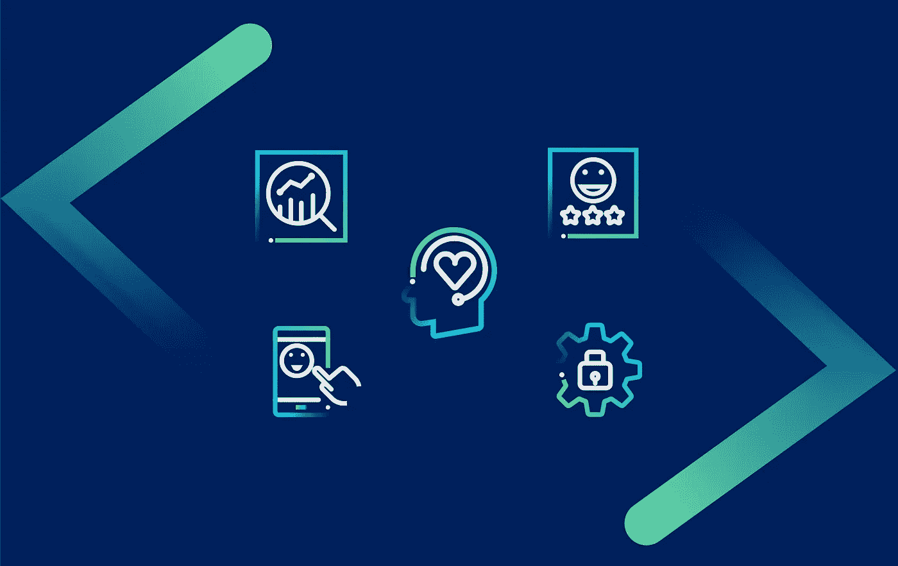

# 2022 年及以后值得关注的五大消费者洞察趋势

> 原文：<https://medium.com/mlearning-ai/top-5-consumer-insights-trends-to-watch-in-2022-and-beyond-ed2e7ac83643?source=collection_archive---------5----------------------->

众所周知，消费者洞察是品牌的圣杯。对消费者的洞察可以帮助企业增加销售、激发创新、改善客户支持、创造成功的产品并提供出色的[客户体验](https://entropiktech.com/blogs/top-4-trends-cx-leaders-cant-ignore-in-2022/)。

您知道吗，那些利用客户行为来获得洞察力的公司在销售增长方面比同行高出 [85%](https://global.hitachi-solutions.com/blog/what-are-consumer-insights#:~:text=Consumer%20insight%20can%20provide%20a,sales%20growth%2C%20according%20to%20Microsoft.) 倍。因此，我们可以有把握地说，我们推动更好增长的业务能力取决于我们对消费者洞察的深度。以及我们如何将这些见解转化为有效的行动。

近年来，新技术被引入来收集消费者的见解——人工智能(AI)和情感人工智能。这些技术正在彻底改变我们收集和理解消费者见解的方式。事实证明，这些技术改变了组织的游戏规则，因为有了这些技术，组织可以比传统的研究方法更快地收集数据和解释客户见解。

2022 年，这些技术将进一步发展，并改变我们收集和解释消费者见解的方式。那么，如何在快速变化的环境中保持领先，并跟上技术发展的脉搏呢？

嗯，有几个趋势将推动 2022 年及以后的消费者研究。这些方法在获取有价值的消费者信息方面的有效性已经得到证明，在未来几个月里，它们将获得更多的关注。所以，这是一个好主意，跳上船，在它们起飞前准备好使用它们。记住这一点，让我们深入了解您今天就需要开始使用的消费者洞察趋势。

# 1.情感人工智能在消费者研究中的应用日益增多

众所周知，消费者洞察是改善我们产品、运营流程和 CX 的关键。但是，随着快速变化的数字营销格局和不断演变的客户行为，我们必须尽快获得可操作的消费者洞察。

毕竟，收集客户的洞察力是一回事，但让它变得极其有用需要不同的技能和心态。

现在，有几种方法可以收集消费者的见解，从调查到民意测验到招募焦点小组，但这些方法非常耗时，而且缺乏准确性。这就是情感人工智能技术可以帮忙的地方。利用这项技术，品牌可以挖掘驱动 95%购买决策的潜意识行为，并快速收集未经过滤的反馈，因为我们的大多数决策都发生在潜意识和情感层面。有了情感，人工智能品牌就能理解消费者未明说的反应。这就是为什么品牌越来越依赖[情感人工智能获得可操作的见解](https://entropiktech.com/blogs/top-3-things-emotion-ai-can-do-for-your-business/)。

这项技术使用先进的算法来检测和分析消费者反应背后的真实情绪，无论是积极的、中立的还是消极的，并轻松快速地理解消费者分享的见解。你想知道怎么做吗？嗯，通过使用[面部编码](https://entropiktech.com/blogs/facial-coding-what-why-and-how-to-use-facial-coding-in-marketing/)和眼球追踪技术——这些技术根据你面部肌肉和眼球注视的位置和运动来追踪你的面部运动，并利用它来实时获得深入的客户洞察力

# 2.随着预算分配的增加，消费者洞察的优先级也在提高

预测客户需求已经成为企业的重中之重，2022 年也不例外。因此，消费者洞察的重要性将在 2022 年持续增长。这些见解对于提高客户服务质量和改善整体客户体验至关重要(CX)。

在 2022 年，获得客户洞察将成为企业成功和生存的关键。为什么？因为在过去的两年里，世界发生了很大的变化，疫情也加快了对消费者洞察力的吸收。因此，在这种不可预测的环境中，组织无法依靠历史客户数据和洞察力来做出决策。这就是为什么越来越多的组织将增加他们的支出来建立客户洞察功能，因为它已经成为高级管理层的首要任务。

[图像来源](https://insightshub.kapiche.com/a-step-by-step-guide-to-building-a-respected-customer-insights-engine/)

因此，客户洞察团队对公司来说将变得非常重要。那些还没有给他们的客户洞察团队参与决策的机会的公司现在将会提供这种机会。

在这个现代世界中，我们都知道组织需要快速行动，如果你在客户洞察团队中，你必须保持快速行动。

# 3.越来越强调在一个地方统一客户反馈

如今，每个企业都在收集客户反馈，他们使用定性和定量的研究方法来获取客户输入。但是很少有人利用这些数据并从中获得洞见。为什么？因为我们的客户数据分散在各处。如果你的客户反馈分布在十个不同的地方，你如何从中获得有意义的见解？但 2022 年就不会这样了。今年，更多的品牌将使用工具进行 Qual 和 Quant 研究，并在一个地方收集所有这些反馈。

了解客户不再仅仅是一件重要的事情。这是必不可少的事情。要了解客户，你需要分析他们的反馈。现在，我们都知道企业正在努力了解消费者，并与消费者建立联系，但今年，他们会更加努力。

因为在这个不确定的时代，品牌忠诚度受到了冲击。品牌那么多，消费者转换成本那么容易。因此，大多数客户愿意探索新产品和服务。留住他们的唯一方法是向他们提供他们想要的东西，而良好的消费者洞察力将帮助你做到这一点。

简而言之，我们被数据(客户反馈)淹没，但在 2022 年，大多数企业将专注于将所有客户反馈统一到一个地方，以提供强大的洞察力。

# 4.使用自助工具为消费者研究带来灵活性和可操作性

消费者研究可能是重复的、费时的和乏味的。出于这个原因，雇佣一个专门从事消费者研究的团队并不总是有意义的。它不具成本效益，缺乏交付速度，并且非常难以扩展。此外，人类研究人员也很难分析和理解收集的数据。数据可视化也可能是一个乏味的过程，因为这也是一个容易出现人为错误的过程。

自助工具的使用似乎是前进的方向。自助工具是指只需要一个人来操作，并且工具的所有功能都是自动化的。这个系统是控制你需要的服务的完美平衡，而大多数工作仍然是自动的。操作这些工具也不需要专家，因为像这样的工具对于普通营销人员来说足够简单，而且有许多资源可以充分利用这些工具。

通过自动化工具获得消费者洞察的其他好处是降低成本、扩大研究规模和快速交付。

许多营销人员已经在使用自动化工具来获取消费者洞察，但这一趋势将在 2022 年获得更多动力。

# 5.数据隐私将成为每个商业策略的核心原则

众所周知，了解客户的需求是企业成功的关键。但这些见解从来没有比在危机时期更有价值。大多数公司在新冠肺炎疫情的初始阶段意识到，他们应该加快消费者研究，并利用这些见解来支持新冠肺炎期间的快速决策。

他们意识到是时候加快速度了，幸运的是，由技术支持的消费者洞察工具帮助他们进行在线数据收集和数据处理。这些工具使他们能够快速获得所需的洞察力。使用自动化自助服务系统，过去可能需要数周时间的消费者数据处理现在可以在数小时内完成。随着越来越多的企业开始在线收集数据，他们管理数据和保证数据安全的责任也越来越大。

为什么？因为消费者越来越关心他们的数据。因此，品牌应该重视证明他们比以往任何时候都更加重视顾客的安全。根据毕马威(KPMG)的一项调查， [86%的受访者](https://www.techrepublic.com/article/data-privacy-is-a-growing-concern-for-more-consumers/#:~:text=A%20full%2086%25%20of%20the,even%20trust%20their%20own%20employers.)表示他们越来越担心数据隐私，而 78%的受访者表示担心被收集的数据量。约 40%的受访消费者不相信公司会合乎道德地使用他们的数据，13%的人甚至不相信自己的雇主。

消费者数据正在改变业务，公司如何处理这些数据将影响他们的成功。事实上，数据隐私将很快成为企业竞争优势的来源和差异化点，使数据保护成为企业的重中之重。

# 总结:

过去两年发生了很多事情，这影响了消费者行为，当然也影响了企业。当我们试图走出这段时期时，品牌将需要加倍重视客户体验，以便在动荡时期生存和发展。

如果你想为你的客户提供一个惊人的体验，你必须了解他们想要什么，对你有什么期望。通过利用客户洞察，这是可能的。

不管喜欢与否，客户的期望和行为都在不断变化。你可以跟上变化，成为变化的一部分，也可以忽视变化，失去竞争优势。

既然你今年有一些重要的客户洞察趋势可以期待，请密切关注它们，因为这些新兴趋势可以帮助你在这些不可预测和要求苛刻的时代保持竞争力。

*最初发表于*[T5【https://entropiktech.com】](https://entropiktech.com/blogs/five-consumer-insights-trends-every-business-should-watch-for-in-2022/)*。*

 [## Mlearning.ai 提交建议

### 如何成为 Mlearning.ai 上的作家

medium.com](/mlearning-ai/mlearning-ai-submission-suggestions-b51e2b130bfb)