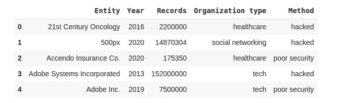
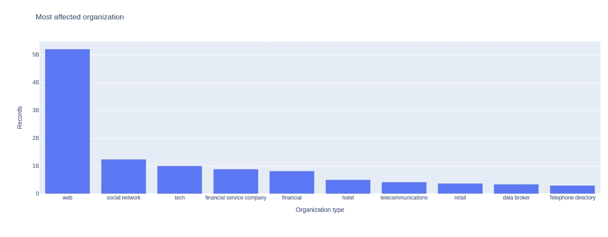
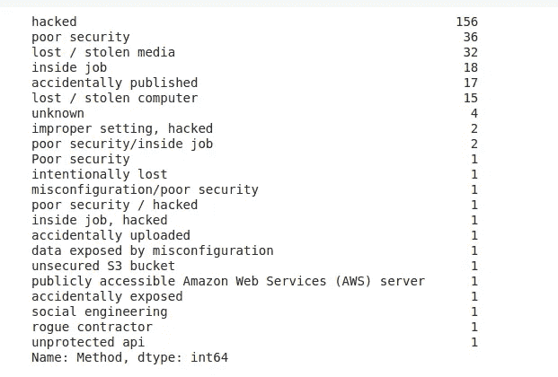
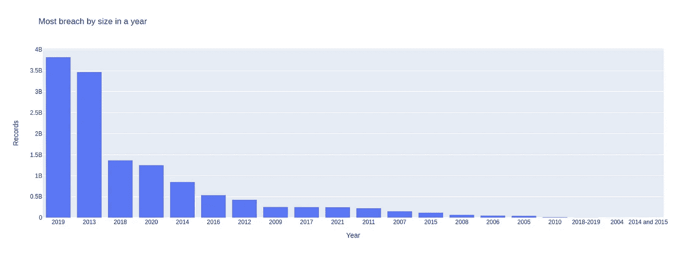
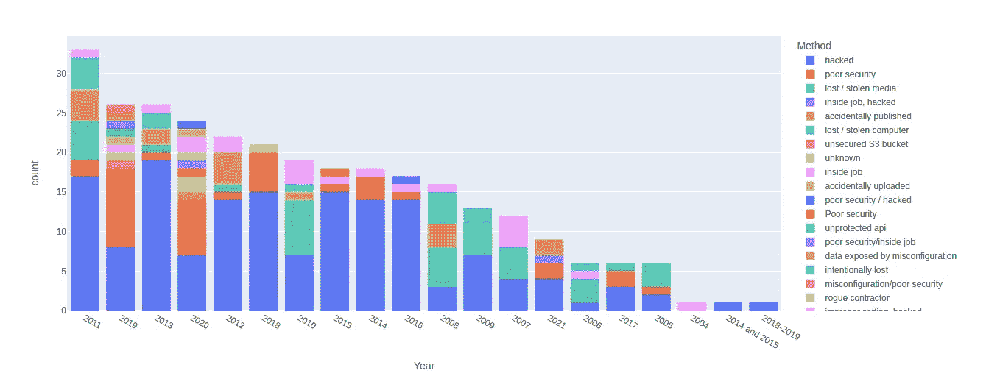
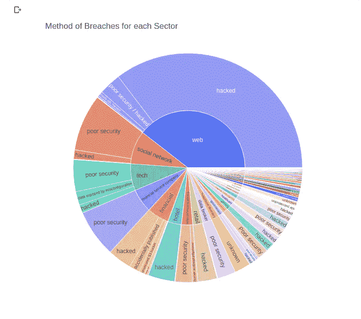
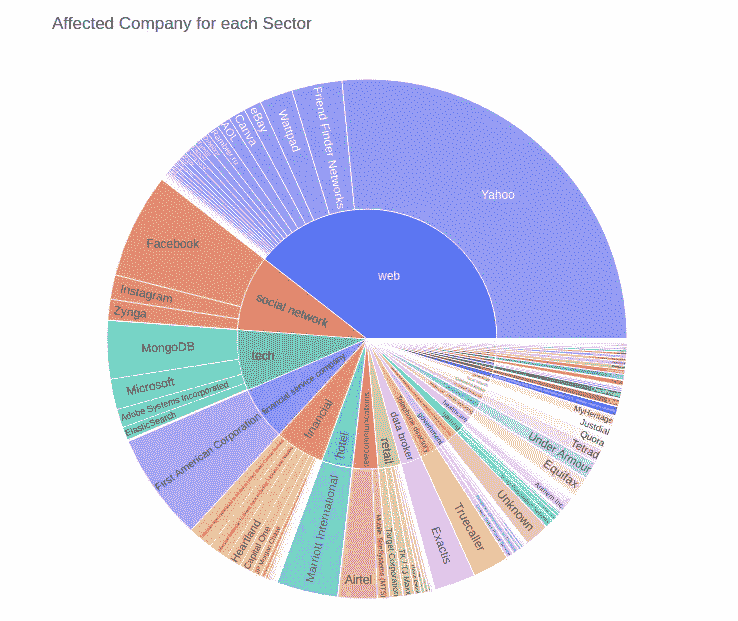

# 顶级网络数据泄露(2004–2021):数据分析和可视化

> 原文：<https://medium.com/mlearning-ai/top-cyber-data-breaches-2004-2021-data-analysis-and-visualization-db61318148f?source=collection_archive---------2----------------------->

## 数据分析项目为初学者以及中级。


Photo by [Max Bender](https://unsplash.com/@maxwbender?utm_source=medium&utm_medium=referral) on [Unsplash](https://unsplash.com?utm_source=medium&utm_medium=referral)

如今，数据的安全性是一个主要问题。正如我已经告诉你的，我们生活在一个信息时代。而信息来自数据。这些数据是我们提供给大型科技巨头公司的。现在，这取决于这些公司对我们数据的重视程度。但是我们一次又一次地听到关于数据泄露的新闻。这些数据泄露包括个人的所有个人信息和职业信息。在个人层面上，我们必须保护我们的在线隐私。

以下是对 2004 年至 2021 年全球顶级数据泄露事件的分析。在分析中，我将使用 Kaggle 数据集。因此，让我们先喝杯咖啡，开始对数据泄露进行一些分析。

视频教程在这里:

# 带分析的代码

*   导入下列库

```
!pip install --upgrade plotly
#for mathematical computationimport numpy as np
import pandas as pd
import scipy.stats as stats#for data visualizationimport seaborn as sns
import matplotlib.pyplot as plt
from matplotlib.pyplot import figure
import plotly 
import plotly.express as px% matplotlib inline
```

我们使用 Plotly 进行数据可视化。如果您的系统中没有升级版本，那么在单元本身中更新它，如上所示。

*   让我们加载数据，先睹为快。下载数据集并将其添加到路径中。之后，渲染数据集的前 5 个数据。我将在本文的最后提供**数据集链接。**

```
df = pd.read_csv("/content/DataBreaches(2004-2021).csv", encoding='latin-1')
df.head()
```

现在运行这个单元，你会在屏幕上看到这样的东西。



Data breach: Analysis and Visualization

*   **获取更多关于数据的信息**

```
#data info
df.info()#Check missing values
df.isnull().sum()
```

检查每一列中的空值。幸运的是，我们的数据集中没有空值。
之后，用每个列的类型属性获得更多关于我们数据集的信息。

*   **最受影响的组织**

```
df_record = df.groupby('Organization type').sum().sort_values('Records', ascending=False)
df_record = df_record.reset_index()
df_record
```

在这里，我们根据数据泄露的记录总和对组织进行分组。运行此单元后，您将获得一个组织类型列表，所有类型都根据违规数量按降序排列。现在得到它的图形视图。

```
px.bar(x='Organization type', y='Records', data_frame=df_record.head(10), title="Most affected organization")
```



Data breach: Analysis and Visualization

正如您可以清楚地看到的，web 组织以超过 50 亿的数据泄露高居榜首，其次是社交网络、技术等。嗯，如果你是一个经常上网的用户，那么你应该更加小心。

*   **不同类型的违约方法**

```
df.Method.unique()
```

在用上面的代码运行单元格后，您将得到一个包含所有数据泄露方法的数组。这些方法包括黑客攻击、安全性差、监守自盗、意外发布等。

*   让我们得到每种方法的总计数

```
df['Method'].value_counts()
```

现在运行这个单元，你会在屏幕上看到这样的东西。



Data breach: Analysis and Visualization

正如你可以清楚地看到，黑客方法是数据破坏者的首要任务。内部人员的工作也对数据泄露负责，这很有意思。这意味着一些大公司的雇员出售用户的数据来换取一些钱。最近就有这样一个案例，谷歌解雇了一些出售数据的员工。这是谷歌的一步好棋。

*   让我们来看看**网络公司是如何发生数据泄露的**

```
df[df['Organization type'] == 'web']
```

当您运行该单元时，您将获得所有网络公司的列表以及他们用于数据泄露的方法。

*   **一年中规模最大的违约**

```
df_year = df.groupby('Year').sum().sort_values('Records', ascending=False)
df_year = df_year.reset_index()px.bar(x='Year', y='Records', data_frame=df_year, title="Most breach by size in a year")
```



Data breach: Analysis and Visualization

2019 年的数据泄露数量最多。2019 年，超过 35 亿用户的数据被泄露。2014–2015 年的数据泄露最少。快乐的旧时光..！！

*   **违规次数(方法)**

```
fig = px.histogram(df, x="Year", y="Records", histfunc="count", color="Method", labels={'x':'Year', 'y':'Records'}).update_xaxes(categoryorder='total descending')
fig.show()
```



Data breach: Analysis and Visualization

在 2011 年，有 17 起数据泄露事件是由于黑客攻击，2 起是由于安全性差，5 起是由于介质丢失/被盗，4 起是由于意外发布，4 起是由于计算机丢失/被盗，1 起是由于内部工作。这使得 2011 年共有 33 起数据泄露事件，是迄今为止最高的一年。让我们来看看一年来的数据泄露统计。

```
df['Year'].value_counts()
```

运行该单元格，您将获得全年数据泄露总数的列表。

*   **每个部门的违规方法**

```
fig =px.sunburst(df, path=["Organization type","Method"], values='Records', width = 650, height = 650, title = "Method of Breaches for each Sector")
fig.show()
```



Data breach: Analysis and Visualization

这是每个部门中查看方法的更好的图形视图。

*   每个部门受影响的公司

```
fig =px.sunburst(df, path=["Organization type","Entity"], values='Records', width = 700, height = 700, title = "Affected Company for each Sector")
fig.show()
```



Data breach: Analysis and Visualization

如你所见，雅虎公司是受数据泄露影响最大的公司。之后，我认为脸书是第二大受影响的公司。让我们多了解一下脸书。

```
df[df['Entity'] == 'Facebook']
```

运行这个单元，看看由于安全问题从脸书泄漏的数据数量，其中一些是意外泄漏。你还在用脸书吗？

嗯，就是这样。恭喜，你分析了从 2004 年到 2021 年的所有数据泄露。你可以自己多挖掘。因为你可以用数据做很多事情。你得到的信息是有价值的。

**完整的 Github 代码和数据集访问都是** [**这里**](https://github.com/imrohit007/Data-breaches-2004-2021) **。**

感谢您的阅读。如果这篇文章内容丰富，那么一定要鼓掌，与你的社区分享，并关注更多。