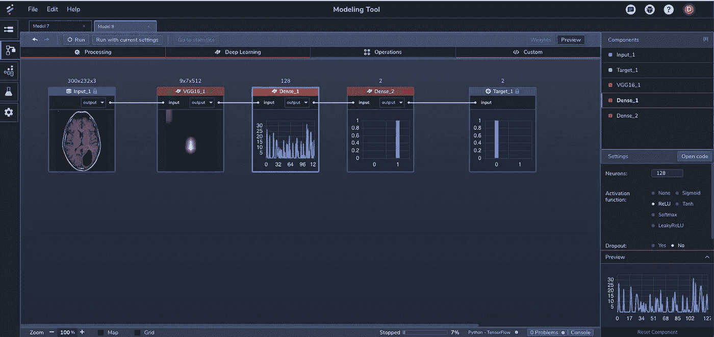
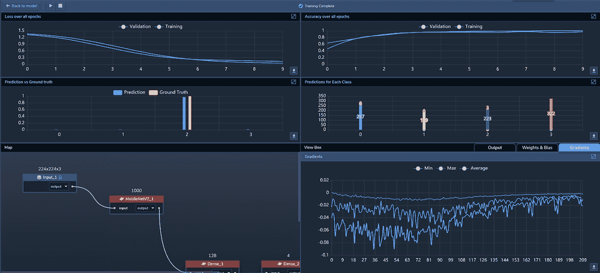
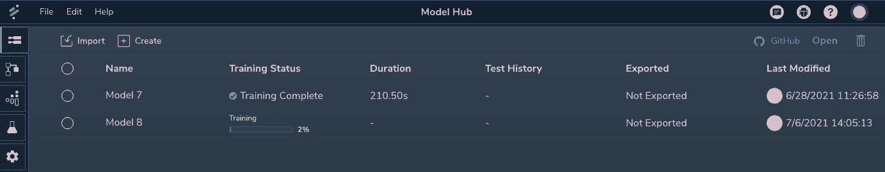

# 感知实验室解决的五大张量流问题

> 原文：<https://medium.com/mlearning-ai/top-five-tensorflow-issues-solved-by-perceptilabs-489b9b9f2fe3?source=collection_archive---------1----------------------->

Image [Source](https://unsplash.com/photos/w7ZyuGYNpRQ\).

TensorFlow 是一个用于构建 ML 模型的强大的开放式 API，但它也有缺点。在我们的博客[TensorFlow 概述和 PerceptiLabs 如何使其更容易](https://blog.perceptilabs.com/an-overview-of-tensorflow-and-how-perceptilabs-makes-it-easier/)中，我们讨论了 TensorFlow 如何工作，以及 PerceptiLabs 的 GUI 和可视化 API 如何使构建 tensor flow 模型更容易。在这里，我们探讨了 ML 从业者在 TensorFlow 中面临的五个常见挑战，以及我们如何用 PerceptiLabs 解决这些挑战。

我们将回顾的张量流挑战包括:

> 1.缺乏对模型架构的可见性
> 
> 2.额外的代码(和时间！)需要将结果可视化
> 
> 3.模型性能的低效跟踪和比较
> 
> 4.长时间反复试验设置
> 
> 5.缺乏可扩展的基础设施

**1。缺乏对模型架构的了解**

正如任何开发人员都可以证明的那样，在纯代码环境中工作需要您可视化正在发生的事情。当使用 TensorFlow 时，这可能会进一步复杂化，因为 API 的目的是构建一个张量流通过的操作图(因此得名 *TensorFlow* )。因此，如果没有某种图表，很难清楚地了解模型的架构。这就是为什么 TensorFlow 是可视化工具的主要候选对象。

*Figure 1: PerceptiLabs’ modeling tool showing visualizations for a VGG16 CNN that performs image recognition to find tumors using brain scans. Here you can immediately see the output of the CNN along with its dense layers and final prediction. Image Source:* [*Perceptilabs*](https://www.perceptilabs.com/)*.*

PerceptiLabs 通过自动可视化模型和指标来解决这个问题。在建模、训练和测试期间，可视化为您提供即时反馈，如图 1 所示。这意味着您可以随时看到模型的尺寸和基于每个组件的视觉转换。Perceptilabs 通过在每次更新模型时使用来自训练数据的第一个样本不断重新运行模型，使这成为可能。该功能将建模过程与训练/测试阶段分开，从而允许快速迭代。

**2。额外的代码(和时间！)需要可视化结果**

对于像 TensorFlow 这样的纯代码方法，设置*样板文件*可视化非常耗时，并且可能需要不必要的迭代。这通常包括在模型中嵌入代码，然后尝试解密输出，这可能仅限于基于文本的调试语句或简单的图形。除此之外，在查看输出或者验证输出代码是否设置正确之前，必须运行整个模型。

PerceptiLabs 通过消除为调试语句、图形和其他输出嵌入代码的需要，使这变得更加容易。相反，PerceptiLabs 的组件和丰富的统计窗口提供了理解模型的每个转换以及模型如何执行所需的所有信息。

*Figure 2: Statistics windows in PerceptiLabs, updated in real-time as the model is training.* Image Source: [Perceptilabs](https://www.perceptilabs.com/).

**3。低效的模型性能跟踪和比较**

通常会开发多个模型来试验和尝试不同的设置，然后比较结果，看哪一个执行得最好。然而，由于 TensorFlow 的 API 专注于模型创建，它不提供跟踪模型或比较模型性能的工具。这取决于您是否通过某种应用程序、脚本等来提供。而如果要同时运行多个模型，就需要设置多个开发环境。

PerceptiLabs 允许您同时开发、训练和测试多个模型。为了帮助管理这一点，PerceptiLabs 的 [ModelHub](https://docs.perceptilabs.com/perceptilabs/references/ui-overview/model-hub) 屏幕列出了您正在 PerceptiLabs 中工作的所有模型，以及它们的当前训练状态、训练持续时间、测试历史、导出状态和最后修改日期/时间，如图 2 所示。

*Figure 3: The ModelHub in PerceptiLabs lists all of your current models and their training status.* Image Source: [Perceptilabs](https://www.perceptilabs.com/).

使用 ModelHub，您可以在一个屏幕上鸟瞰模型的状态。很快，PerceptiLabs 也将包含版本控制功能，因此您可以更容易地跟踪您的模型的历史和变更。

**4。长时间反复试验设置**

建模期间最常见的任务之一是试验不同的设置(超参数)。然而，您需要更改 TensorFlow 代码的哪一行来修改设置，或者更改会对模型产生什么影响，这并不总是显而易见的。您还需要重新运行整个模型，然后才能确定这些更改会产生什么影响，对于大型数据集，这样做可能需要很长时间

PerceptiLabs 的组件将所有设置呈现在 GUI 中。使用它，您可以清楚地说明层设置中可用的设置，并且由于在您更新模型时，PerceptiLabs 会使用第一条训练数据重新运行您的模型，因此您可以获得关于它们对模型的影响的即时视觉反馈。

**5。缺乏可扩展的基础设施**

最后，训练 ML 模型可能需要大量的处理能力，尤其是在并发运行多个模型时。建立一个可扩展的基础设施来支持这一点可能会很棘手。

PerceptiLabs 在幕后为您设置基于 TensorFlow 的 ML 环境。我们的企业和(即将推出的)云版本会自动为您启动和扩展这些实例。

当你使用感知实验室时，这五个挑战将成为过去。这使您可以专注于建模，而 PerceptiLabs 负责张量流细节。

**今天就开始吧！**

查看我们的[快速入门指南](https://docs.perceptilabs.com/perceptilabs/v/master/getting-started/quickstart-guide)，了解更多关于如何开始使用感知实验室的信息。