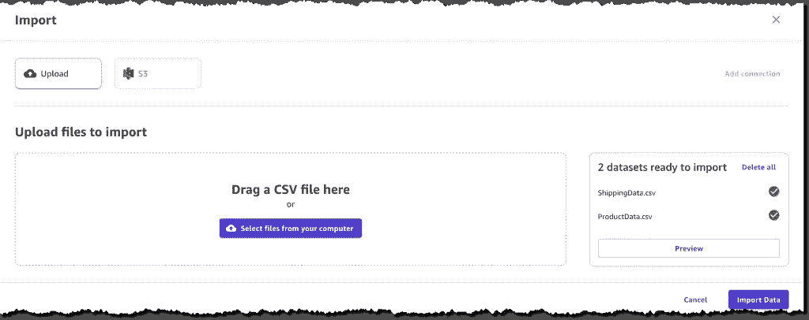
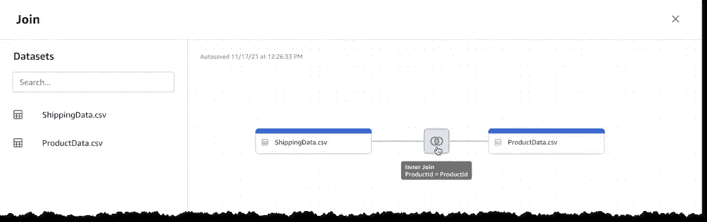
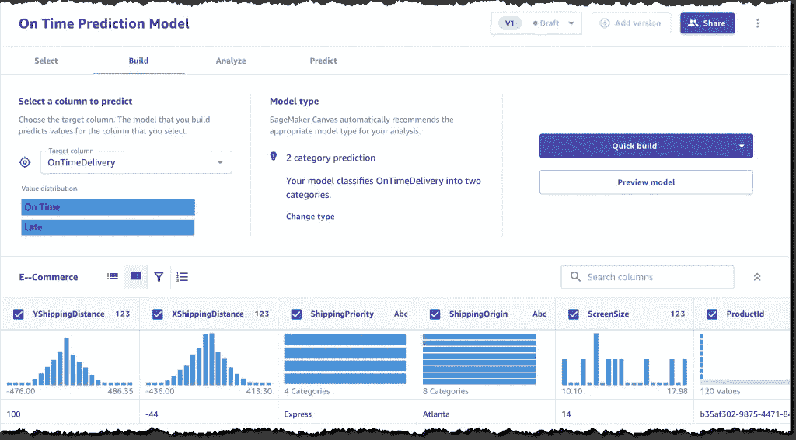
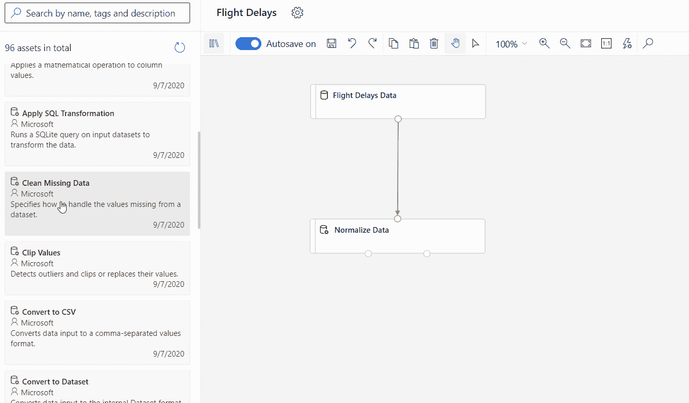
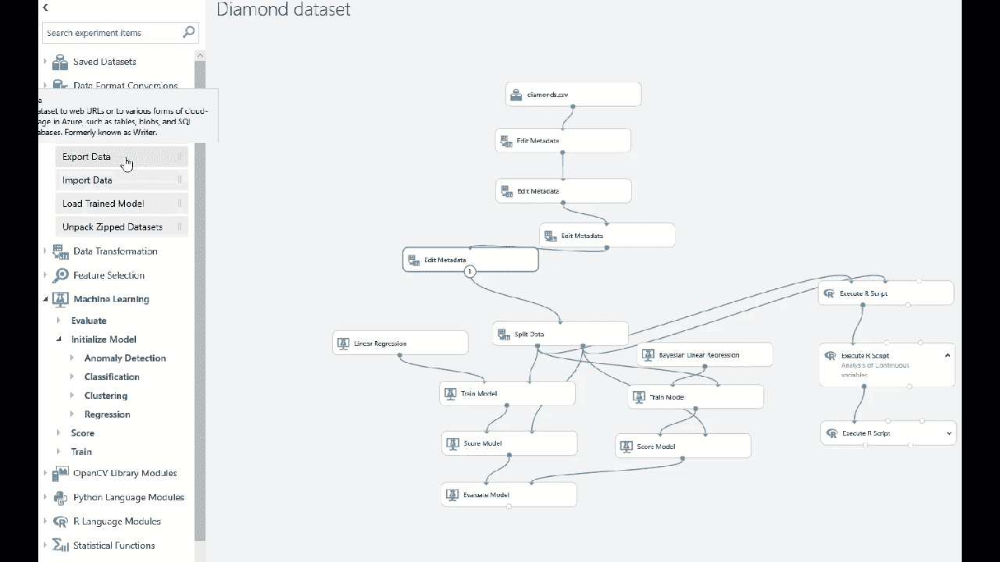

# 云端机器学习的顶级无/低代码工具

> 原文：<https://medium.com/mlearning-ai/top-no-low-code-tools-for-machine-learning-on-cloud-dad4d7fbbd6f?source=collection_archive---------9----------------------->

Photo by [John Schnobrich](https://unsplash.com/@johnschno?utm_source=unsplash&utm_medium=referral&utm_content=creditCopyText) on [Unsplash](https://unsplash.com/s/photos/data-analysis?utm_source=unsplash&utm_medium=referral&utm_content=creditCopyText)

# 介绍

所以你刚刚听说过机器学习和人工智能，或者学习了它的理论方面，但不知道如何编写一个 ML 模型训练脚本。不要担心，本文将向您介绍一些无代码工具，通过这些工具，您可以成为一名机器学习实践者，而无需编写哪怕一行代码。

本文涵盖了一些强大的平台，通过这些平台我们可以训练/测试/部署 ML 模型。

# 基于云的平台

让我们来看看一些运行在云中的机器学习工具。我将分享 AWS 和 Azure 的不同产品。现在，请注意，要使用这些服务，您需要订阅，并且如果您是第一次注册，您还可以获得一些免费积分。

1.  ***亚马逊 SageMaker 画布:***

*   为用户提供简单的点击界面，无需编写任何代码即可生成准确的模型预测。
*   支持 CSV 文件类型，因此您可以直接将文件从本地系统拖放到画布中。它还支持来自亚马逊 S3 和亚马逊红移的数据源的链接。

source: [https://aws.amazon.com/blogs/aws/announcing-amazon-sagemaker-canvas-a-visual-no-code-machine-learning-capability-for-business-analysts/](https://aws.amazon.com/blogs/aws/announcing-amazon-sagemaker-canvas-a-visual-no-code-machine-learning-capability-for-business-analysts/)

*   它有一个自动数据准备工具，可以自动检测和处理丢失的数据/异常情况。

Data Prep Example: Joining two datasets

*   自动识别问题类别，执行功能工程，并从广泛的技术中选择模型，如线性回归、逻辑回归、深度学习、时间序列预测和梯度推进。

Auto Model Training and Model Preview

你可以使用 [AWS 免费层](https://aws.amazon.com/sagemaker/canvas/pricing/)的前两个月，它允许你免费创建多达 10 个模型，最多 100 万个数据单元。查看此[链接](https://aws.amazon.com/sagemaker/canvas/?nc=sn&loc=1)以了解更多关于 SageMaker Canvas 的信息。

**2。 *Azure 机器学习工作室:***

*   由机器学习设计器组成，它有一个画布来创建 ML 管道和一个用户可以拖放到画布中的动作列表。
*   允许用户从本地设备上传 csv 文件，也可以从 blob 存储中导入表格数据。
*   提供不同的功能工程操作供选择，如聚合、缩放、混合、拆分数据。它还允许数据的快速可视化。

source: [https://docs.microsoft.com/en-us/azure/machine-learning/overview-what-is-machine-learning-studio](https://docs.microsoft.com/en-us/azure/machine-learning/overview-what-is-machine-learning-studio)

*   它有各种各样的 ML 算法可供实验。不同的 ML 算法用于执行特定的 ML 任务，如异常检测、分类、聚类、回归、文本分析和时间序列异常检测。

source: [https://microsoft.github.io/AzureTipsAndTricks/blog/blog/tip189.html](https://microsoft.github.io/AzureTipsAndTricks/blog/blog/tip189.html)

*   您还可以通过超参数优化来调整您的模型。
*   它还可以灵活地执行定制的 python 和 R 脚本。
*   一旦模型最终确定，您还可以通过几次点击来发布训练或推理管道。

Machine Learning Studio (classic)与 pipeline designer 工具下的 Azure 机器学习服务合并。点击了解更多关于 ML Studio [的信息。](https://studio.azureml.net)

# 结论

我希望这篇文章已经向您简要介绍了一些在云上可用的无代码工具。如果你喜欢这个内容，那么请喜欢这篇文章，并关注更多这样的文章。

 [## Mlearning.ai 提交建议

### 如何成为 Mlearning.ai 上的作家

medium.com](/mlearning-ai/mlearning-ai-submission-suggestions-b51e2b130bfb)