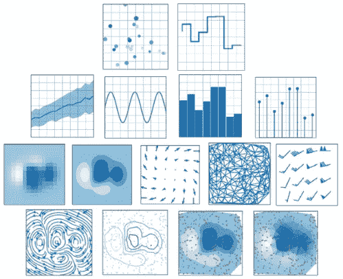
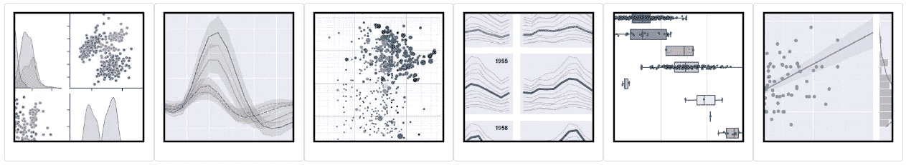
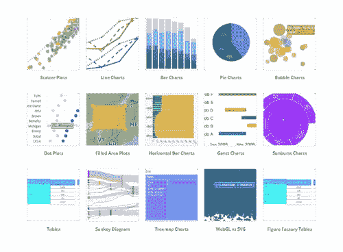
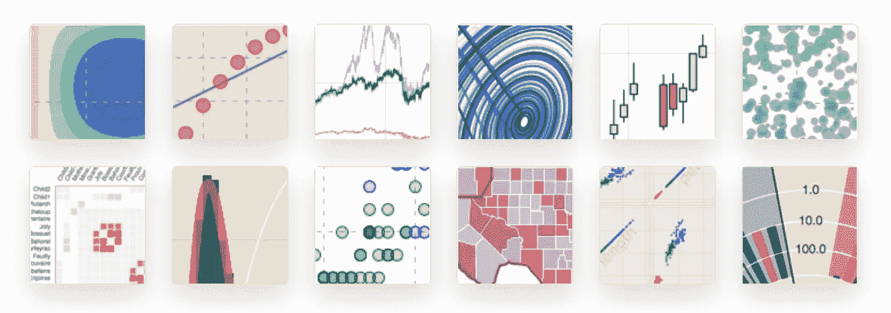
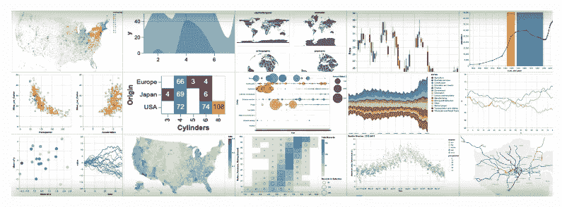

# 用于数据可视化的顶级 Python 库(静态和交互式可视化)

> 原文：<https://medium.com/mlearning-ai/top-python-libraries-for-data-visualization-static-and-interactive-visualization-e5f1bc72de41?source=collection_archive---------3----------------------->

## 用于数据可视化的 Python 库集合


Photo by Anna Nekrashevich from [pexels](https://www.pexels.com/photo/magnifying-glass-on-top-of-document-6801648/)

在我们开始收集用于数据可视化的 python 库之前，最好了解一些关于数据可视化的基本概念以及它的重要性。

> 我相信视觉化是实现个人目标的最有力的手段之一。— ***哈维·麦凯***

基本上，我们天生不擅长用数据讲故事。数据可视化有助于我们缩短理解和解释数据中所包含的洞察力的时间。那么数据可视化到底是什么意思呢？数据可视化是以可视化的形式(如图形、图表、信息图、动画或地图)描述数据，使其更容易理解。数据可视化的主要用途是探索数据和交流数据。那么，数据可视化有什么大不了的呢？数据可视化至关重要，因为它有助于我们减少理解数据所需的时间，并使我们更容易用数据讲述故事。

有几个 Python 库可以帮助我们创建数据可视化。在本文中，我将介绍几个可用于数据可视化(静态和交互式可视化)的 python 库。所以让我们开始吧！

# **1。Matplotlib**

在第一个位置，我将把 Matplotlib 作为最广泛使用的用于数据可视化的 Python 库。Matplotlib 是一个用于经典数据可视化的库。每个开始学习 python 的数据可视化的人，一定都用过 Matplotlib。Matplotlib 中的数据可视化类型包括基本图、数组图、统计图和非结构化坐标图。有许多第三方包建立在 Matplotlib 之上并对其进行了扩展，如 Seaborn、Cartopy、DNA Features Viewer、Plotnine、WCS 轴和 [more](https://matplotlib.org/mpl-third-party/) 。直到现在，Matplotlib 3 . 5 . 2 版本已经发布。



Several types of data visualization can be created using Matplotlib (Image compiled by the author)

使用 Matplotlib 之前，需要先安装。

```
# Install using pip:
pip install matplotlib

# Install using conda:
conda install matplotlib
```

你可以在这里阅读更多关于 Matplotlib [的内容。](https://matplotlib.org/stable/)

# **2。Seaborn**

接下来我会把 Seaborn 放在 Matplotlib 之后的第二位。Seaborn 是一个构建在 Matplotlib 之上的 python 库，用于数据可视化。它提供了一个高层次的界面来绘制有吸引力的和信息丰富的统计图形。此外，seaborn 还集成了 pandas 数据结构。Seaborn 的设计在研究项目的整个生命周期中都是有效的。Seaborn 支持快速原型开发和探索性数据分析，通过一个函数调用以最少的输入提供完整的图像。它还可以用来创建精美的出版物质量的图形，因为它提供了许多定制的可能性，并公开了底层的 Matplotlib 对象(Waskom，2021)。直到现在，Seaborn 0 . 11 . 2 版本已经发布。



Several types of statistical data visualization can be created using seaborn (Image from [Seaborn](https://seaborn.pydata.org/))

在使用 Seaborn 之前，你需要先安装它。请记住，当您安装 Seaborn 时，还会安装其他几个库，如 NumPy、SciPy、pandas 和 Matplotlib。

```
# Install using pip:
pip install seaborn

# Install using conda:
conda install seaborn
```

你可以在这里阅读更多关于 Seaborn [的信息。](https://seaborn.pydata.org/index.html)

# **3。阴谋地**

在 Seaborn 之后，我会把 Plotly 作为一个 python 库，用于交互式数据可视化。Plotly 是一个交互式可视化库，用于在 Jupyter 中、在本地浏览器中可视化数据，甚至是在 Plotly 团队创建的可视化和仪表板平台 Dash 上托管这些图形以供查看。Plotly 有 40 多种图表类型可供选择，涵盖了广泛的统计、金融、地理、科学和三维应用。Plotly Python 是基于 JavaScript 库 Plotly ( `plotly.js`)构建的。到目前为止，Plotly for python 5 . 8 . 0 版本已经发布。



Several basic graphics on Plotly (Image from [Plotly](https://plotly.com/python/basic-charts/)).

在使用 Plotly 之前，你需要先安装它。

```
# Install using pip:
pip install plotly

# Install using conda:
conda install -c plotly plotly
```

你可以在这里阅读更多关于 Plotly [的内容](https://plotly.com/python/)。

# **4。散景**

排在第四位的是散景。就像 Plotly 一样，Bokeh 是一个用于交互式数据可视化的 python 库。Bokeh 专注于 Python 生态系统，而 Plotly 建立在顶部`plotly.js`。使用散景创建的绘图、仪表盘和应用程序可以发布在网页或 Jupyter 笔记本上。此外，Bokeh 的一个优点是，您可以创建 JavaScript 支持的可视化效果，而无需自己编写任何 JavaScript。直到现在，散景 2.4.3 版本已经发布。



Several types of data visualization can be created using Bokeh (Image from [Bokeh](https://docs.bokeh.org/en/latest/index.html)).

在使用散景之前，你需要先安装它。

```
# Install using pip:
pip install bokeh

# Install using conda:
conda install bokeh
```

你可以在这里阅读更多关于散景的信息。

# **5。牛郎星**

在第五个位置，有一个牛郎星。Altair 是一个 python 库，用于基于 Vega 和 Vega-lite 的声明式数据可视化。这个库的主要概念是，我们不需要显式地写出图形中的每个特征(比如 x 轴、y 轴、颜色等。).这些细节将由 Altair 自动处理。通过使用 Altair，我们可以仅使用相对简洁的语法来设计从简单到复杂的数据可视化。直到现在，牛郎星 4.2.0 版本已经发布。



Several types of data visualization can be created using Altair (Image from [Altair](https://altair-viz.github.io/index.html)).

在使用 Altair 之前，你需要先安装它。几乎和 Seaborn 一样，当你安装 Altair 时，下面的模块也会作为 entrypoints、jsonschema、NumPy、Pandas 和 Toolz 安装。

```
# Install using pip:
pip install altair

# Install using conda:
conda install -c conda-forge altair
```

你可以在这里阅读更多关于牛郎星的信息。

# **6。Pydeck**

在最后一个位置，有 Pydeck 作为流行的 python 库用于数据可视化。Pydeck 是一个 python 库，用于高比例的空间渲染，并在 Mapbox 上绘制可视化图层。要使用 Pydeck，您需要互联网接入，如果没有互联网接入，可视化将不会呈现。使用 Pydeck，我们可以启用或禁用地图控件，还可以修改地图投影的类型，如在平面上绘制而不是在墨卡托投影上绘制。直到现在，py deck 0 . 7 . 1 版本已经发布。

在使用 Pydeck 之前，你需要先安装它。

```
# Install using pip:
pip install pydeck

# Install using conda:
conda install -c conda-forge pydeck
```

你可以在这里阅读更多关于 Pydeck [的信息。](https://deckgl.readthedocs.io/en/latest/)

# **参考文献:**

[1] [J. D. Hunter，“Matplotlib:一个 2D 图形环境”，科学计算&工程，第 9 卷，第 3 期，第 90–95 页，2007](https://doi.org/10.1109/MCSE.2007.55) 。

[2] Knaflic，C. (2015 年)。用数据讲故事:商业专家数据可视化指南。威利。

[3]瓦斯科姆，法学博士，(2021 年)。seaborn:统计数据可视化。《开源软件杂志》，6 卷(60 期)，3021 页，[https://doi.org/10.21105/joss.03021](https://doi.org/10.21105/joss.03021)

[https://plotly.com/python/](https://plotly.com/python/)

[https://docs.bokeh.org/en/latest/index.html](https://docs.bokeh.org/en/latest/index.html)

[https://altair-viz.github.io/index.html](https://altair-viz.github.io/index.html)

[https://deckgl.readthedocs.io/en/latest/](https://deckgl.readthedocs.io/en/latest/)

您可能有兴趣阅读以下文章:

[](/mlearning-ai/python-libraries-for-data-science-that-you-must-know-in-2022-f2a5063ef58b) [## 2022 年你必须知道的数据科学 Python 库

### 可以支持数据科学家的 python 库集合

medium.com](/mlearning-ai/python-libraries-for-data-science-that-you-must-know-in-2022-f2a5063ef58b)