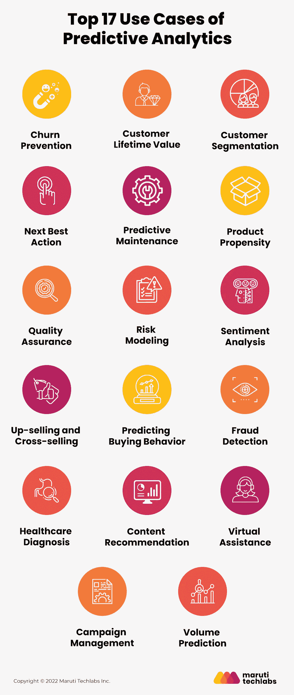

# 八大现实预测分析使用案例

> 原文：<https://medium.com/mlearning-ai/top-real-life-predictive-analytics-use-cases-54a2f8a2980a?source=collection_archive---------5----------------------->

预测分析是指通过机器学习算法和统计来预测未来的结果和性能。数据挖掘和预测建模等技术可估计未来结果的可能性，并提醒您即将发生的事件，以帮助您做出决策。

如今，企业定期使用预测分析来分析目标客户，以获得运营结果。各行各业的预测分析应用不胜枚举。因此，以下是在多个领域进行预测分析的一些日常使用案例:

# 1.流失预防

当一个企业失去一个客户时，它必须通过带来新的客户来弥补收入的损失。事实证明，这很昂贵，因为获得新客户的成本比留住现有客户高得多。

预测分析模型通过分析您当前客户的不满情绪并确定最有可能离开的客户群，帮助防止客户流失。企业可以使用预测数据进行必要的修改，以保持客户满意，最终保护他们的收入。

**重点行业**:银行、电信、零售、汽车、保险

# 2.客户终身价值

确定市场上谁最有可能在长时间内持续花费大量资金是非常困难的。

通过预测分析获得的此类数据使企业能够优化其营销策略，以获得对您的公司和产品具有最大终身价值的客户。

**重点产业**:保险、电信、银行、零售

# 3.客户细分

客户细分使您能够根据共同的特征对客户进行分组。不同的企业根据为他们的公司、产品和服务提供最大价值的方面来决定他们的市场。

对预测分析技术的深入运用有助于根据准确的见解和指标瞄准市场，并分析对您公司提供的产品最感兴趣的细分市场。使用这些预测分析应用程序，您可以为业务的每个部分做出数据驱动的决策。同样的数据也让你能够识别出你甚至不知道存在的整个市场。

**重点产业**:银行、医药、汽车、零售、保险、电信、公用事业

# 4.下一个最佳行动

确定您的主要营销目标和客户是预测分析的一个关键用例。它只是提供了一个不完整的图片什么你的营销方法应该是。

预测数据分析是接近给定细分市场中的此类个人客户并分析一切(从购买模式到客户行为和互动)的最佳方式，可让您洞察联系这些客户的最佳时间和模式。

**重点行业**:银行、电信、保险、教育

# 5.预测性维护

在企业中，维持成本在增加收入方面起着至关重要的作用。对一个在设备和基础设施上有大量投资的组织来说，管理资本支出是很困难的。这就是[预测维护机器学习技术](https://marutitech.com/predictive-maintenance-machine-learning-techniques/?utm_source=medium&utm_medium=referral&utm_campaign=maintenance_ml_techniques)的用武之地。

通过分析技术设备维护周期的洞察力和指标，公司可以通过简化维护成本和停机时间来设定维护事件的时间表和即将到来的支出要求。您可以通过采取能够延长设备寿命的措施来降低维护成本。

通常，大多数系统在维护期间变得不可操作。预测分析用例将帮助您找到执行维护的最佳时间，以避免收入损失和客户不满。

**重点行业**:汽车、物流&运输、石油&天然气、制造业、公用事业

# 6.产品倾向

产品倾向将购买活动和行为数据与来自社交媒体和电子商务的在线行为指标相结合。它使您能够确定客户购买您的产品和服务的兴趣，以及接触这些客户的媒介。

它有助于关联数据，从不同的营销活动和社交媒体渠道为您的业务服务和产品提供见解。预测分析应用程序总能最大限度地利用那些最有机会产生可观收入的渠道。

**重点行业**:银行、保险、零售

# 7.质量保证

质量保证是您客户体验的关键，也是您所有运营支出的底线。

无效的质量控制将影响您的客户满意度，并最终影响收入和市场份额。此外，它还会导致更多的客户支持成本、保修问题以及低效制造的维修。使用预测分析用例的行业可以在潜在的质量问题和趋势成为关键问题之前提供对它们的洞察。

预测分析用例可以帮助识别应用中的高风险模块，确定关键领域的优先级，并通过左移测试缩短上市时间。借助预测分析，您的 QA 方法从被动变为主动。

**重点行业**:制药、制造、汽车、物流运输、公用事业

# 8.风险建模

预防和预测是一个硬币的两面。风险有多种形式，来源也多种多样。预测分析可以从大多数组织的重要数据洞察中发现潜在的风险领域。

它对它们进行分类，以分析潜在的风险，并对可能影响业务的情况发展提出建议。通过将预测分析应用的结果与风险管理方法相结合，公司可以评估风险问题并决定如何减轻这些风险因素。

例如，卫生组织生成风险分数来识别可能从增强的服务、预防性护理和健康咨询中受益的患者。

**重点行业:**银行业、制造业、汽车、物流运输、公用事业、油气公用事业、制药

阅读所有用例- [预测分析的 17 大用例](https://marutitech.com/predictive-analytics-use-cases/?utm_source=medium&utm_medium=referral&utm_campaign=predictive_analytics_use_cases)。

 [## Mlearning.ai 提交建议

### 如何成为 Mlearning.ai 上的作家

medium.com](/mlearning-ai/mlearning-ai-submission-suggestions-b51e2b130bfb)