# 网飞描述的主题检测和情感分析

> 原文：<https://medium.com/mlearning-ai/topic-detection-and-sentiment-analysis-for-netflix-descriptions-c7314d244413?source=collection_archive---------5----------------------->

网飞是最受欢迎的媒体和视频流媒体平台之一。他们的平台上有超过 8000 部电影或电视节目，截至 2021 年年中，他们在全球拥有超过 2 亿用户。

在下面的分析中，我们将查看电影/连续剧描述变量中的文本数据，我们将应用自然语言处理来获取复合情感和主题。

## 数据集:

这个表格数据集由在[网飞](https://www.kaggle.com/shivamb/netflix-shows)上可获得的所有电影和电视节目的列表组成，下面是数据集中出现的所有列

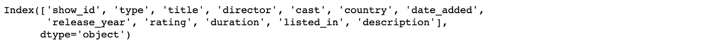

## 数据清理:

**删除空值:**空值会降低模型性能并扭曲数据。从下面的屏幕截图中，我们看到导演、演员和国家/地区具有最多的空值，基于冗余变量，我们删除了导演和演员列。在下一步中，我们使用 dropna()函数删除所有包含空值的行。

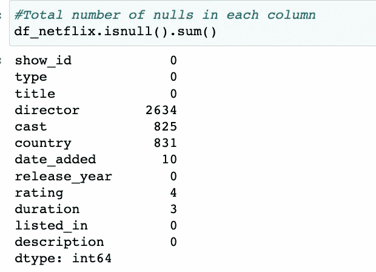

**删除冗余变量:**包含链接、描述等不重要数据的变量会降低模型性能。删除了“显示标识”、“类型”、“国家”、“评级”、“添加日期”、“持续时间”、“列出日期”等列。

**减少高方差的数据过滤器:**为了防止数据具有高方差，我们对列应用过滤器并减少行数。从下图中我们可以看到数据向右倾斜，为了标准化数据，我们过滤了 release_year > 1980。

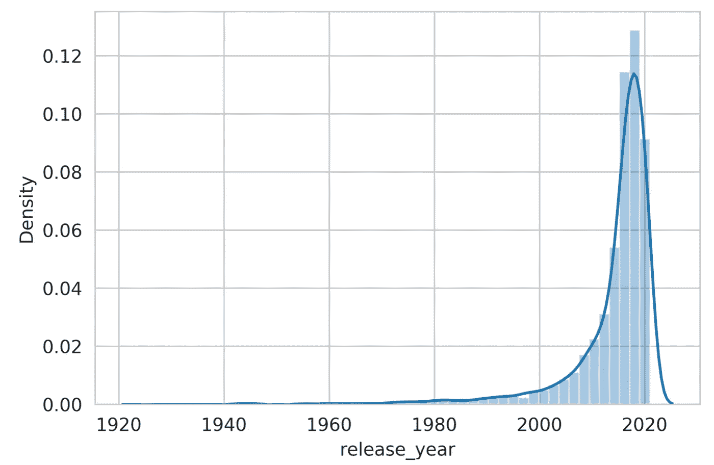

Distribution Plot

# 文本数据清理:

文本数据是一种复杂的自然语言(英语、德语、法语等)，文本数据的本质是非结构化的，我们需要对其进行清理和转换，以便 python 能够理解和解释。

以下是我们清理文本数据的步骤:

**标记化:**标记化是一个从语句中提取单数词的过程——我们导入 nlkt 的 **word_tokenize** 函数，为数据集中所有电影/连续剧的描述创建标记。

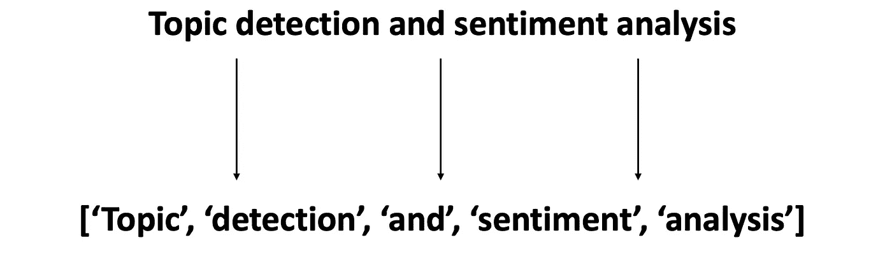

**删除停用词:**停用词是对分析没有任何价值的词，只是自然语言的填充词，例如“the”、“a”、“an”、“is”等。要删除停用词，我们需要导入停用词词典或创建一个手动词典。我已经从 **Spacy** 文本造型库中导入了停用词词典。为了删除停用词，我创建了一个函数来应用标记化，并从空间中删除停用词词典中匹配的标记。

**词条化:**这是将一个单词的屈折形式组合在一起的过程，这样它们就可以作为一个单独的项目进行分析，通过该单词的[词条](https://en.wikipedia.org/wiki/Lemma_(morphology))或字典形式来识别。

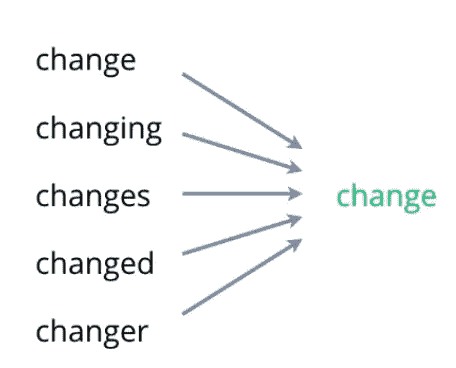

下面是我们运行的代码，用于对数据集中的描述文本应用标记化、删除停用词和词条化:

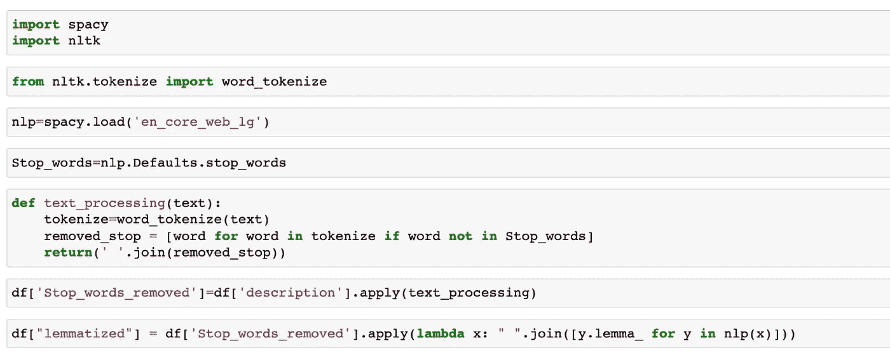

下面是应用文本数据清理前后的步骤:

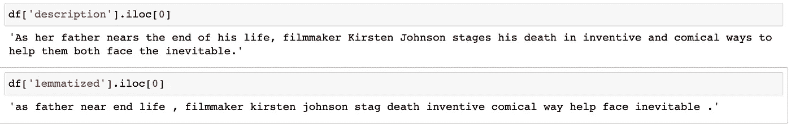

# VADER 的情感分析:

**VADER(V**alence**A**ware**D**ictionary**和 s**E**ntiment**R**easoner**)**是一款专门针对社交媒体中表达的情绪的词汇和基于规则的情绪分析工具。 **VADER** 使用情感词汇的组合是词汇特征(例如，单词)的列表，其通常根据它们的语义取向被标记为正面或负面。VADER** 不仅告诉我们积极和消极，还通过给出积极分数、消极分数、中性分数和三个分数相加的综合分数来告诉我们一种情绪是积极还是消极。

下面是应用 Vader 情绪分析的代码片段:

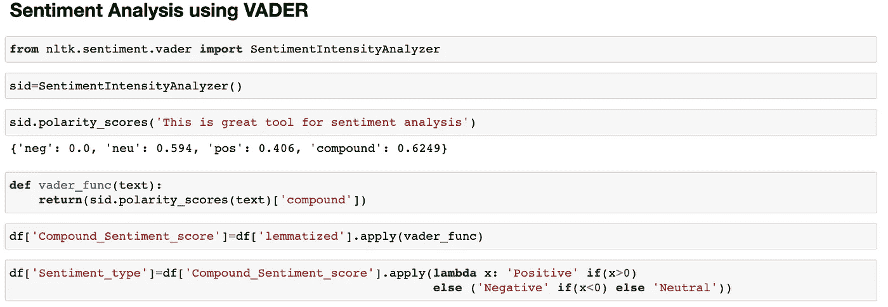

下面是包含复合情感得分和情感类型的 10 行代码片段:

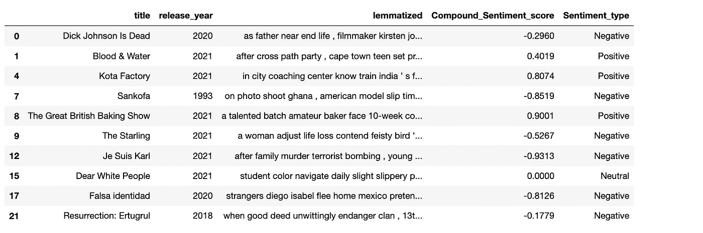

# 使用 LDA 的主题检测:

[潜在狄利克雷分配](https://en.wikipedia.org/wiki/Latent_Dirichlet_allocation)是一种无监督学习算法，它将文档表示为主题的混合物，这些主题以一定的概率吐出单词。

**LDA 的缺点:**

1.  用户必须定义要创建的主题数量。
2.  用户必须根据分配给主题的单词的概率来解释什么是主题。

为了让 python 理解文本数据，我们需要使用计数矢量器对其进行矢量化，经过拟合变换后，我们会得到一个大的字数矩阵。

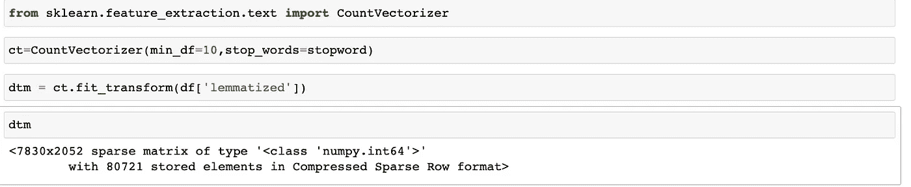

从 sklearn 库导入 LDA，创建一个实例并将其应用于矩阵 spit out of Count 矢量器:

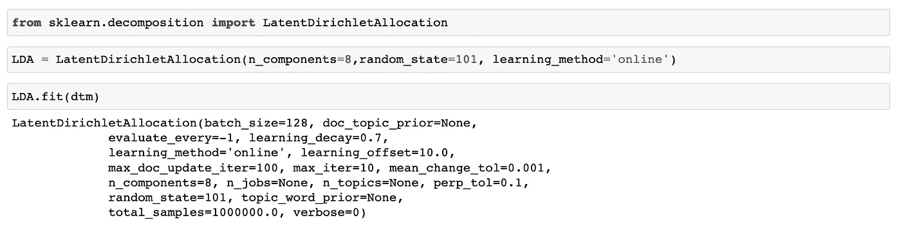

打印与每个主题相关的前 15 个单词:

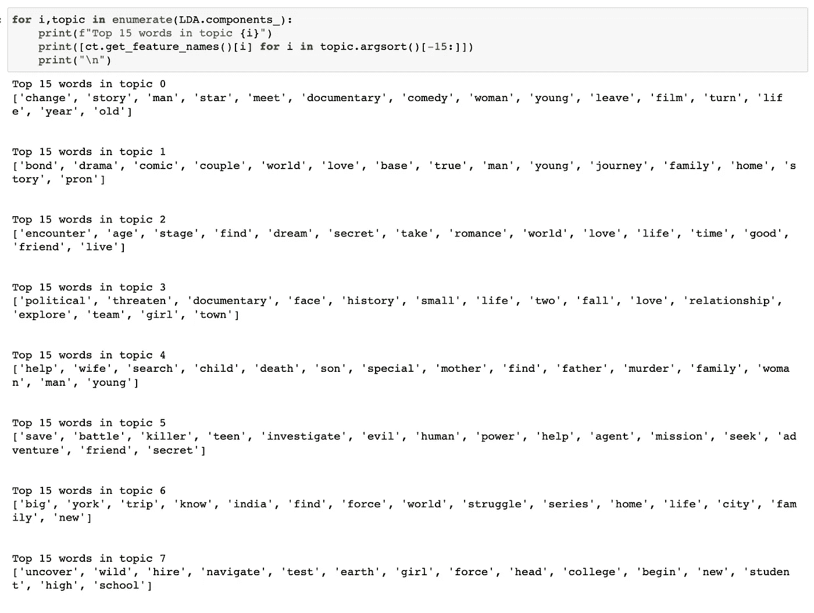

下一步是手动的，完全是主观的，用户解释与上面的主题列表相关联的最高概率的单词，并给主题分配一个类别名称。

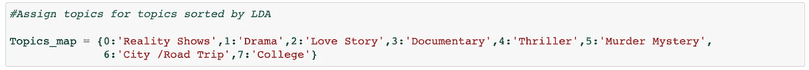

我们使用 LDA 模型转换 dtm 矩阵，创建 LDA 模型是为了给每个描述单元分配每个主题的混合概率。我们采用使用 argmax()函数分配的顶部主题。

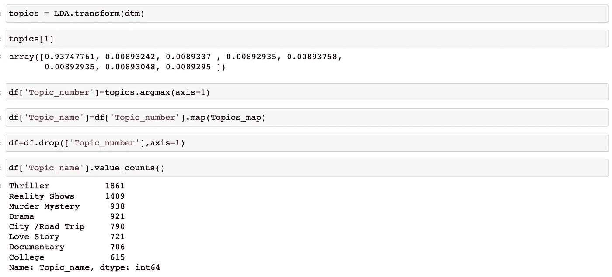

**输出:**

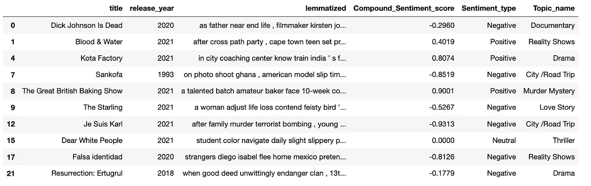 [## Mlearning.ai 提交建议

### 如何成为 Mlearning.ai 上的作家

medium.com](/mlearning-ai/mlearning-ai-submission-suggestions-b51e2b130bfb)